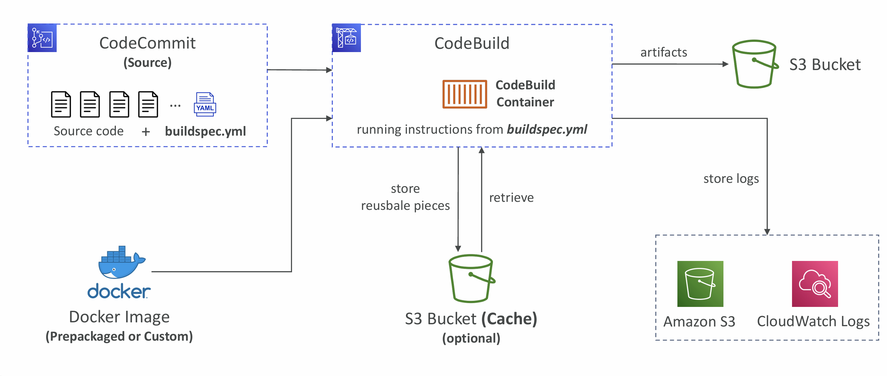
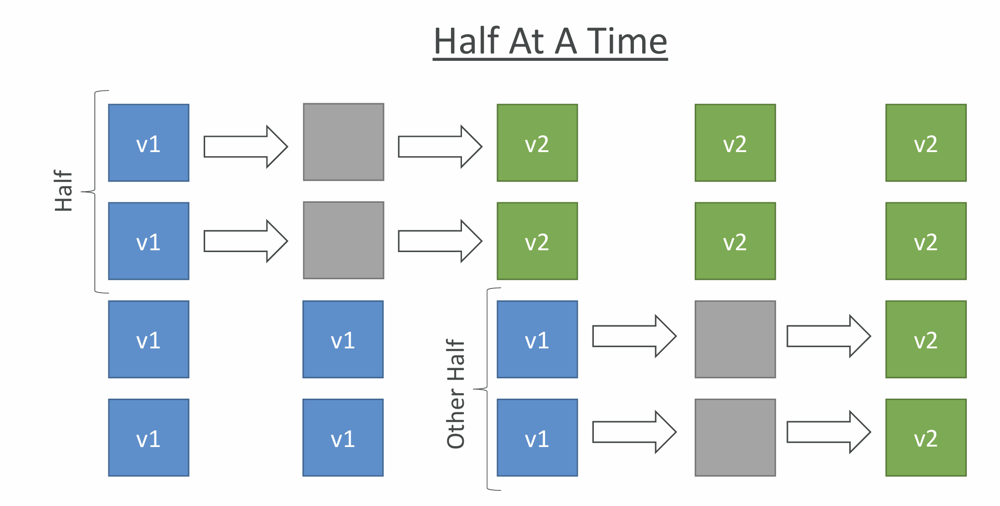
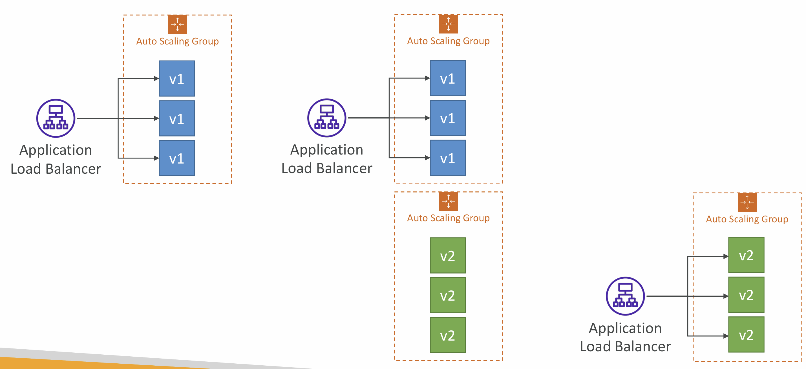
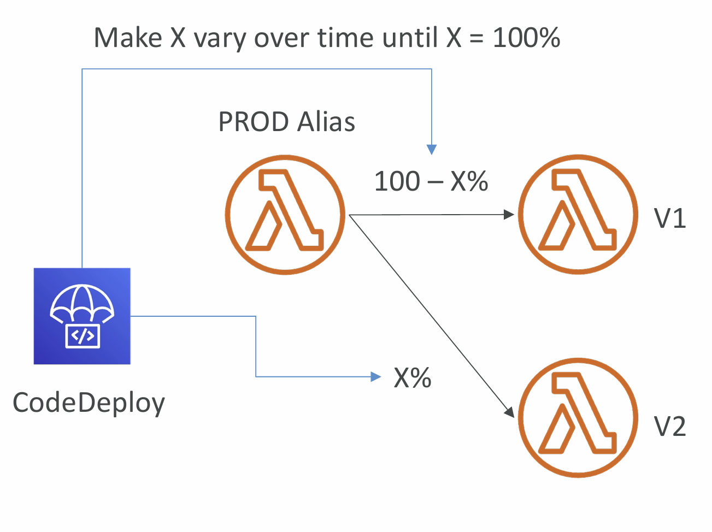
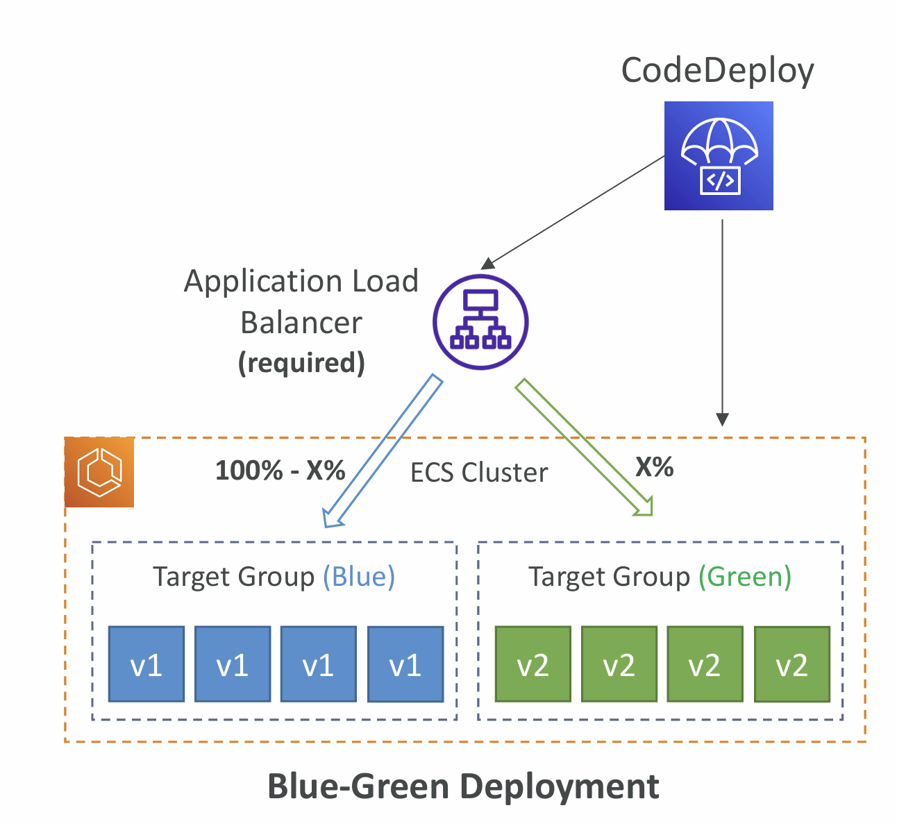
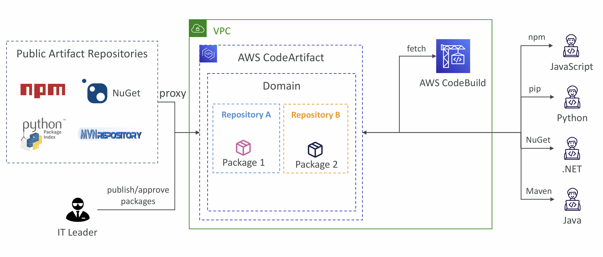
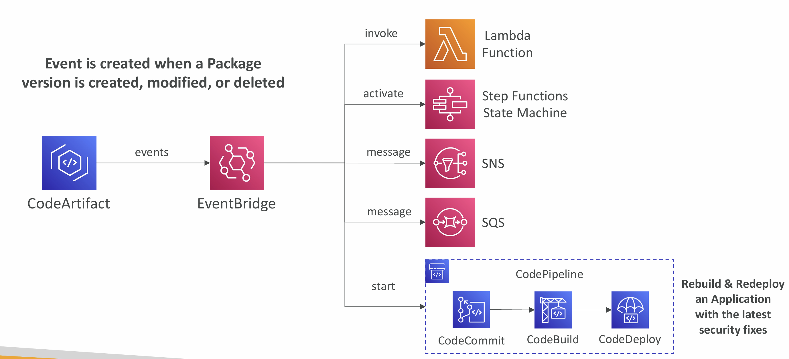
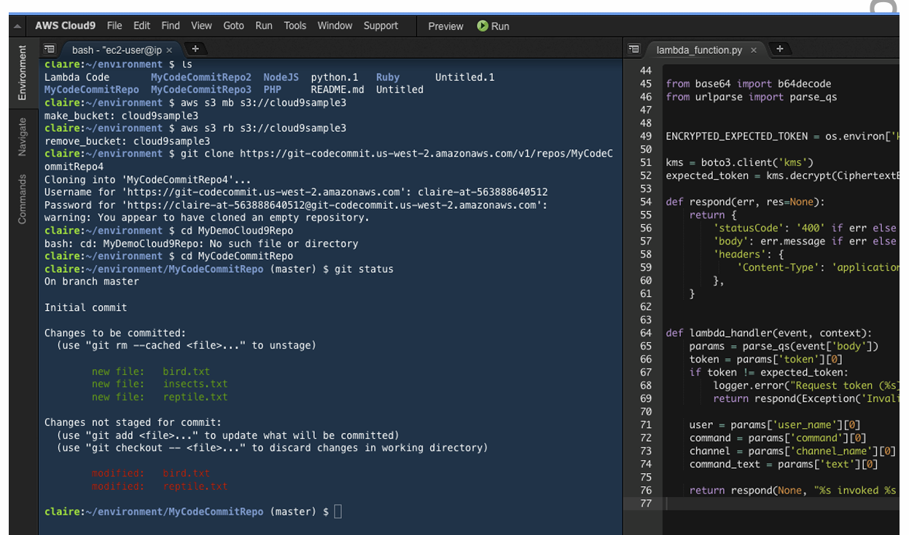

# Section 24. AWS CICD

## Continuous Integration (CI)

- Developers push the code to a code repository often (e.g., GitHub, CodeCommit, Bitbucket…)
- A testing / build server checks the code as soon as it’s pushed (CodeBuild, Jenkins CI, …)
- The developer gets feedback about the tests and checks that have passed / failed
- Find bugs early, then fix bugs
- Deliver faster as the code is tested
- Deploy often

## Continuous Delivery (CD)

- Ensures that the software can be released reliably whenever needed
- Ensures deployments happen often and are quick

## AWS CodeCommit

- Version control is the ability to understand the various changes that happened to the code over time (and possibly roll back)
- All these are enabled by using a version control system such as Git
- A Git repository can be synchronized on your computer, but it usually is uploaded on a central online repository
- Benefits are:
  - Collaborate with other developers
  - Make sure the code is backed-up somewhere
  - Make sure it’s fully viewable and auditable

---

- Git repositories can be expensive
- The industry includes GitHub, GitLab, Bitbucket, …
- And AWS CodeCommit:
  - Private Git repositories
  - No size limit on repositories (scale seamlessly)
  - Fully managed, highly available
  - Code only in AWS Cloud account => increased security and compliance
  - Security (encrypted, access control, …)
  - Integrated with Jenkins, AWS CodeBuild, and other CI tools

## CodeCommit – Security

- Interactions are done using Git (standard)
- Authentication
  - SSH Keys – AWS Users can configure SSH keys in their IAM Console
  - HTTPS – with AWS CLI Credential helper or Git Credentials for IAM user
- Authorization
  - IAM policies to manage users/roles permissions to repositories
- Encryption
  - Repositories are automatically encrypted at rest using AWS KMS
  - Encrypted in transit (can only use HTTPS or SSH – both secure)
- Cross-account Access
  - Do NOT share your SSH keys or your AWS credentials
  - Use an IAM Role in your AWS account and use AWS STS (AssumeRole API)

## AWS CodePipeline

- Visual Workflow to orchestrate your CICD
- **Source** – CodeCommit, ECR, S3, Bitbucket, GitHub
- **Build** – CodeBuild, Jenkins, CloudBees, TeamCity
- **Test** – CodeBuild, AWS Device Farm, 3rd party tools, …
- **Deploy** – CodeDeploy, Elastic Beanstalk, CloudFormation, ECS, S3, …
- **Invoke** – Lambda, Step Functions
- Consists of stages:
  - Each stage can have sequential actions and/or parallel actions
  - Example: Build -> Test -> Deploy -> Load Testing -> …
  - Manual approval can be defined at any stage

## CodePipeline – Artifacts

- Each pipeline stage can create artifacts
- Artifacts stored in an S3 bucket and passed on to the next stage

## CodePipeline – Troubleshooting

- Use **CloudWatch Events (Amazon EventBridge)**. Example:
  - You can create events for failed pipelines
  - You can create events for cancelled stages
- If CodePipeline fails a stage, your pipeline stops, and you can get information in the console
- If pipeline can’t perform an action, make sure the “IAM Service Role”
- AWS CloudTrail can be used to audit AWS API calls

## AWS CodeBuild

- Source – CodeCommit, S3, Bitbucket, GitHub
- Build instructions: Code file buildspec.yml or insert manually in Console
- Output logs can be stored in Amazon S3 & CloudWatch Logs
- Use CloudWatch Metrics to monitor build statistics
- Use EventBridge to detect failed builds and trigger notifications
- Use CloudWatch Alarms to notify if you need “thresholds” for failures
- Build Projects can be defined within CodePipeline or CodeBuild

## CodeBuild – buildspec.yml

- buildspec.yml file must be at the root of your code
- env – define environment variables
  - variables – plaintext variables
  - parameter-store – variables stored in SSM Parameter Store
  - secrets-manager – variables stored in AWS Secrets Manager
- phases – specify commands to run:
  - install – install dependencies you may need for your build
  - pre_build – final commands to execute before build
  - Build – actual build commands
  - post_build – finishing touches (e.g., zip output)
- artifacts – what to upload to S3 (encrypted with KMS)
- cache – files to cache (usually dependencies) to S3 for
  future build speedup

## AWS CodeDeploy

- Deployment service that automates application deployment
- Deploy new applications versions to EC2 Instances, On-premises servers, Lambda functions, ECS Services
- Automated Rollback capability in case of failed deployments, or trigger CloudWatch Alarm
- Gradual deployment control
- A file named appspec.yml defines how the deployment happens

## CodeDeploy – EC2/On-premises Platform

- Can deploy to EC2 Instances & on-premises servers
- Perform in-place deployments or blue/green deployments
- Must run the CodeDeploy Agent on the target instances
- Define deployment speed
  - AllAtOnce: most downtime
  - HalfAtATime: reduced capacity by 50%
  - OneAtATime: slowest, lowest availability impact
  - Custom: define your %

## CodeDeploy Agent

- The CodeDeploy Agent must be running on the EC2 instances as a pre requisites
- It can be installed and updated automatically if you’re using Systems Manager
- The EC2 Instances must have sufficient permissions to access Amazon S3 to get deployment bundles

## CodeDeploy – Lambda Platform

- CodeDeploy can help you automate traffic shift for Lambda aliases
- **Linear**: grow traffic every N minutes until 100%
  - LambdaLinear10PercentEvery3Minutes
  - LambdaLinear10PercentEvery10Minutes
- **Canary**: try X percent then 100%
  - LambdaCanary10Percent5Minutes
  - LambdaCanary10Percent30Minutes
- **AllAtOnce**: immediate

## CodeDeploy – ECS Platform

- CodeDeploy can help you automate the deployment of a new ECS Task Definition
- Only Blue/Green Deployments
- **Linear**: grow traffic every N minutes until 100%
  - ECSLinear10PercentEvery3Minutes
  - ECSLinear10PercentEvery10Minutes
- **Canary**: try X percent then 100%
  - ECSCanary10Percent5Minutes
  - ECSCanary10Percent30Minutes
- **AllAtOnce**: immediate

## CodeDeploy – Redeploy & Rollbacks

- Rollback = redeploy a previously deployed revision of your application
- Deployments can be rolled back:
  - Automatically – rollback when a deployment fails or rollback when a CloudWatch Alarm thresholds are met
  - Manually
- Disable Rollbacks — do not perform rollbacks for this deployment
- If a roll back happens, CodeDeploy redeploys the last known good revision as a new deployment (not a restored version)

## AWS CodeStar

- An integrated solution that groups: GitHub, CodeCommit, CodeBuild, CodeDeploy, CloudFormation, CodePipeline, CloudWatch, …
- Quickly create “CICD-ready” projects for EC2, Lambda, Elastic Beanstalk
- Supported languages: C#, Go, HTML 5, Java, Node.js, PHP, Python, Ruby
- Issue tracking integration with JIRA / GitHub Issues
- Ability to integrate with Cloud9 to obtain a web IDE (not all regions)
- One dashboard to view all your components
- Free service, pay only for the underlying usage of other services
- Limited Customization

## AWS CodeArtifact

- Storing and retrieving dependencies is called artifact management
- Traditionally you need to setup your own artifact management system
- CodeArtifact is a secure, scalable, and cost-effective artifact management for software development
- Works with common dependency management tools such as Maven, Gradle, npm, yarn, twine, pip, and NuGet
- Developers and CodeBuild can then retrieve dependencies straight from CodeArtifact

## CodeArtifact – EventBridge Integration

## CodeArtifact – Resource Policy

- Can be used to authorize another account to access CodeArtifact
- A given principal can either read all the packages in a repository or none of them

## Amazon CodeGuru

- An ML-powered service for automated code reviews and application performance recommendations
- Provides two functionalities
  - CodeGuru Reviewer: automated code reviews for static code analysis (development)
  - CodeGuru Profiler: visibility/recommendations about application performance during runtime (production)

## Amazon CodeGuru – Agent Configuration

- MaxStackDepth – the maximum depth of the stacks in the code that is represented in the profile
  - Example: if CodeGuru Profiler finds a method A, which calls method B, which calls method C, which calls method D, then the depth is 4
  - If the MaxStackDepth is set to 2, then the profiler evaluates A and B
- MemoryUsageLimitPercent – the memory percentage used by the profiler
- MinimumTimeForReportingInMilliseconds – the minimum time between sending reports (milliseconds)
- ReportingIntervalInMilliseconds – the reporting interval used to report profiles (milliseconds)
- SamplingIntervalInMilliseconds – the sampling interval that is used to profile samples (milliseconds)
  - Reduce to have a higher sampling rate

## AWS Cloud9

- Cloud-based Integrated Development Environment (IDE)
- Code editor, debugger, terminal in a browser
- Work on your projects from anywhere with an Internet connection
- Prepackaged with essential tools for popular programming languages (JavaScript, Python, PHP, …)
- Share your development environment with your team (pair programming)
- Fully integrated with AWS SAM & Lambda to easily build serverless applications
