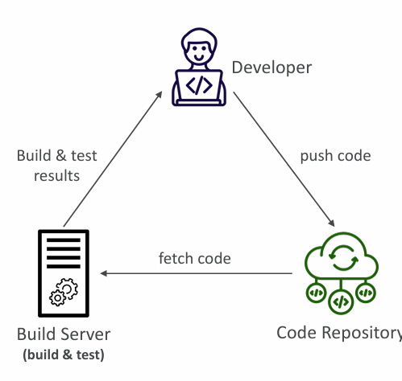
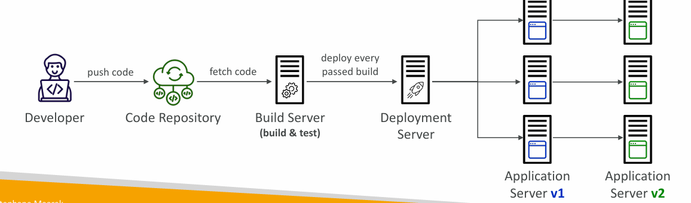
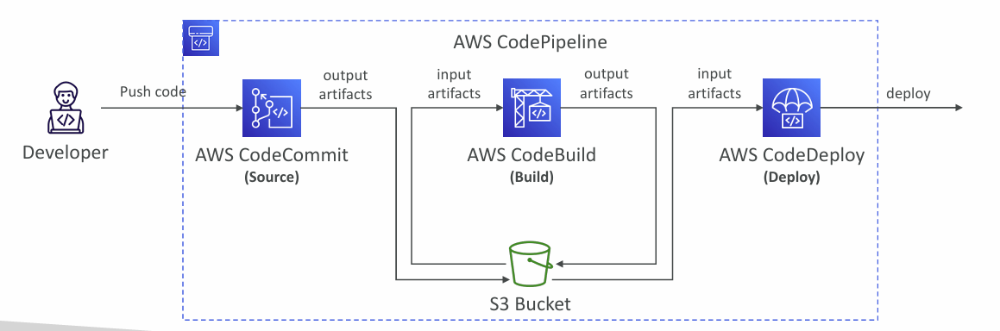

# Section 24. AWS CICD

## Continuous Integration (CI)

- Developers push the code to a code repository often (e.g., GitHub, CodeCommit, Bitbucket…)
- A testing / build server checks the code as soon as it’s pushed (CodeBuild, Jenkins CI, …)
- The developer gets feedback about the tests and checks that have passed / failed
- Find bugs early, then fix bugs
- Deliver faster as the code is tested
- Deploy often
- Happier developers, as they’re unblocked

## Continuous Delivery (CD)

- Ensures that the software can be released reliably whenever needed
- Ensures deployments happen often and are quick
- Shift away from “one release every 3 months” to ”5 releases a day”
- That usually means automated deployment (e.g., CodeDeploy, Jenkins CD, Spinnaker, …)

## AWS CodeCommit

- Version control is the ability to understand the various changes that happened to the code over time (and possibly roll back)
- All these are enabled by using a version control system such as Git
- A Git repository can be synchronized on your computer, but it usually is uploaded on a central online repository
- Benefits are:
- Collaborate with other developers
- Make sure the code is backed-up somewhere
- Make sure it’s fully viewable and auditable

---

- Git repositories can be expensive
- The industry includes GitHub, GitLab, Bitbucket, …
- And AWS CodeCommit:
  - Private Git repositories
  - No size limit on repositories (scale seamlessly)
  - Fully managed, highly available
  - Code only in AWS Cloud account => increased security and compliance
  - Security (encrypted, access control, …)
  - Integrated with Jenkins, AWS CodeBuild, and other CI tools

## CodeCommit – Security

- Interactions are done using Git (standard)
- Authentication
  - SSH Keys – AWS Users can configure SSH keys in their IAM Console
  - HTTPS – with AWS CLI Credential helper or Git Credentials for IAM user
- Authorization
  - IAM policies to manage users/roles permissions to repositories
- Encryption
  - Repositories are automatically encrypted at rest using AWS KMS
  - Encrypted in transit (can only use HTTPS or SSH – both secure)
- Cross-account Access
  - Do NOT share your SSH keys or your AWS credentials
  - Use an IAM Role in your AWS account and use AWS STS (AssumeRole API)

## AWS CodePipeline

- Visual Workflow to orchestrate your CICD
- **Source** – CodeCommit, ECR, S3, Bitbucket, GitHub
- **Build** – CodeBuild, Jenkins, CloudBees, TeamCity
- **Test** – CodeBuild, AWS Device Farm, 3rd party tools, …
- **Deploy** – CodeDeploy, Elastic Beanstalk, CloudFormation, ECS, S3, …
- **Invoke** – Lambda, Step Functions
- Consists of stages:
  - Each stage can have sequential actions and/or parallel actions
  - Example: Build -> Test -> Deploy -> Load Testing -> …
  - Manual approval can be defined at any stage

## CodePipeline – Artifacts

- Each pipeline stage can create artifacts
- Artifacts stored in an S3 bucket and passed on to the next stage

## CodePipeline – Troubleshooting

- For CodePipeline Pipeline/Action/Stage Execution State Changes
- Use **CloudWatch Events (Amazon EventBridge)**. Example:
  - You can create events for failed pipelines
  - You can create events for cancelled stages
- If CodePipeline fails a stage, your pipeline stops, and you can get information in the console
- If pipeline can’t perform an action, make sure the “IAM Service Role”
- AWS CloudTrail can be used to audit AWS API calls

## AWS CodeBuild

- A fully managed continuous integration (CI) service
- Continuous scaling (no servers to manage or provision – no build queue)
- Compile source code, run tests, produce software packages, …
- Alternative to other build tools (e.g., Jenkins)
- Charged per minute for compute resources (time it takes to complete the builds)
- Leverages Docker under the hood for reproducible builds
- Use prepackaged Docker images or create your own custom Docker image
- Security:
  - Integration with KMS for encryption of build artifacts
  - IAM for CodeBuild permissions, and VPC for network security
  - AWS CloudTrail for API calls logging

## Lambda Function Dependencies

- If your Lambda function depends on external libraries, You need to install the packages alongside your code and zip it together
- Upload the zip straight to Lambda if less than 50MB, else to S3 first
- Native libraries work: they need to be compiled on Amazon Linux
- AWS SDK comes by default with every Lambda function

## Lambda and CloudFormation – inline

- Cannot include function dependencies with inline functions

## Lambda and CloudFormation – through S3

- You must store the Lambda zip in S3
- You must refer the S3 zip location in the CloudFormation code
  - S3Bucket
  - S3Key: full path to zip
  - S3ObjectVersion: if versioned bucket

## Lambda Container Images

- Deploy Lambda function as container images of up to 10GB from ECR
- Base images are available for Python, Node.js, Java, .NET, Go, Ruby
- Can create your own image as long as it implements the Lambda Runtime API
- Test the containers locally using the Lambda Runtime Interface Emulator

## Lambda Container Images – Best Practices

- Strategies for optimizing container images:
  - Use AWS-provided Base Images
    - Stable, Built on Amazon Linux 2, cached by Lambda service
  - Use Multi-Stage Builds
    - Build your code in larger preliminary images, copy only the artifacts you need in your final container image, discard the preliminary steps
  - Build from Stable to Frequently Changing
    - Make your most frequently occurring changes as late in your Dockerfile as possible
  - Use a Single Repository for Functions with Large Layers
    - ECR compares each layer of a container image when it is pushed to avoid uploading and storing duplicates
- Use them to upload large Lambda Functions (up to 10 GB)

## AWS Lambda Versions

## AWS Lambda Aliases

## Lambda & CodeDeploy

- CodeDeploy can help you automate traffic shift for Lambda aliases
- Linear: grow traffic every N minutes until 100%
  - Linear10PercentEvery3Minutes
  - Linear10PercentEvery10Minutes
- Canary: try X percent then 100%
  - Canary10Percent5Minutes
  - Canary10Percent30Minutes
- AllAtOnce: immediate
- Can create Pre & Post Traffic hooks to check the health of the Lambda function

## Function URL

- Dedicated HTTP(S) endpoint for your Lambda function
- A unique URL endpoint is generated for you (never changes)
  - https://{url-id}.lambda-url.{region}.on.aws (dual-stack IPv4 & IPv6)
- Access your function URL through the public Internet only
- Supports Resource-based Policies & CORS configurations
- Can be applied to any function alias or to $LATEST (can’t be applied to other function versions)
- Create and configure using AWS Console or AWS API

## Function URL Security

- Resource-based Policy
  - AuthType NONE: allow public and unauthenticated access
  - AuthType AWS_IAM: IAM is used to authenticate and authorize requests
    - Same account: Identity-based Policy OR Resource-based Policy as ALLOW
    - Cross account: Identity-based Policy AND Resource Based Policy as ALLOW
- Cross-Origin Resource Sharing (CORS)

## Lambda and CodeGuru Profiling

- Gain insights into runtime performance of your Lambda functions using CodeGuru Profiler
- CodeGuru creates a Profiler Group for your Lambda function
- Supported for Java and Python runtimes
- Activate from AWS Lambda Console
- When activated, Lambda adds:
  - CodeGuru Profiler layer to your function
  - Environment variables to your function
  - AmazonCodeGuruProfilerAgentAccess policy to your function

## AWS Lambda Limits to Know - per region

- Execution:
  - Memory allocation: 128 MB – 10GB (1 MB increments)
  - Maximum execution time: 900 seconds (15 minutes)
  - Environment variables (4 KB)
  - Disk capacity in the “function container” (in /tmp): 512 MB to 10GB
  - Concurrency executions: 1000 (can be increased)
- Deployment:
  - Lambda function deployment size (compressed .zip): 50 MB
  - Size of uncompressed deployment (code + dependencies): 250 MB
  - Size of environment variables: 4 KB

## AWS Lambda Best Practices

- Perform heavy-duty work outside of your function handler
- Use environment variables
- Minimize your deployment package size to its runtime necessities
- Avoid using recursive code, never have a Lambda function call itself
