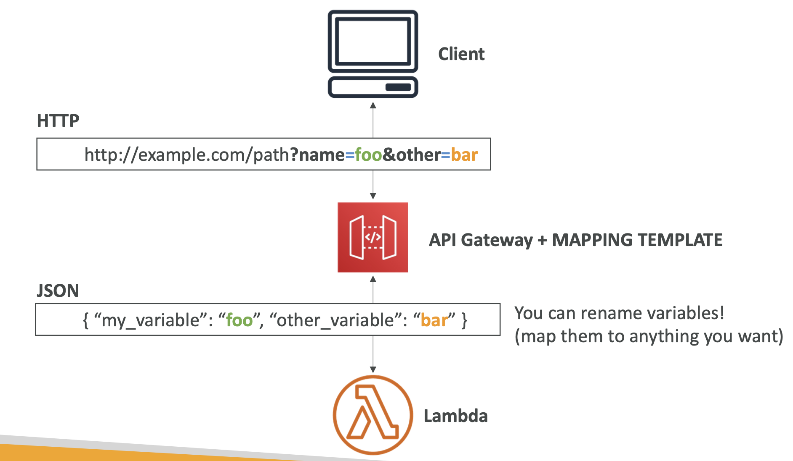

# Section 23. API Gateway

- Serverless API
  
- Handles Versioning, Deployment, and Security
- Support for the WebSocket Protocol

## Integrations High Level

- `Lambda Function`: Invoke a Lambda function.
- `HTTP`: Invoke an HTTP endpoint. (Add rate limiting, caching, user authentication, etc.)
- `AWS Service`: Invoke an AWS service. (Add authentication, deploy publicly, rate control, etc.)

## Endpoint Types

- `Edge-optimized`: Requests are routed through CloudFront. (For global clients)
- `Regional`: Requests are routed through a regional endpoint. (For clients in the same region)
- `Private`: Requests are routed through a VPC link. (For clients in the same VPC)

## Security

- User Authentication through

  - `IAM`
    
  - `Cognito`
    
  - `Custom Authorizers`
    

- Custom Domain Name HTTPS security through integration with AWS Certificate Manager (ACM)
  - `ACM` provides free SSL/TLS certificates for your domain names.
  - Must setup CNAME in your DNS provider (Route 53)

## Deployment Stages

- `Stage`: A logical reference to a lifecycle state of your API Gateway.
- `Stage Variables`: Variables that are accessible from your Lambda function.
  - Format: `${stageVariables.variableName}`

### Stages v1 and v2 API breaking change

### Stage Variables & Lambda Aliases

- Canary Deployment: Deploy a new version of your API to a subset of users. (Choose the % of traffic the canary channel receives)
  

## Integration Types

- `MOCK`: API Gateway returns a response without sending the request to the backend.
- `HTTP / AWS`: API Gateway configures the request & response with mapping templates.
- `AWS Proxy`: API Gateway passes the request to the backend service without changing the request.
- `HTTP Proxy`: API Gateway passes the request to the backend service with changing the HTTP Headers.

### Mapping Templates

- Transform the request and response from API Gateway to the backend service.
- Use Velocity Template Language (VTL) to transform the request and response.
- Use `$input` to access the request.
- Content-Type can be set to application/json or application/xml.
  
  

## Open API spec

- `OpenAPI`: A specification for building APIs.
- Import an OpenAPI spec to API Gateway or export an API Gateway API to an OpenAPI spec.
- Request Validation: Validate the request against the OpenAPI spec.
  - When the request is invalid, API Gateway returns a 400 Bad Request response.

## API Gateway Caching

- Cache responses from your backend API.
- Reduce the number of calls to your backend API.
- Cache can be invalidated by time-to-live (TTL) or by invalidating the cache.

### Cache Invalidation

- `Invalidate Cache`: Invalidate the cache for a specific resource.
- `Flush Entire Cache`: Invalidate the cache for all resources.

### Usage Plans & API Keys

- `Usage Plan`: A plan that specifies who can access one or more deployed API stages and methods.
- `API Key`: A token that API Gateway uses to identify the caller.
- Correct order of operations:
  1. Create an API Key.
  2. Create a Usage Plan.
  3. Add the API Key to the Usage Plan.
  4. Associate the Usage Plan with the API Stage.

## Logging & Tracing

- CloudWatch Logs: Log requests and responses.
  
  - Integration Latency: The time between when API Gateway relays a request to the backend and when it receives a response from the backend.
  - Latency: The time between when API Gateway receives a request and when it sends a response.
- X-Ray: Trace requests as they travel through your API Gateway.

## Throttling

- `Account Limit`: The maximum number of requests per second (rps) that you can make to your API Gateway.
- Too many requests: API Gateway returns a 429 Too Many Requests response.
- Can set Stage limit & Method limits or use Usage Plans.

## Cross-Origin Resource Sharing (CORS)

- `CORS`: A security feature that restricts resources from another domain.
- Enable CORS for your API Gateway.
  
