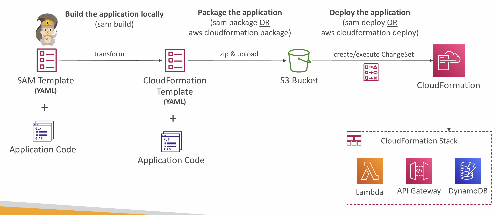
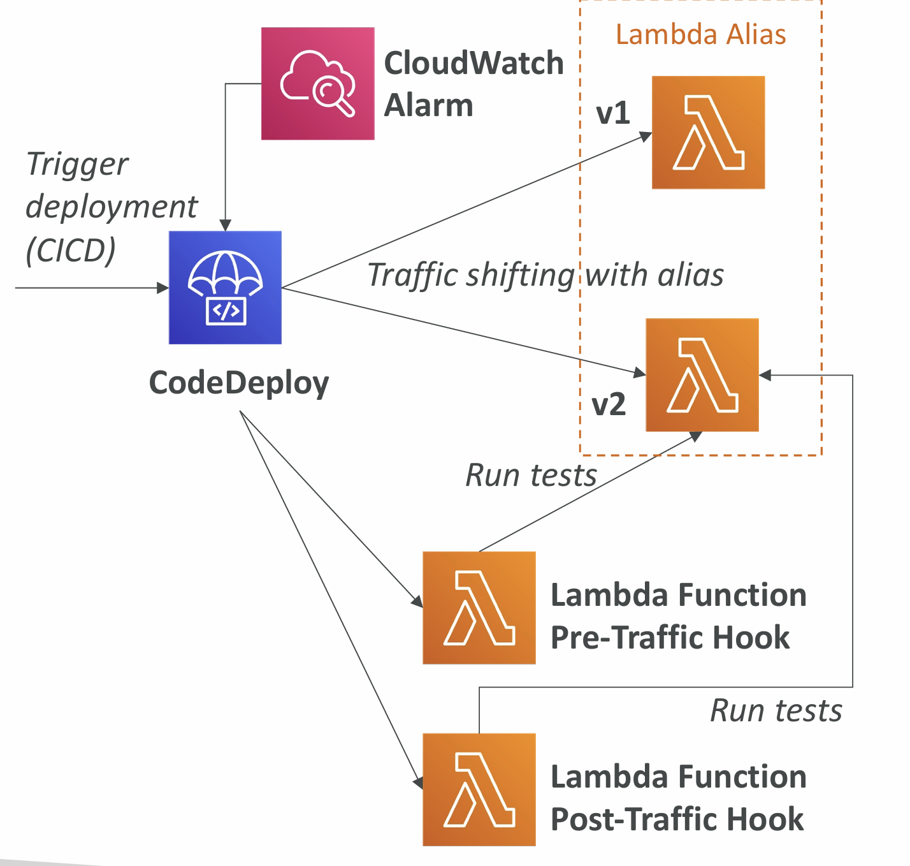
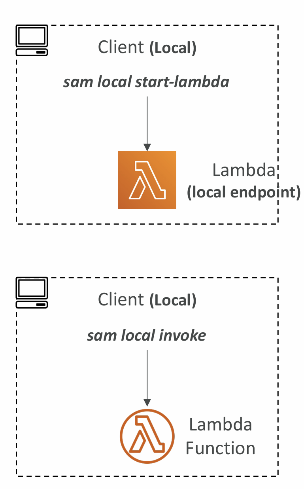
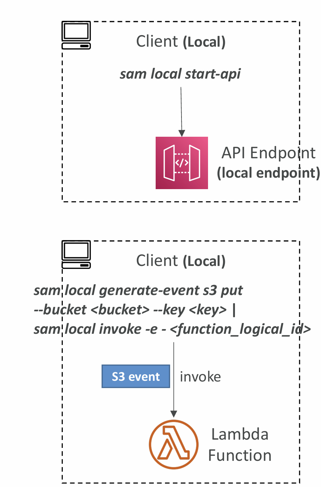

# Section 25. AWS Serverless Application Model (SAM)

## AWS SAM

- SAM = Serverless Application Model
- Framework for developing and deploying serverless applications
- All the configuration is YAML code
- Generate complex CloudFormation from simple SAM YAML file
- Supports anything from CloudFormation: Outputs, Mappings, Parameters, Resources…
- Only two commands to deploy to AWS
- SAM can use CodeDeploy to deploy Lambda functions
- SAM can help you to run Lambda, API Gateway, DynamoDB locally

## AWS SAM – Recipe

- Transform Header indicates it’s SAM template:
  - Transform: 'AWS::Serverless-2016-10-31'
- Write Code
  - AWS::Serverless::Function
  - AWS::Serverless::Api
  - AWS::Serverless::SimpleTable
- Package & Deploy:
  - aws cloudformation package / sam package
  - aws cloudformation deploy / sam deploy

## Deep Dive into SAM Deployment

## SAM – CLI Debugging

- Locally build, test, and debug your serverless applications that are defined using AWS SAM templates
- Provides a lambda-like execution environment locally
- SAM CLI + AWS Toolkits => step-through and debug your code
- Supported IDEs: AWS Cloud9, Visual Studio Code, JetBrains, PyCharm, IntelliJ, …
- AWS Toolkits: IDE plugins which allows you to build, test, debug, deploy, and invoke Lambda functions built using AWS SAM

## SAM Policy Templates

- List of templates to apply permissions to your Lambda Functions
- Full list available here:
  https://docs.aws.amazon.com/serverless-application-model/latest/developerguide/serverless-policy-templates.html#serverless-policy-template-table
- Important examples:
  - S3ReadPolicy: Gives read only permissions to objects in S3
  - SQSPollerPolicy: Allows to poll an SQS queue
  - DynamoDBCrudPolicy: CRUD = create read update delete

## SAM and CodeDeploy

- SAM framework natively uses CodeDeploy to update Lambda functions
- Traffic Shifting feature
- Pre and Post traffic hooks features to validate deployment (before the traffic shift starts and after it ends)
- Easy & automated rollback using CloudWatch Alarms

---

- AutoPublishAlias
  - Detects when new code is being deployed
  - Creates and publishes an updated version of that function with the latest code
  - Points the alias to the updated version of the Lambda function
- DeploymentPreference
  - Canary, Linear, AllAtOnce
- Alarms
  - Alarms that can trigger a rollback
- Hooks
  - Pre and post traffic shifting Lambda functions to test your deployment

## SAM – Local Capabilities

- Locally start AWS Lambda
  - sam local start-lambda
  - Starts a local endpoint that emulates AWS Lambda
  - Can run automated tests against this local endpoint
- Locally Invoke Lambda Function
  - sam local invoke
  - Invoke Lambda function with payload once and quit after invocation completes
  - Helpful for generating test cases
  - If the function make API calls to AWS, make sure you are using the correct --profile option

---

- Locally Start an API Gateway Endpoint
  - sam local start-api
  - Starts a local HTTP server that hosts all your functions
  - Changes to functions are automatically reloaded
- Generate AWS Events for Lambda Functions
  - sam local generate-event
  - Generate sample payloads for event sources
  - S3, API Gateway, SNS, Kinesis, DynamoDB…

## SAM – Exam Summary

- SAM is built on CloudFormation
- SAM requires the Transform and Resources sections
- Commands to know:
  - sam build: fetch dependencies and create local deployment artifacts
  - sam package: package and upload to Amazon S3, generate CF template
  - sam deploy: deploy to CloudFormation
- SAM Policy templates for easy IAM policy definition
- SAM is integrated with CodeDeploy to do deploy to Lambda aliases
