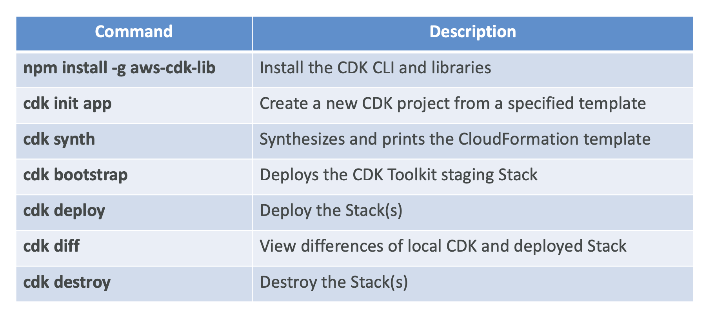

# Section 26. Cloud Development Kit (CDK)

- Define infrastructure using familiar programming languages. (e.g. TypeScript, Python, Java, C#)
- The codes are compiled into CloudFormation templates.
  
  

## CDK + SAM

- Use SAM CLI to locally test your CDK apps.
  

## CDK Constructs

- A construct is a cloud component that represents a resource or a collection of resources.
- AWS Construct Library provides a collection of constructs that represent AWS resources.
- 3 levels of constructs: L1, L2, L3

### L1 Constructs

- Directly reflect AWS resources.
- Can be called CFN resources.
- Construct names start with `Cfn`. (e.g. `CfnBucket`, `CfnTable`)
- Must explicitly configure all resource properties.

### L2 Constructs

- Higher-level abstractions of AWS resources.
- Similar functionality as L1 but with convenient defaults and boilerplate.

### L3 Constructs

- Can be called Patterns, which represents multiple related resources.
- Helps you complete common tasks in AWS.
  

## Important CDK Commands

## CDK Bootstrapping

- The first time you deploy an app in an AWS account, you need to run `cdk bootstrap` to create a CloudFormation stack.
- AWS Environment = account & region

## CDK Testing

- Use `CDK Assertions Module` with popular testing frameworks. (e.g. Jest, Pytest)
- 2 types of tests:
  - Fine-grained tests: Test specific aspects of the CloudFormation template.
  - Snapshot tests: Test the synthesized CloudFormation template against a previously stored baseline template.

