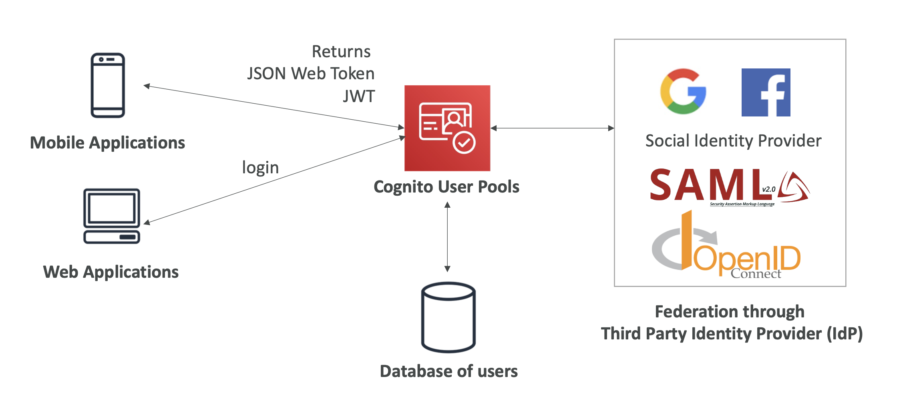
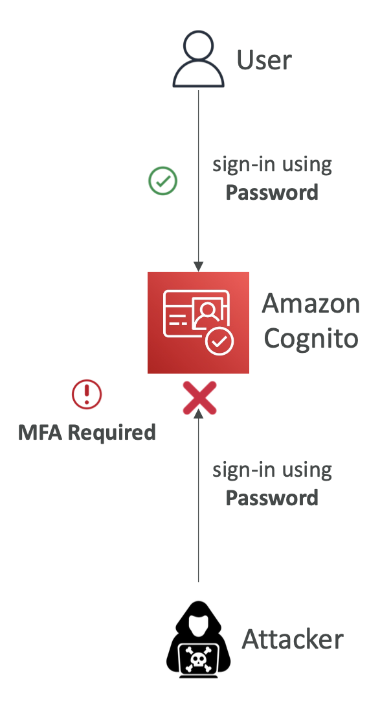
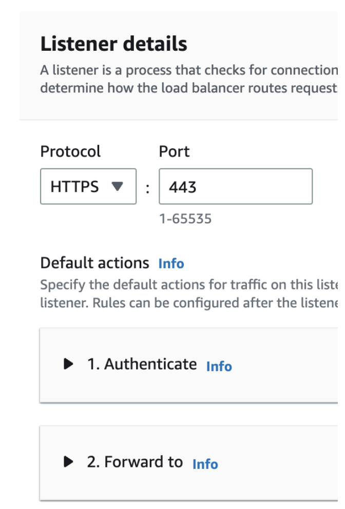
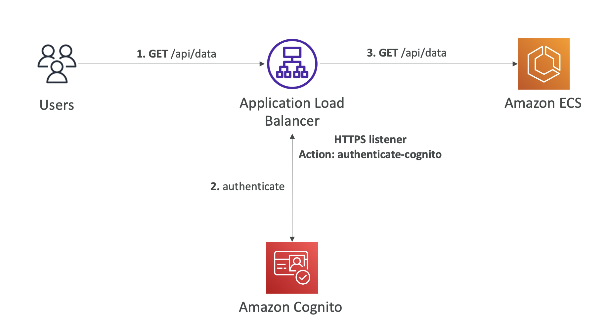
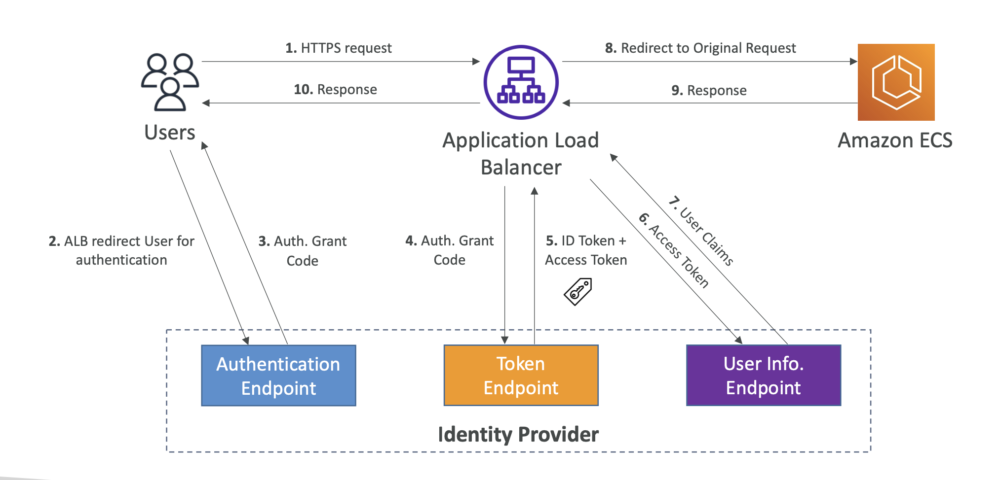
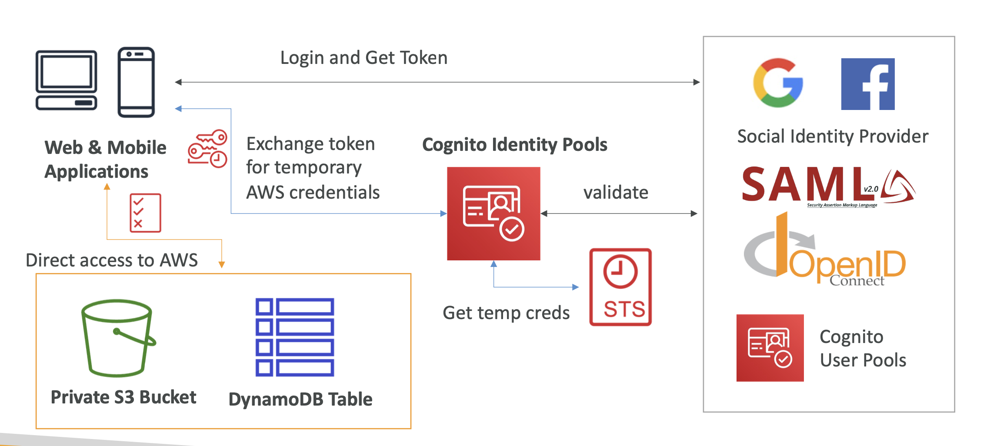
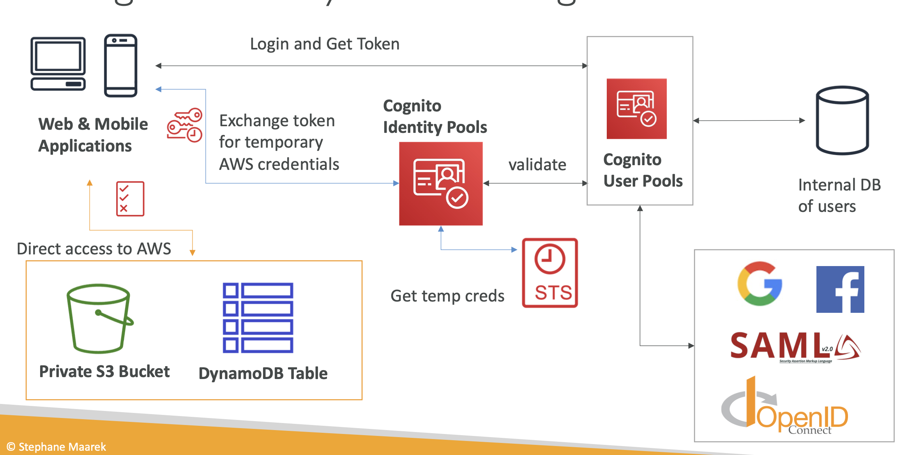
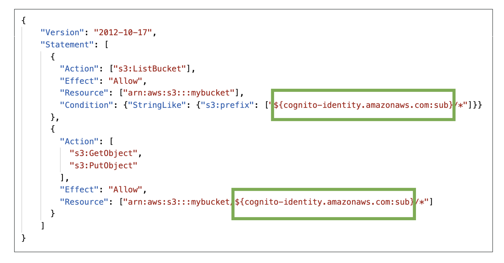

# Section 27. Cognito: Cognito User Pools, Cognito Identity Pools & Cognito Sync

- Give users an identity to interact with our web or mobile application.

## Cognito User Pools (CUP)

- User directory that manages user registration, authentication, and account recovery.
- Login sends back a JSON Web Token (JWT).
- Can be integrated with API Gateway, Lambda, and other AWS services.
  

### Hosted Authentication UI

- Cognito provides a hosted UI to sign up and sign in users.
- Can customize with a custom logo and custom CSS.

### Adaptive Authentication

- Block sign-ins or require MFA if the login appears suspicious.
- Users are prompted for a second MFA only when risk is detected.
- Risk score is based on different factors such as if the user has used the same device, location, or IP address.
  

### JWT

- JSON Web Token (JWT) is a compact, URL-safe means of representing claims to be transferred between two parties.
- The Payload will contain the user information (sub UUID, given_name, email, phone_number, attributes...)
- From the sub UUID, you can retrieve all users details from Cognito / OIDC.

### Application Load Balancer – Authenticate Users

- ALB can authenticate users using Cognito User Pools.
- Offload the work of authenticating users to your load balancer.
- Your applications can focus on their business logic.

- Must use an HTTPS listener to set authenticate-oidc & authenticate-cognito rules.
  

- Cognito Auth
  

- OIDC Auth
  

## Cognito Identity Pools (CIP)

- Federated identities for users.
- Get identities for “users” so they obtain temporary AWS credentials.

- CIP with CUP
  

### IAM Roles

- Default IAM roles for authenticated and unauthenticated users (guests).
- Define rules to choose the role for each user based on the user’s ID.
- Partition users’ access using policy variables.
- IAM credentials are obtained using the STS (Security Token Service) API.

- Policy Variables on S3
  

## CUP vs CIP

- CUP: Authentication.

  - User directory.
  - Login sends back a JWT.

- CIP: Authorization.
  - Federated identities.
  - Get AWS credentials.
