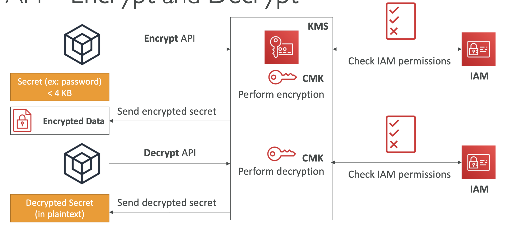

# Section 30.Security: KMS, Encryption SDK, SSM Parameter Store, IAM & STS

## Encryption

- `Encryption in flight (SSL/TLS)`

  - Data is encrypted before sending and decrypted after receiving.
  - Ensures no MITM (man in the middle attack).
    

- `Server-side encryption at rest`

  - Data is encrypted after being received by the server and decrypted before being sent.
  - Stored in an encrypted form thanks to a key.
    

- `Client-side encryption`
  - Data is encrypted by the client and never decrypted by the server.
  - The server only stores the encrypted data and does not have access to the encryption keys.
    

## KMS (Key Management Service)

- AWS Manages encryption keys for us.
- Fully integrated with IAM for authorization.
- Seamlessly integrated into most AWS services. (EBS, S3, RDS, etc.)

- KMS Keys Types:

  - `Symmetric (AES-256)`: Single key to encrypt and decrypt.
  - `Asymmetric (RSA & ECC - Elliptic Curve Cryptography)`: Public and private key pair. Public key encrypts data, private key decrypts data.

- KMS Workflow (Server-side encryption):
  

- Envelope Encryption (Client-side encryption):

  - Encrypt > 4KB.
  - GenerateDataKey API.
  - Envelope Encryption:
    
  - Decrypt Envelope Data:
    

- KMS Request Quotas:
  - Throttling Exceptions when you exceed the request rate.
  - Solution:
    - Exponential backoff.
    - DEK caching from the Encryption SDK.
    - Request a Request Quotas increase through API or AWS support.

- S3 Bucket Key for SSE-KMS encryption
  - Decrease number of KMS calls from S3 by 99%.
  - Decrease cost of KMS calls from S3 by 99%.
    

## CloudHSM

- Cloud Hardware Security Module.
- Hardware security module (HSM) for key storage and cryptographic operations.
- Users manage their own keys entirely. (Not AWS).
- No free tier.
  

- High Availability:
  - Multiple HSMs in multiple AZs.
    

## SSM Parameter Store

- Secure storage for configuration and secrets.

- SSM Parameter Store Hierarchy:
  

## Secrets Manager

- Rotate, manage and retrieve secrets from the AWS console.
- Secrets are encrypted using KMS.

- Multi-Region Secrets:
  - Replicate Secrets across multiple AWS Regions.
    

- Secrets Manager vs SSM Parameter Store:
<table>
  <tr>
    <th>SSM Parameter Store</th>
    <th>Secrets Manager</th>
  </tr>
  <tr>
    <td>No secret rotation</td>
    <td>Automatic rotation of secrets with AWS Lambda</td>
  </tr>
  <tr>
    <td>Cheap</td>
    <td>Expensive</td>
  </tr>
  <tr>
    <td>KMS encryption is optional</td>
    <td>KMS encryption is mandatory</td>
  </tr>
</table>

- SSM Parameter Store vs. Secrets Manager Rotation
  

## Cloudformation - Dynamic References

- Reference external values stored in Systems Manager Parameter Store and Secrets Manager within CloudFormation templates.
- CloudFormation retrieves the value of the specified reference during create/update/delete operations.
  

- Option 1: ManageMasterUserPassword

  - creates admin secret implicitly.
    

- Option 2: Dynamic Reference
  
