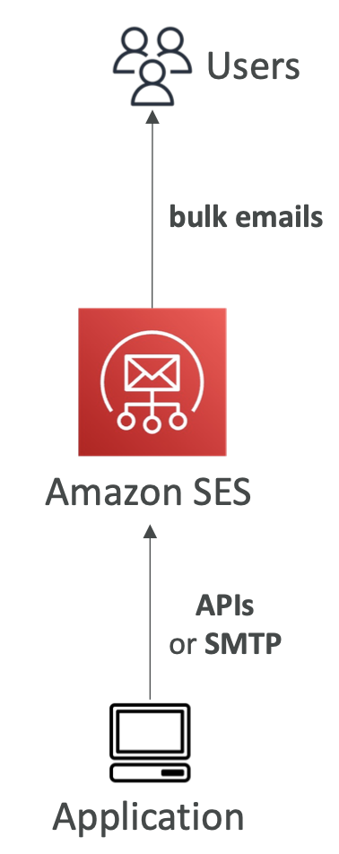
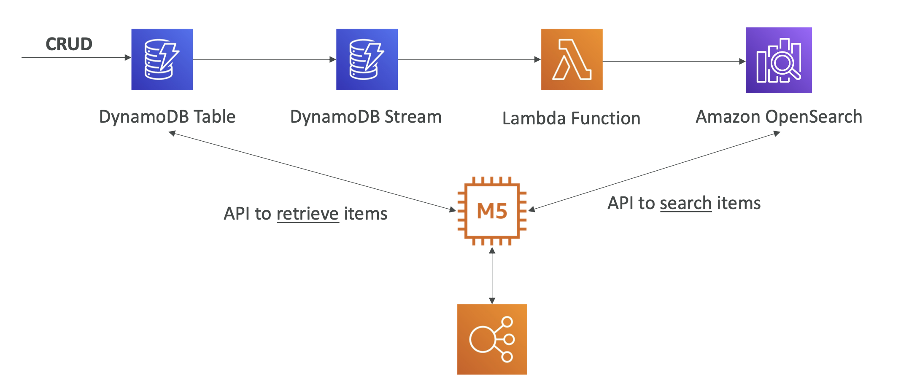
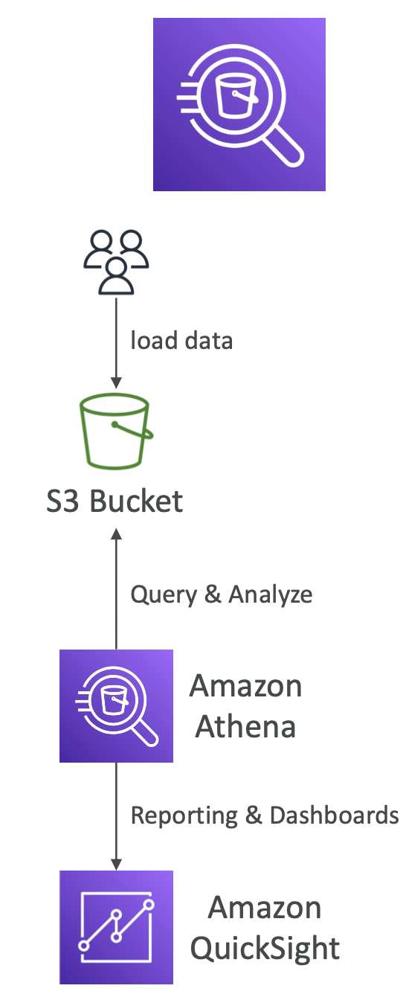
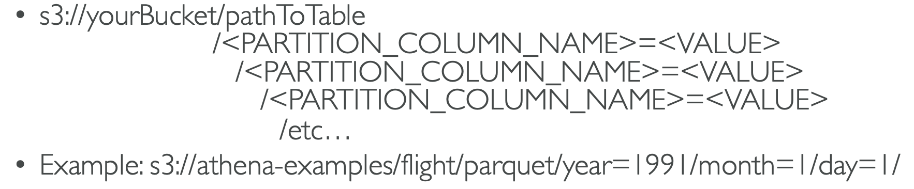
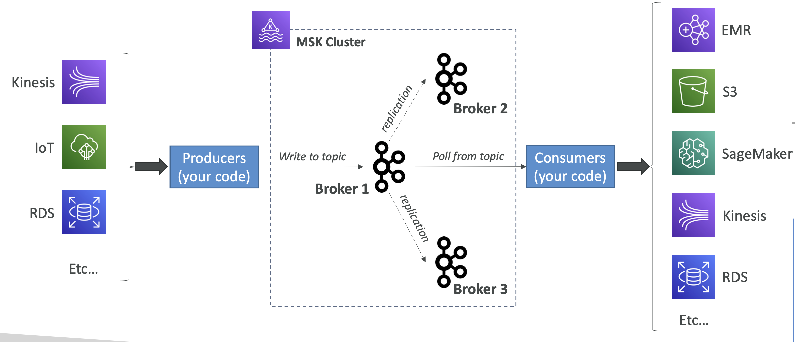
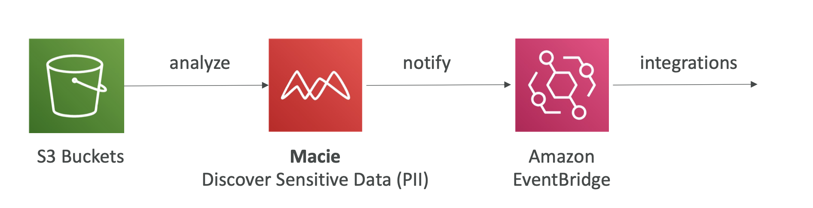
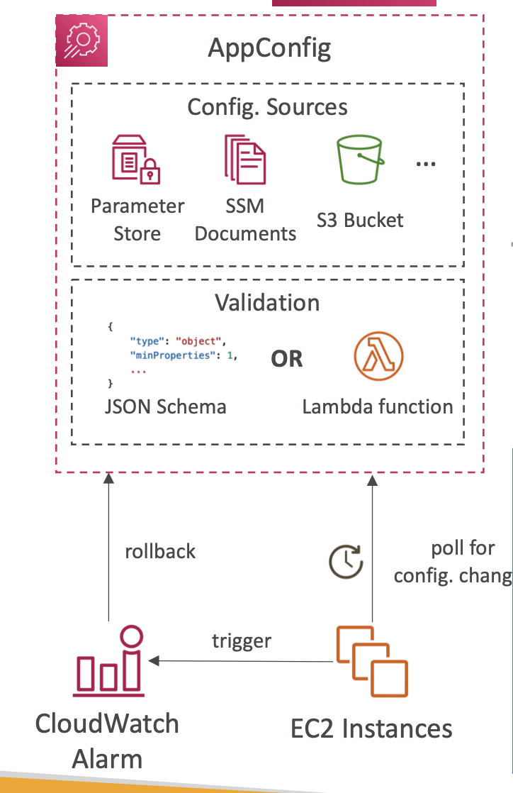

# Section 31. Other Services

## Amazon Simple Email Service (Amazon SES)

- Fully managed service to send emails securely, globally and at scale.
- Reputation dashboard, performance insights, anti-spam feedback.
- Provides statistics such as email deliveries, bounces, feedback loop results, email open.
  

## OpenSearch Service

- Successor to Amazon Elasticsearch Service.
- Can search any field, even partially matches.
- Does not natively support SQL (can be enabled via a plugin).
  

## Athena

- Serverless query service to analyze data stored in Amazon S3.
- Uses standard SQL language to query the files (built on Presto).
- Commonly used with Amazon Quicksight for reporting/dashboards.
  

### Performance Improvement

- Columnar data: Store data in columnar format (Parquet, ORC).
- Compress data: Compress data to reduce the amount of data scanned.
- Partition data: Partition data in S3 to reduce the amount of data scanned.
  

## Amazon Managed Streaming for Apache Kafka (Amazon MSK)

- Fully managed service for Apache Kafka.
- Creates & manages Kafka brokers nodes & Zookeeper nodes for you.
  

## AWS Certificate Manager (ACM)

- Managed service to provision, manage and deploy SSL/TLS certificates.
- Used to provide in-flight encryption for websites (HTTPS)

## AWS Certificate Authority (CA)

- Managed service allows you to create private Certificate Authorities (CA), including root and subordinaries CAs.
- Certificates are trusted only by your Organization (not the public Internet).

## AWS Macie

- Fully managed data security and data privacy service.
- Uses machine learning and pattern matching to discover, classify and protect sensitive data.
  

## AWS AppConfig

- Application configuration management service.
- Helps you deploy application configurations in a managed and secure way.
- Validate configuration changes before deployment using:
  - JSON Schema (syntactic check)
  - Lambda Function – run code to perform validation (semantic check)
    
