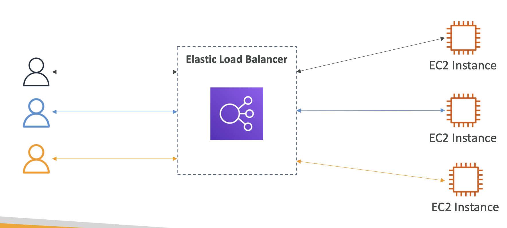
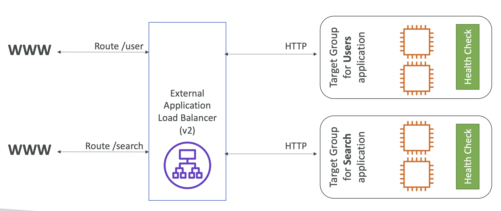
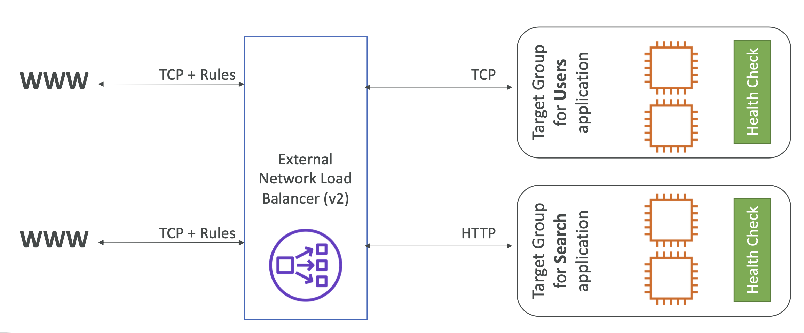
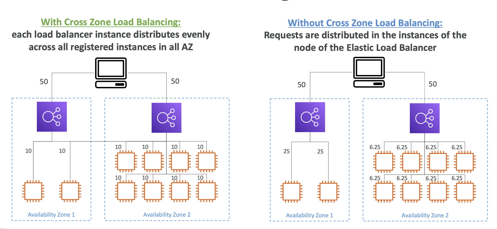
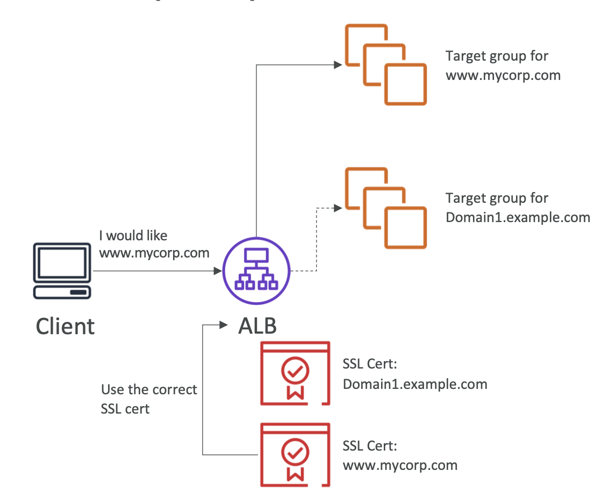

# Section 7. ELB + ASG

## Availability & Scalability

- **Availability**: Ensuring that your system is up and running. (Highly available system)
- **Scalability**: Handling the load by increasing or decreasing in size. (Elastic system)

## Load Balancer

- **Distributes incoming network traffic** across multiple servers.
  
- **Elastic Load Balancer (ELB)**: Managed load balancer (integrated with AWS services).
- **Health Checks**: Monitors the health of the instances.

## Classic Load Balancer (CLB)

- Deprecated & replaced by **Application Load Balancer (ALB)** and **Network Load Balancer (NLB)**.
- **Layer 4 (TCP)** and **Layer 7 (HTTP/HTTPS)** load balancer.
- **Health Checks**: Ping target (TCP) or HTTP endpoint (HTTP/HTTPS).

## Application Load Balancer (ALB)

- **Layer 7 (HTTP/HTTPS)** load balancer.
- **Routing tables**: Routes traffic to different target groups based on the rules. (ex. path-based, host-based, query string-based)
- Having a port mapping feature to redirect traffic to different ports. -> Useful for microservices architecture.
  
- Target Groups: Group of instances that receive traffic from the load balancer.
  - EC2 instances
  - ECS tasks
  - Lambda functions
  - IP addresses
- Fixed hostname.

## Network Load Balancer (NLB)

- **Layer 4 (TCP)** and **Layer 7 (TLS)** load balancer.
- **Static IP**: Public IP that does not change.
- **High Throughput**: Handle millions of requests per second. (Low latency)
  

## Gateway Load Balancer (GWLB)

- **Layer 3 (IP)** load balancer.
- Deploy, scale, and manage virtual appliances. (ex. Firewall, WAF, IDS/IPS)

## Sticky Sessions

- **Session Affinity**: Ensures that the same client is always redirected to the same instance. (Useful for stateful applications)
- **Application-based Cookie**: Uses a cookie generated by the application.
- **Duration-based Cookie**: Uses a cookie generated by the load balancer.

## Cross-Zone Load Balancing

- With Cross-Zone Load Balancing: Distributes traffic evenly across all instances in **all** AZs.
- Without Cross-Zone Load Balancing: Distributes traffic evenly across all instances in **the same** AZ.
  
- ALB: Enabled by default & NLB: Disabled by default.

## SSL/TLS

- **Secure Sockets Layer (SSL)** and **Transport Layer Security (TLS)**: Secure communication over the internet.
- **SSL Certificate**: Allows traffic between clients and load balancer to be encrypted in transit (in-flight encryption)
  
- **SNI (Server Name Indication)**: Allows multiple SSL certificates to be hosted on the same IP address (1 web server, multiple websites) -> ALB & NLB support SNI.
  

## Connection Draining

- **Connection Draining**: Ensures that the load balancer stops sending new requests to the instance that is deregistering or unhealthy.

## Auto Scaling Group (ASG)

- **Auto Scaling Group (ASG)**: Automatically adjusts the number of instances based on the demand.
- **Launch Template**: Template for launching instances. (ex. AMI, instance type, key pair, security group, load balancer info)
- **Scaling Policies**: Scale out (increase) or scale in (decrease) based on the conditions.
  - **Dynamic Scaling**: Target tracking (CPU utilization, memory utilization, etc.) & Step scaling (CloudWatch alarms trigger)
  - **Scheduled Scaling**: Scale out or in based on the schedule.
  - **Scaling Cooldown**: Time period to wait before the next scaling activity.
  - **Instance Refresh**: Replace instances with the new ones.
