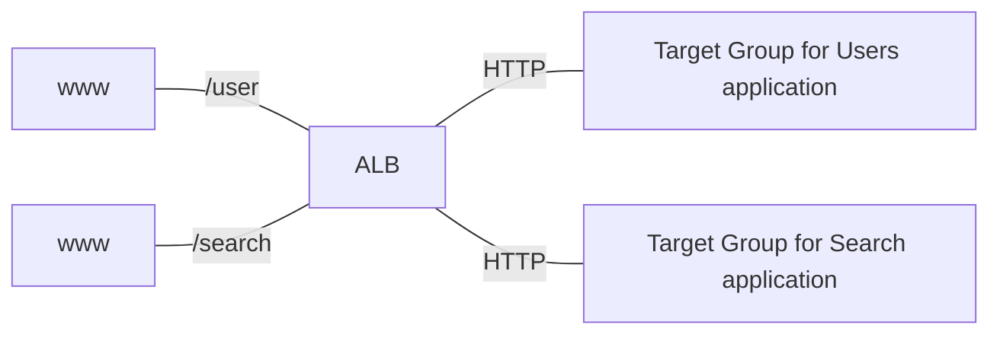
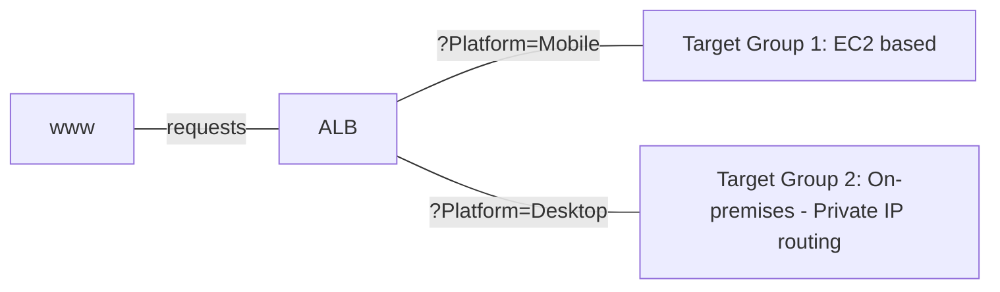
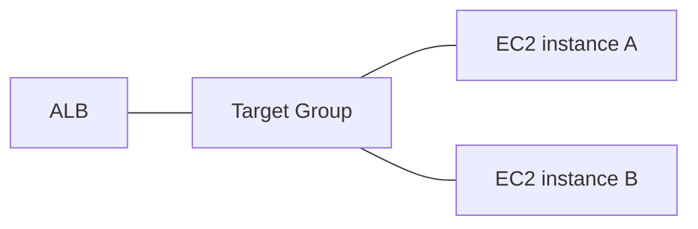
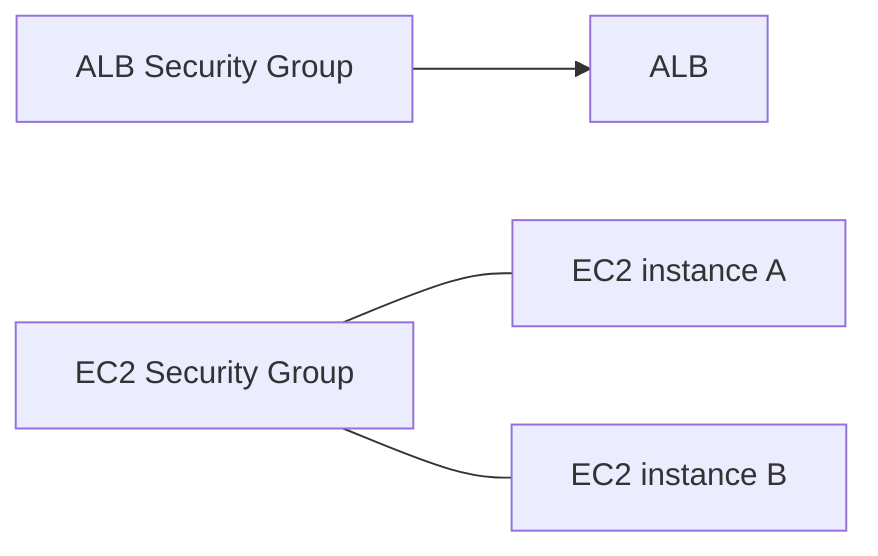
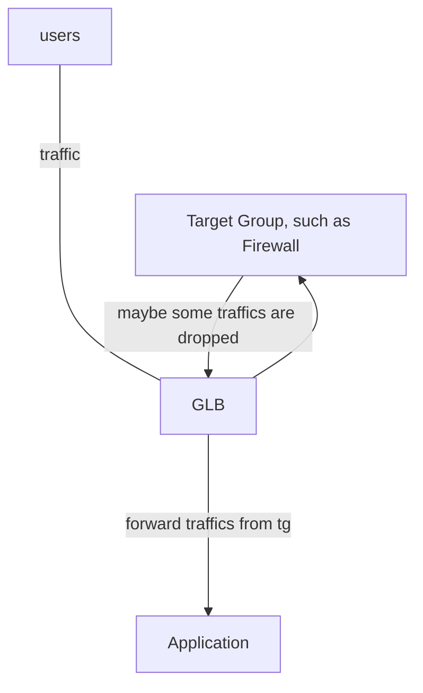
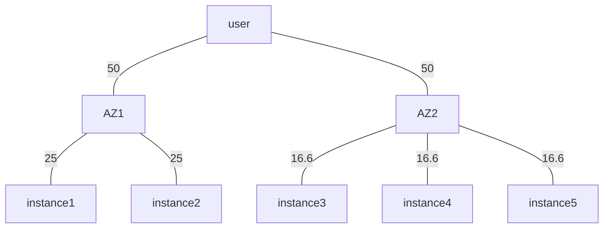
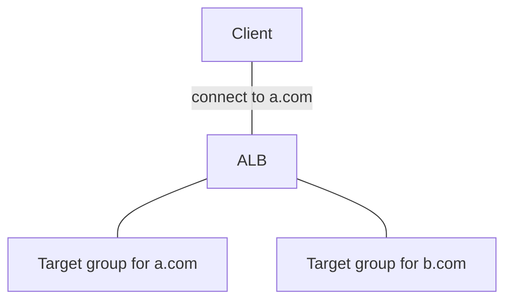

# section7

## Scalability & High Availability

### Scalability

- Scalability: application / system can handle greater loads by adapting
  - Vertical Scalability
  - Horizontal Scalability (== elasticity)
- **Scalability != High Availalability**, but both are linked

#### Vertical Scalability

- increasing the size of the instance
- common for non distributed systems, such as a database
- there's a limit to how much you can vertically scale (HW limit)

#### Horizontal Scalability

- increase the number of instances / systems for your application
- horizontal scale is available at distributed systems: common for web applicadtions, modern applications
- very easy to horizontally scale with cloud offerings such as EC2

### High Availability

- goes hand in hand with horizontal scaling
- goal of high availability == survive a data center loss (== make application to be available 24 hrs / day as possible)
- can be passive (RDS Multi AZ) or active (horizontal scaling)

### High Availability & Scalability for EC2

- Vertical Scaling: Increasing instance size (scale up / down)
- Horizontal Scaling: Increasing number of instances (scale out / in)
- High Availability: Run instances for the same application across multi AZ
  - Auto Scaling Group multi AZ
  - Load Balancer multi AZ

## Load Balancing

- Load Balancer: server that forward traffic to multiple servers downstream
- why use a load balancer?
  - spread load across multiple downstream instances (effectively)
  - expose a single point of access to your application (to DNS)
  - seamlessly handle failures of downstream instances & regular health checks to instances
  - provide SSL termination for your websites
  - enforce stickiness with cookies
  - help achieving high availability across zones
  - separate public traffic from private traffic

### Elastic Load Balancer

- managed load balancer
  - AWS guarantees that it will be working
  - AWS takes care of upgreades, maintenance, high availability
  - AWS provides only a few config knobs
- costs more, but much easier than setting up your own load balancer
- integrated with many AWS offerings / services
  - EC2, AWS Certified Manager, CloudWatch, Route53, AWS WAF, ...

#### Health Checks

- enable load balancer to know if downstream instances are available to reply to requests
- done on a port and a route (`/health` is common)

#### Types of AWS load balancer

1. Classic Load Balancer (v1, 2009): HTTP, HTTPS, TCP, SSL (secure TCP)
2. Application Load Balancer (v2, 2016): HTTP, HTTPS, WebSocket
3. Network Load Balancer (v2, 2017): TCP, TLS (Secure TCP), UDP
4. Gateway Load Balancer (2020): Operates at Network layer (L3) - IP Protocol

- Overall, it's recommended to use newer generation
- some can be setup as internal or external

#### Load Balancer Security Groups

1. Load Balancer: allow HTTP, HTTPS from anywhere
2. instances: allow traffic only from Load Balancer - 이를 위해 instance의 security group의 'source'에 Load Balancer Security Group을 넣으면 된다!

#### Application Load Balancer

- works at L7 (HTTP)
- Load balancing to
  1. multiple HTTP applications across machines (target groups)
  2. multiple applications on the same machine (like containers)
- routing tables to different target groups:
  - Routing based on
    1. path in URL
    2. hostname in URL
    3. Query String, Headers
- great fit for micro services & container-based application (Docker & ECS)
- Has a port mapping feature to redirect to a dynamic port in ECS
- We would need multiple load balancers with Classic Load Balancer

##### HTTP Based Traffic

##### Target Groups

- Can be one of following:
  - EC2 instances (managed by Auto Scaling Group) - HTTP
  - ECS tasks (managed by ECS itself) - HTTP
  - Lambda functions - HTTP request translated into a JSON event: base of 'serverless'
  - IP Addresses - must be private IPs
- ALB can route to multiple target groups
- Health checks are at the target group level

##### Query Strings / Parameters Routing

##### Good to know

- Fixed Hostname (XXX.region.elb.amazonaws.com)
- application servers don't see IP of the client(request sender) directly (replaced to Load Balancer's Private IP since the packet is relayed via Load Balancer!)
  - true IP inserted at header `X-Forwarded-For`
  - true Port inserted at header `X-Forwarded-Port` and proto `X-Forwarded-Proto`

##### Hands-on summary

###### overview

###### security group

- If we add inbound rule that only allow `ALB Security Group` to `EC2 Security Group`, now two instances are only reachable via ALB

###### ALB rules

- condition
  - type: `HTTP request method`, `Path(url after hostname)`, `Source IP`, `Host header(hostname)`, `HTTP header`, `Query String`
- actions
  - type: forward to target groups, redirect to URL, return fixed response
- priority

#### Network Load Balancer

- work on L4(Transport Layer):
  - Forward **TCP, UDP traffic** to your instances
  - handle millions request per seconds
  - **latency ~100ms (vs 400ms for ALB)**
- NLB has **one static IP per AZ** and supports assigning Elastic IP
- NLB are used for extreme performance, TCP or UDP traffic
- Not included in AWS free tier

##### Target Groups

- EC2 instances
- IP addresses: must be private IPs
  - for example, you can use both EC2 and your own server's IP
- ALB
- Health Checks are supported via **TCP, HTTP, HTTPS protocols (not only TCP!)**

#### Gateway Load Balancer

- deploy, scale, manage a fleet of 3rd party network virtual appliances in AWS
- ex: firewalls, intrusion detection & prevention systems, deep packet inspection systems, payload manipulation, ...

- summary:
  1. GLB receive packets from users
  2. GLB forward all the packets to target group
  3. target group do some tasks on packets (just log all of them, or maybe drop some of them for security), and send packets back to GLB
  4. GLB forward all the packets (from target group) to destination (application)

- operates at L3 (Network Layer) - IP packets
  - combine following functions:
    - Transparent Network Gateway: Single entry/exit for all traffic
    - Load Balancer: distributes traffic to your virtual appliances
- use **GENEVE** protocol on port **6081** (appear on exam!)

##### Target Groups

- EC2 instances
- IP Addresses

#### Sticky Sessions (Session Affinity)

- stickiness: same client to always be redirected to the same instance behind a load balancer
  - 새로고침 할 때마다 다른 instance로 redirect 되면 로그인 유지 같은 것이 어려워질 수 있음
- implement stickiness with "cookie", which has expiration date you control
- works for Classic / Application / Network Load Balancer (not GLB)
- but this may bring imbalance load among EC2 instances

##### Cookie Names

- application-based cookies
  - custom cookie
    - generated by the target
    - can include any custom attributes required by the application
    - cookie name must be specified individually for each target group
    - except `AWSALB`, `AWSALBAPP`, `AWSALBTG` (reserved by ELB)
  - application cookie
    - generated by the load balancer
    - cookie name is `AWSALBAPP`
- duration-based cookies
  - generated by the load balancer
  - cookie name is `AWSALB` for ALB, `AWSELB` for CLB(deprecated)
- no need to remember all cookie names
- TODO: application cookie vs duration-based cookies - 뭔 차이가 있는걸까?
- hands-on
  1. target groups - edit attributes - check `turn on stickiness`
  2. choose type between `load balancer generated cookie`, `application-based cookie`
  3. choose duration

#### cross-zone load balancing

- ALB
  - enabled by default (can disable at Target Group level)
  - No charges for inter AZ data
- NLB, GLB
  - disabled by default
  - **charges** for inter AZ data

##### without Cross Zone Load Balancing

##### with Cross Zone Load Balancing

- still 50:50 across AZ1, AZ2, but distributed later -> this is charged for NLB, GLB, but not for ALB

#### SSL Certificates

##### SSL/TLS basics

- SSL certificate allows traffic between your clients and your load balancer to be encrypted 'in transit' (in-flight encryption)
- SSL(Secure Sockets Layer): encrypt connections
- TLS(Transport Layer Security): newer version
- TLS are mainly used nowadays (but still referred as SSL)
- public SSL certficates are issued by CA(Certificate Authorities)
- has expiration date so must be renewed

##### overview

- load balancer uses X.509 certificate
- you can manage certificates using ACM (AWS Certificate Manager)
- can also use your own certificates
- HTTPS listener:
  - you must specify a default certificate
  - you can add optional list of certs to support multiple domains
  - clients can use SNI (Server Name Indication) to specify the hostname they reach
  - has ability to specify security policy (to support older versions of SSL/TLS)

##### Server Name Indication (SNI)

- solves the problem of loading **multiple SSL certificates onto one web server** (to serve multiple websites)
- requires client to *indicate* the hostname of the target server in the initial SSL handshake
- server will then find correct certificate (or return the default one)
- it's (relatively) 'new' protocol, only works for ALB, NLB, CloudFront

- here ALB has SSL certs for both `a.com` and `b.com`
- ALB choose right cert and establish SSL connection with it

##### history

- Classic Load Balancer: only support one cert
  - need to use multiple CLB for multiple hostname(with multiple SSL certs)
- ALB, NLB (v2): support multiple certs & use SNI to make it work

#### Deregistration Delay

- delay before completely de-registering the instance to handle existing connections
- situation
  1. An EC2 instance is about to de-register
  2. but there are existing connections to the instance
  3. block new requests to the instance, while waiting for the existing connections === de-registration delay
- between 1 - 3600 secs (default 300, 0 to disable)

#### Auto Scaling Group

- scale out (add EC2 intances) to match increased load
- or scale in to match decreased load
- ensure we have minimum and maximum number (limit) of EC2 instances running
- automatically register new instances to load balancer
- re-create an EC2 instance in case a previous one is terminated
- free! (only pay for EC2 instances)

##### attributes

- launch template: configs of EC2 instance when it's launched
- min size, max size, init capacity
- policy

##### CloudWatch Alarms & Scaling

- you can scale ASG based on CloudWatch alarms (monitors metrics such as **Average CPU usage** (of all instances in ASG) or any custom metrics)

##### Scaling Policies

- Dynamic Scaling
  - target tracking scaling
    - simple to set-up
    - example: average CPU to stay around 40%
  - simple / step scaling
    - when alarm (CPU > 70%) is triggered, add 2 units
    - when alarm (CPU < 30%) is triggered, remove 1 unit
- Scheduled Scaling
  - anticipate scaling based on known usage patterns
  - example: increase min capacity to 10 at Sunday 10PM
- Predictive Scaling
  - continuously forecast load and schedule scaling ahead

##### Good metrics to scale on

- CPUUtilization: avg CPU utilization across instances
- RequestCountPerTarget: # of requests per EC2 instance is stable
- Average Network In / Out (if application is network bound)

##### Scaling Cooldowns

- after scaling activity happens, enter into **cooldown period (default 300 secs)**, to wait until metrics stabilized
- advice
  - use ready-to-use AMI to reduce configuration time
  - and reduce cooldown period

##### Instance Refresh

- goal: update launch template and then re-create all EC2 instances
- min healthy percentage: how many instances should be healthy while refresh is performing
- warm-up time: how long until the instance is ready to use
