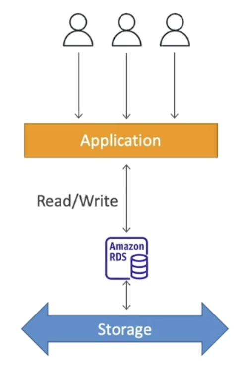
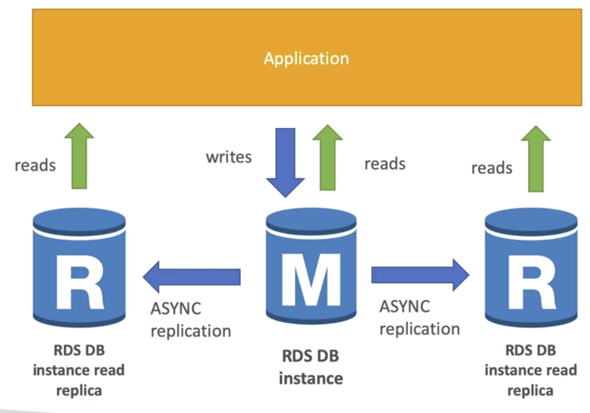

# section8: RDS + Aurora + ElastiCache

## RDS

- Relational Database Service
- managed DB service for SQL DB
- allows you to create databases in the cloud that are managed by AWS
  - Postgres
  - MySQL
  - MariaDB
  - Oracle
  - MS SQL Server
  - IBM DB2
  - Aurora (AWS Proprietary db)

### Advantages over EC2

- managed service:
  - automated provisioning, OS patching
  - continuous backup & restore
  - monitoring dashboards
  - read replicas for improved read performance
  - multi AZ setup for Disaster Recovery
  - maintenance windows for upgrades -> ?
  - scaling capability (vertical & horizontal)
  - storage backed by EBS (gp2 or io1)
- but, you can't SSH into your instances

### Storage Auto Scaling

- when RDS detects not enough free db stroage, it scales automatically
- no need of manual scaling
- you have to set Maximum Storage Threshold
- automatically modify storage if:
  - free storage < 10%
  - low-storage lasts at least 5 minutes
  - 6 hours passed since last modification
- useful for applications with *unpredictable workloads*

### Read Replicas

- up to 15 read replicas
- within AZ, cross AZ, or cross Region
- replication is **ASYNC**, so reads are *eventually* consistent -> 당장은 old data를 볼 수 있음
- replicas can be promoted to their own DB (replica를 바로 독립된 db로 사용이 가능)
- applications *must* **update the connection string to leverage read replicas**

#### Use Cases

- you have a production database taking normal load
- you want to run a reporting application to run some analytics -> might affect application's performance
- create a Read Replica and run the new workload there
- now, production application is unaffected at all!
- **Read Replicas are used only for read(SELECT)**

#### Network Cost

- AWS, there's a *network cost*, charged when data goes from one AZ to another
- but for RDS Read Replicas **within the same region**, it's free
- but for *cross region* Read Replicas, it will be charged

### Multi AZ (Disaster Recovery)

- SYNC replication: replicate every single changes in Master DB
- One DNS name -> any loss of AZ, loss of network, instance or storage failure, automatically redirected -> automatic app failover, increase availability
- not used for scaling, only for standby... but, Read Replicas can be setup as Multi AZ for DR, and it's common setup!

#### how to: from single AZ to multi AZ

- just click on "modify" for the database
- zero downtime operation! (no need to stop DB)
- how?
  1. snapshot of main DB is taken
  2. restored into new standby DB (at different AZ)
  3. syncrhonization starts
