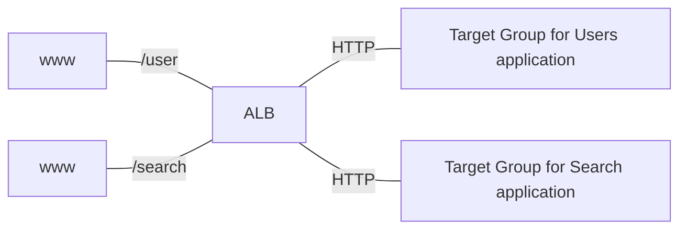
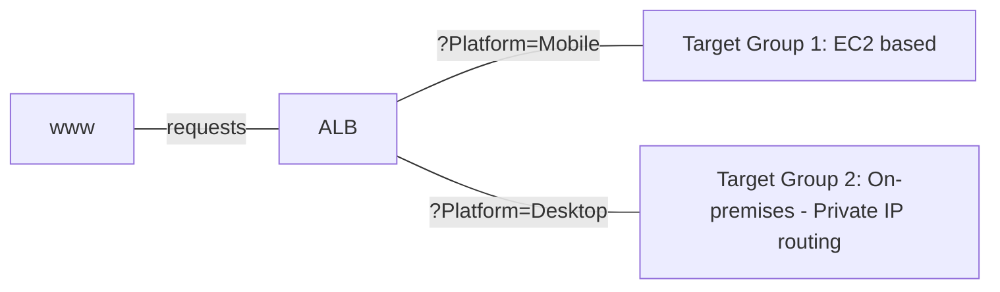

# section7

## Scalability & High Availability

### Scalability

- Scalability: application / system can handle greater loads by adapting
  - Vertical Scalability
  - Horizontal Scalability (== elasticity)
- **Scalability != High Availalability**, but both are linked

#### Vertical Scalability

- increasing the size of the instance
- common for non distributed systems, such as a database
- there's a limit to how much you can vertically scale (HW limit)

#### Horizontal Scalability

- increase the number of instances / systems for your application
- horizontal scale is available at distributed systems: common for web applicadtions, modern applications
- very easy to horizontally scale with cloud offerings such as EC2

### High Availability

- goes hand in hand with horizontal scaling
- goal of high availability == survive a data center loss (== make application to be available 24 hrs / day as possible)
- can be passive (RDS Multi AZ) or active (horizontal scaling)

### High Availability & Scalability for EC2

- Vertical Scaling: Increasing instance size (scale up / down)
- Horizontal Scaling: Increasing number of instances (scale out / in)
- High Availability: Run instances for the same application across multi AZ
  - Auto Scaling Group multi AZ
  - Load Balancer multi AZ

## Load Balancing

- Load Balancer: server that forward traffic to multiple servers downstream
- why use a load balancer?
  - spread load across multiple downstream instances (effectively)
  - expose a single point of access to your application (to DNS)
  - seamlessly handle failures of downstream instances & regular health checks to instances
  - provide SSL termination for your websites
  - enforce stickiness with cookies
  - help achieving high availability across zones
  - separate public traffic from private traffic

### Elastic Load Balancer

- managed load balancer
  - AWS guarantees that it will be working
  - AWS takes care of upgreades, maintenance, high availability
  - AWS provides only a few config knobs
- costs more, but much easier than setting up your own load balancer
- integrated with many AWS offerings / services
  - EC2, AWS Certified Manager, CloudWatch, Route53, AWS WAF, ...

#### Health Checks

- enable load balancer to know if downstream instances are available to reply to requests
- done on a port and a route (`/health` is common)

#### Types of AWS load balancer

1. Classic Load Balancer (v1, 2009): HTTP, HTTPS, TCP, SSL (secure TCP)
2. Application Load Balancer (v2, 2016): HTTP, HTTPS, WebSocket
3. Network Load Balancer (v2, 2017): TCP, TLS (Secure TCP), UDP
4. Gateway Load Balancer (2020): Operates at Network layer (L3) - IP Protocol

- Overall, it's recommended to use newer generation
- some can be setup as internal or external

#### Load Balancer Security Groups

1. Load Balancer: allow HTTP, HTTPS from anywhere
2. instances: allow traffic only from Load Balancer - 이를 위해 instance의 security group의 'source'에 Load Balancer Security Group을 넣으면 된다!

#### Application Load Balancer

- works at L7 (HTTP)
- Load balancing to
  1. multiple HTTP applications across machines (target groups)
  2. multiple applications on the same machine (like containers)
- routing tables to different target groups:
  - Routing based on
    1. path in URL
    2. hostname in URL
    3. Query String, Headers
- great fit for micro services & container-based application (Docker & ECS)
- Has a port mapping feature to redirect to a dynamic port in ECS
- We would need multiple load balancers with Classic Load Balancer

##### HTTP Based Traffic

##### Target Groups

- Can be one of following:
  - EC2 instances (managed by Auto Scaling Group) - HTTP
  - ECS tasks (managed by ECS itself) - HTTP
  - Lambda functions - HTTP request translated into a JSON event: base of 'serverless'
  - IP Addresses - must be private IPs
- ALB can route to multiple target groups
- Health checks are at the target group level

##### Query Strings / Parameters Routing

##### Good to know

- Fixed Hostname (XXX.region.elb.amazonaws.com)
- application servers don't see IP of the client(request sender) directly (replaced to Load Balancer's Private IP since the packet is relayed via Load Balancer!)
  - true IP inserted at header `X-Forwarded-For`
  - true Port inserted at header `X-Forwarded-Port` and proto `X-Forwarded-Proto`
