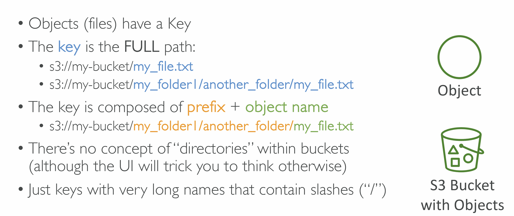
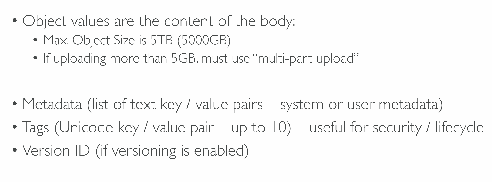
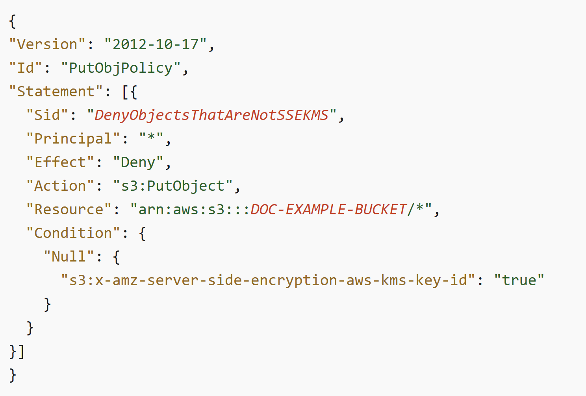
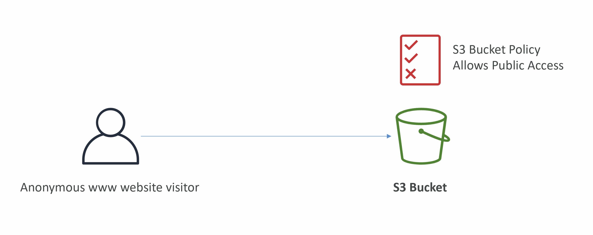
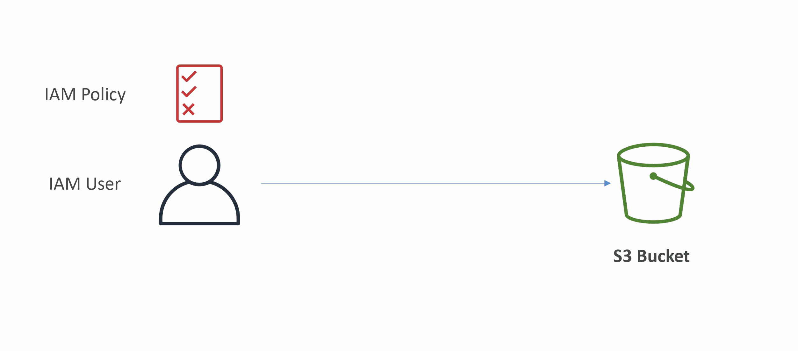
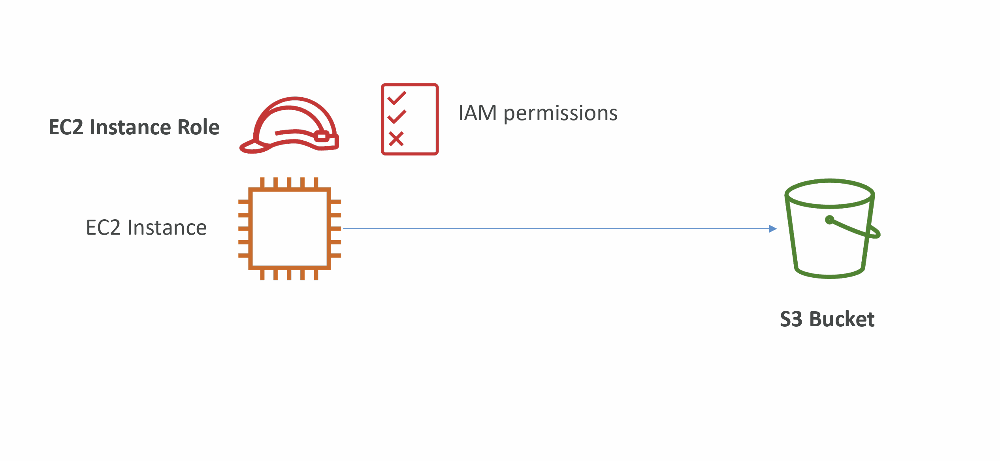
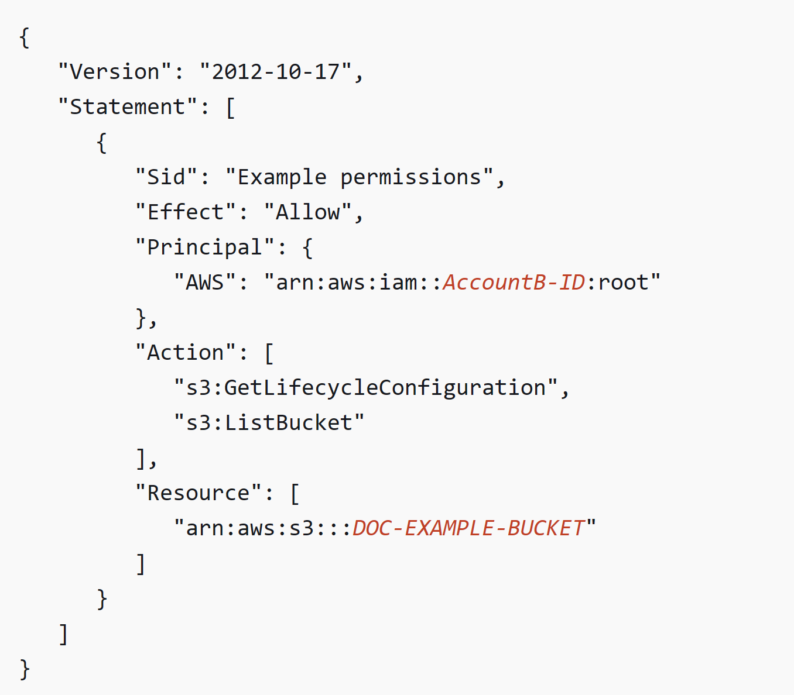
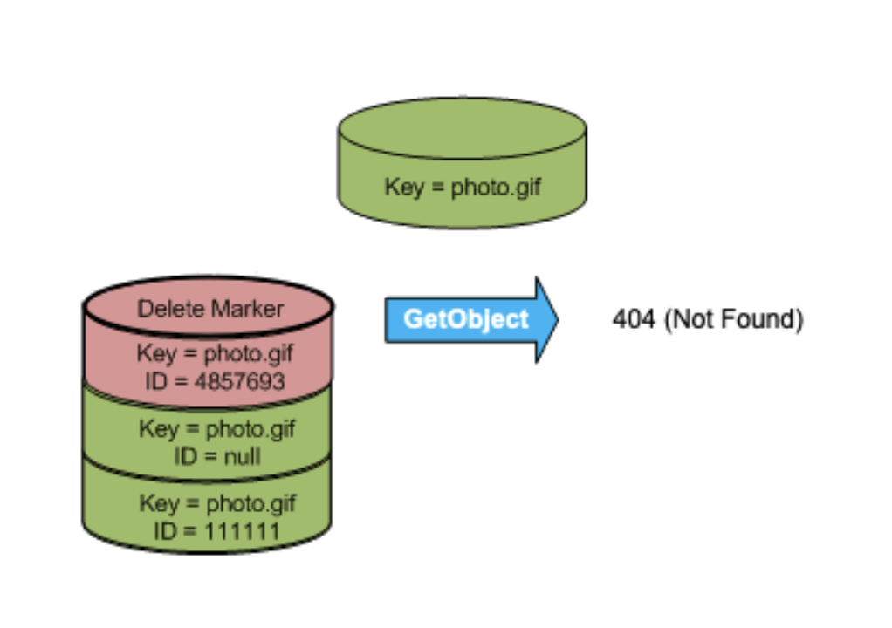
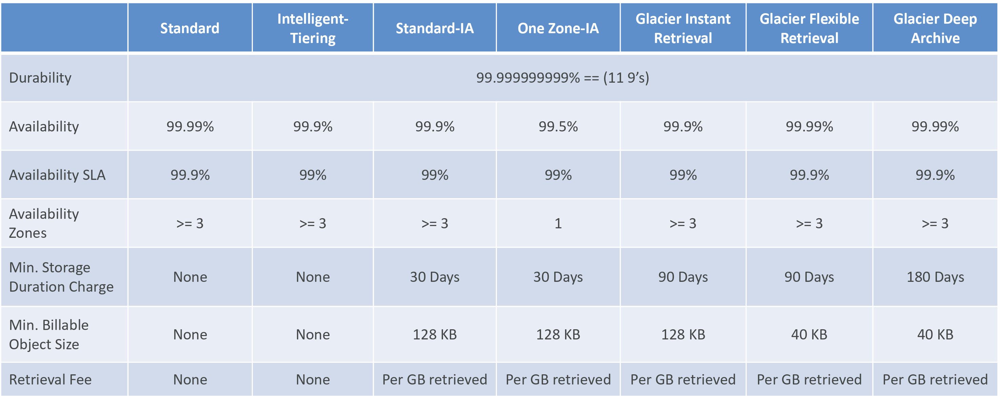

# Section 11. S3

## What is S3?

- One of the main building blocks of AWS.
- Infinitely scaling **storage**

## S3 Use Cases

- Backup and storage
- Disaster Recovery
- Archive
- Hybrid Cloud storage
- Application hosting
- Media hosting
- Data lakes & big data analytics
- Software delivery
- Static website

## Buckets

- Store **objects(files)** in **buckets(directories)**.
- **Globally unique name** (across all regions all accounts).
- Defined at the **region level**
- Looks like a global service but **created in a region**
- Naming convention:
  - No uppercase, No underscore
  - 3-63 characters long
  - Not an IP
  - Must start with lowercase letter or number
  - Must NOT start with the prefix xn--
  - Must NOT end with the suffix -s3alias

## Objects

## Security

- User-Based
  - IAM Policies
- Resource-Based

  - Bucket Policies

    

  - Object Access Control List (can be disabled)
  - Bucket Access Control List (can be disabled)

- Encryption
- Notes:
  - (IAM permissions || resource policy) && (!explicit deny)

### Example

- Public Access (Bucket Policy)

    

- User Access (IAM Policy)

    

- EC2 Instance Access (IAM Role)

    

- Cross-Acount Access (Bucket Policy)

    

### Block Public Access Settings

- Created to prevent company data leaks
- Default: ON
- Can be set at the account level

## Static Website Hosting

- Can host static websites
- Website URL
  - http://**buckt-name**.s3-website-**aws-region**.amazonaws.com
  - http://**buckt-name**.s3-website.**aws-region**.amazonaws.com
- 403 Forbidden error (if not allow public reads)

## Versioning

- Can version files
- Enabled at the **bucket level**
- Overwrite => change version
- Pros:
  - Restore a version
  - Easy roll back
- Notes: - Any file that is not versioned prior to enabling versioning will have version **null** - Suspending versioning does not delete the previous versions

    

## Replication

- Must enable Versioning in source and destination buckets
- Cross-Region Replication (CRR)
- Same-Region Replication (SRR)
- Buckets can be in different AWS accounts
- Copying is asynchronous
- Must give proper IAM permissions to S3
- Use cases:
  - CRR –> compliance, lower latency access, replication across accounts
  - SRR –> log aggregation, live replication between production and test accounts
- Notes:
  - After enable replication, only new objects are replicated
  - S3 Batch Replication
    - replicates existing objects and objects that failed replication
  - DELETE operations
    - Can replicate delete markers from source to target (optional)
    - Deletions with a version ID are not replicated
  - No chaining

## Storage Classes

- Standard
- Standard-Infrequent Access
- One Zone-Infrequent Access
- Glacier Instant Retrieval
- Glacier Flexible Retrieval
- Glacier Deep Archive
- Intelligent Tiering
- Note:
  - Can move between classes manually or automatically (S3 Lifecycle configurations)

### S3 Durability and Availability

- Durability
  - How many objects are lost
  - High durability (99.999999999%)
  - Same for all storage classes
- Availability
  - How readily available service is
  - Varies depending on storage class

 

### Standard

- Used for frequently accessed data
- Low latency and high throughput
- Use Cases:
  - Big Data analytics, mobile & gaming applications, content distribution…

### IA

- For data that is less frequently accessed, but requires rapid access when needed
- Lower cost than S3 Standard
- Use Cases:
  - Standard-IA:
    - Disaster Recovery, backups
  - One Zone-IA:
    - Storing secondary backup copies of on-premises data, or recreatable data

### Glacier

- Low-cost object storage meant for archiving / backup
- Notes:
  - Glacier Instant Retrieval:
    - Millisecond retrieval, great for data accessed once a quarter
  - Glacier Flexible Retrieval:
    - Expedited (1 to 5 minutes), Standard (3 to 5 hours), Bulk (5 to 12 hours) – free
  - Glacier Deep Archive:
    - Standard (12 hours), Bulk (48 hours)

### Intelligent Tiering

- Small monthly monitoring and auto-tiering fee
- Moves objects automatically between Access Tiers based on usage

 

- Frequent Access tier (automatic): default tier
- Infrequent Access tier (automatic): objects not accessed for 30 days
- Archive Instant Access tier (automatic): objects not accessed for 90 days
- Archive Access tier (optional): configurable from 90 days to 700+ days
- Deep Archive Access tier (optional): config. from 180 days to 700+ days
