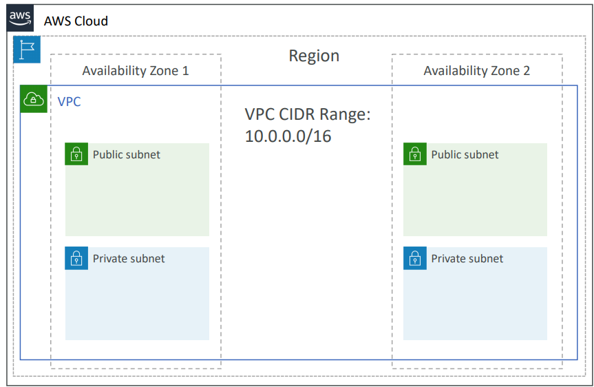
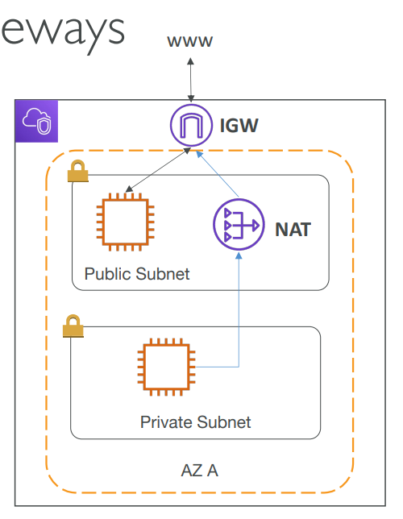
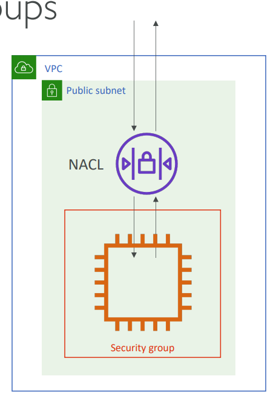
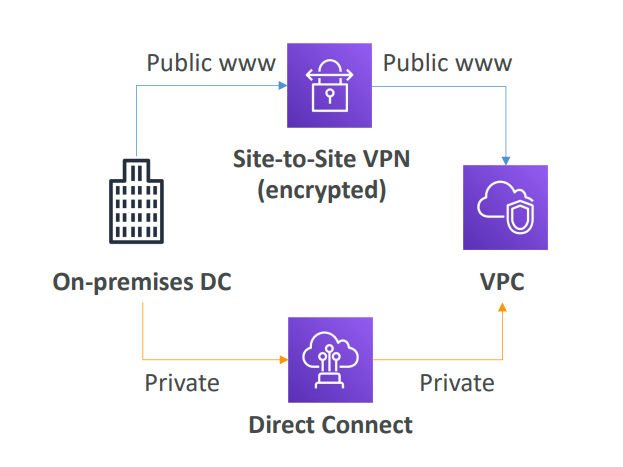

# Section 10. VPC

## VPC & Subnets Primer

- **VPC**: Virtual Private Cloud (Regional Resource)
- **Subnet**: Part of VPC (Availability Zone Resource)
  - public subnet: has route to internet gateway
  - private subnet: does not have route to internet gateway
- **Route Table**: controls traffic between subnets

## Internet Gateway & NAT Gateway

- **Internet Gateway**: allows VPC resources to access the internet
- **NAT Gateway**: allows private subnet resources to access the internet

## NACLs & Security Groups

- **NACLs**: Network Access Control Lists (firewall rules for subnets)
  - Have ALLOW and DENY rules
- **Security Groups**: Stateful firewall rules for EC2 instances
  - Have ALLOW rules only

## VPC Flow Logs

- Capture information about IP traffic going to and from network interfaces in your VPC
- Can be published to CloudWatch Logs or S3

## VPC Peering

- Connect two VPCs together
- Must not have overlapping CIDR blocks
- Transitive peering is not allowed

## VPC Endpoints

- To connect to AWS services using a private network instead of the public internet
- Enhanced security and lower latency

## Site-to-Site VPN & Direct Connect (DX)

- **Site-to-Site VPN**: Connect on-premises VPN to AWS
  - Goes over the public internet
- **Direct Connect (DX)**: Physical connection between on-premises and AWS
  - Goes over a private network

## 3 Tier Architecture

- **Public Subnet**: Web Server
- **Private Subnet**: Application Server
- **Private Subnet**: Database Server

## LAMP Stack

- **Linux**: Operating System
- **Apache**: Web Server
- **MySQL**: Database
- **PHP**: Server-side scripting language
