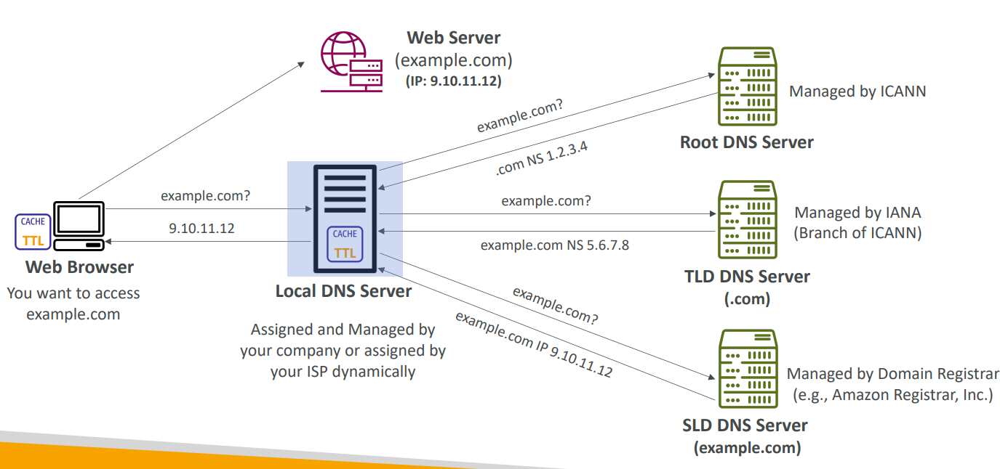

# Section 9. Route 53

## DNS (Domain Name System)

- **Translate domain names** to IP addresses.
- **Root domain**: the highest level of the DNS hierarchy.
- **Top-level domains (TLDs)**: .com, .org, .net, .gov, .edu, etc.
- **Second-level domains (SLDs)**: google.com, amazon.com, etc.
  

## Route 53

- **Route 53**: a scalable and highly available Domain Name System (DNS) web service.
  

## Route 53 Records

- How Route 53 routes traffic to resources.
- Types:
  - **A Record (Address Record)**: maps a domain name to an IPv4 address.
  - **AAAA Record (IPv6 Address Record)**: maps a domain name to an IPv6 address.
  - **CNAME Record (Canonical Name Record)**: maps a domain name to another domain name.
  - **NS Record (Name Server Record)**: delegates a DNS zone to use the given authoritative name servers.

## Route 53 Hosted Zones

- **Hosted Zone**: a container for records.
- **Public Hosted Zone**: a container for records that define how internet traffic is routed to a domain.
- **Private Hosted Zone**: a container for records that define how internet traffic is routed within an Amazon VPC.

## Route 53 Records TTL (Time to Live)

- **TTL**: the amount of time that a DNS record is cached on either the resolving server or the user's own local cache.
- **High TTL**: Possibly outdated records, less traffic, faster response time.
- **Low TTL**: Easy to change records, more traffic, slower response time.

## CNAME vs. Alias Records

- **CNAME Record**: maps a domain name to another domain name.
- **Alias Record**: maps a domain name to an AWS resource (e.g., an ELB, an S3 bucket, a CloudFront distribution).

## Route 53 Alias Records

- Extension of Route 53's CNAME feature.
- Can be used for the top node of a DNS namespace (e.g., example.com).
- Can be used for the root domain (e.g., http://example.com).
- Always of the type A / AAAA.
- Can't set TTL.

## Route 53 Routing Policies

- Defines how Route 53 responds to DNS queries.
- Types:
  - **Simple Routing**: route traffic to a single resource.
  - **Weighted Routing**: route traffic to multiple resources in proportions.
  - **Latency-based Routing**: route traffic based on the lowest network latency.
  - **Failover Routing**: route traffic to a resource when it's healthy or unhealthy.
  - **Geolocation Routing**: route traffic based on the location of the user.
  - **Geoproximity Routing**: route traffic based on the location of the user and resources.
  - **IP-Based Routing**: route traffic based on the IP address of the user.
  - **Multi-Value Routing**: route traffic to multiple resources in proportions.

## Route 53 Health Checks

- Monitor the health and performance of your web applications.
- Types:
  - **Endpoint Health Check**: monitor the health of an endpoint.
    - About 15 glocal health checkers & if > 18% of the checkers report healthy, the endpoint is considered healthy.
  - **CloudWatch Alarm Health Check**: monitor the health of a CloudWatch alarm.

## Health Check - Private Hosted Zone

- Health checks can be associated with records in a private hosted zone.
- Can create a CloudWatch alarm based on the health check status.

## Traffic Flow

- Visual editor for Route 53 routing policies.
- Simplifies the process of creating and managing complex routing configurations.

## Domain Registar vs. DNS Service

- Domain Registar usually provides DNS service.
- Ex: Purchase a domain from GoDaddy and use Route 53 as the DNS service.
