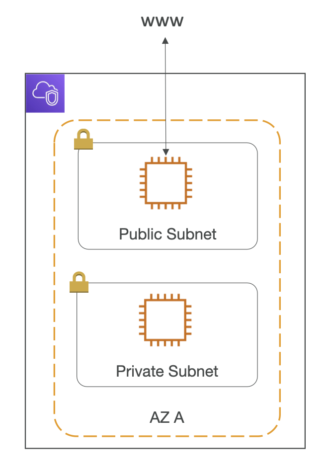
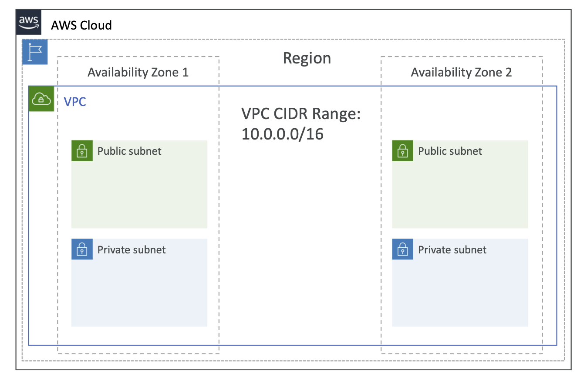
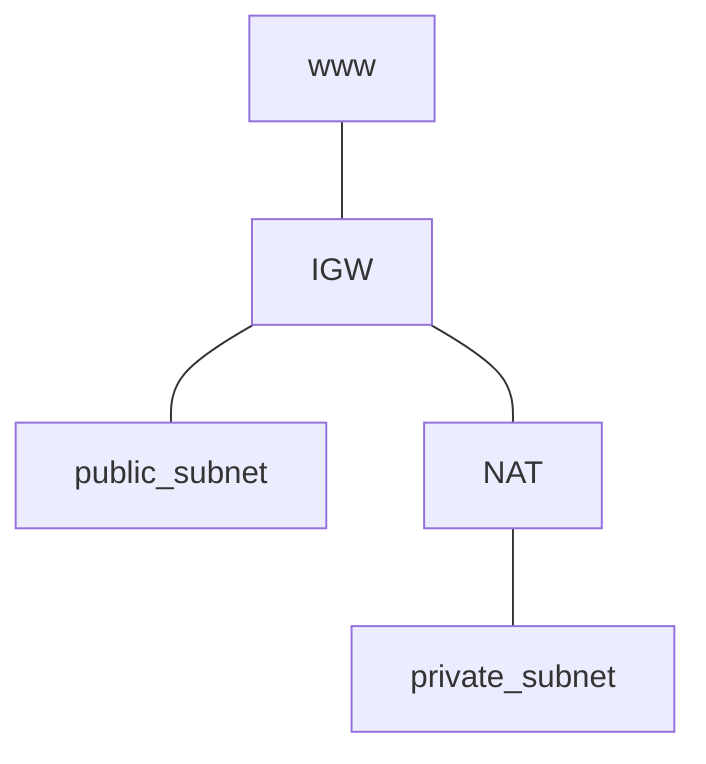
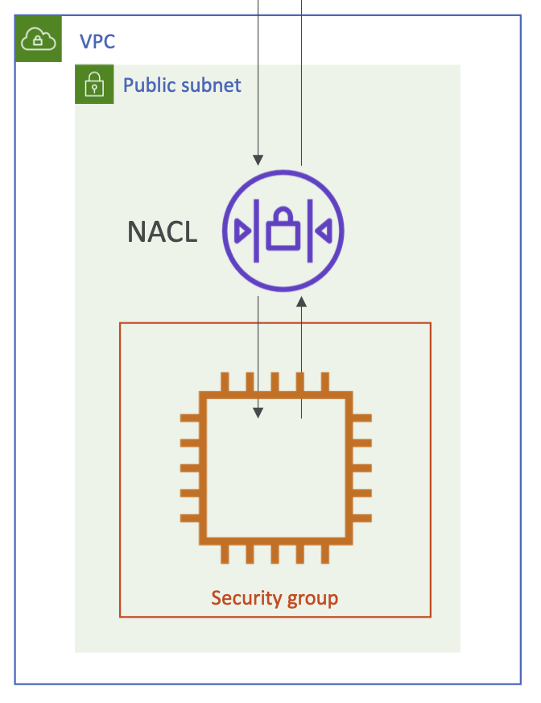
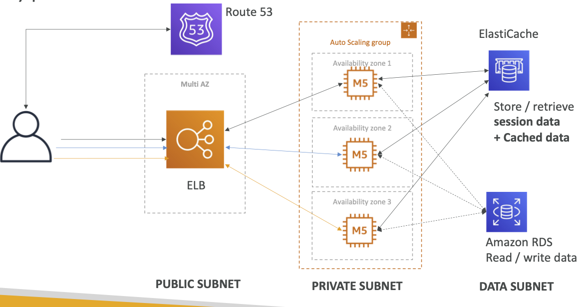

# section10: VPC

## VPC

### Overview

- you should know VPC in depth for AWS Certified Solutions Architect Associate & SysOps Administrator
- but for AWS Certified Developer:
  - VPC, Subnets, Internet Gateways & NAT Gateways
  - Security Groups, Network ACL, VPC Flow Logs
  - VPC Peering, VPC Endpoints
  - Site to site VPN & Direct Connect
- only 1~2 questions on exam

### VPC & Subnets Primer

- VPC: private network to deploy your resources (regional resource)
- Subnets: allow you to partition network inside your VPC (AZ resource)
- Public subnet: subnet that is accessible from the internet
- Private subnet: subnet that is not accessible from the internet
- To define access to the internet and between subnets, we use *Route Tables*

### VPC diagram

- 1 VPC per 1 Region (across all AZs, by default)
- 1 public subnet per 1 AZ (by default)

### Internet Gateway & NAT Gateways

- Internet Gateway: help our VPC instances connect to the internet
- Public Subnets have a route to the internet gateway
- so, *route to the internet gateway* is what makes a subnet to be a *public* subnet
- NAT Gateways (AWS managed) & NAT Instances (self managed): allow your instances in your Private Subnets to access the internet while remaining private

### Network ACL & Security Groups

- Network ACL: a **firewall which controls traffic from & to subnet**
  - ALLOW or DENY rules
  - attached at the **Subnet level**
  - rules only include **IP addresses** (allow/deny all traffic from/to specific IP)
- Security Groups: a **firewall that controls traffic from & to an ENI / an EC2 Instance**
  - only ALLOW rules
  - rules include IP addresses or other security groups

### VPC Flow Logs

- capture informations about all IP traffic going into your interfaces, including:
  - VPC Flow Logs
  - Subnet Flow Logs
  - Elastic Network Interface Flow Logs
- helps to monitor & troubleshoot connectivity issues. like:
  - subnets to internet
  - subnets to subnets
  - internet to subnets
  - ...
  - whatever issue happens, see flow logs!
- captures network information from AWS managed interfaces too: Elastic Load Balancers, ElastiCache, RDS, Aurora, ...
- these log data can go to S3, CloudWatch Logs, and Kinesis Data Firehose

### VPC Peering

- connect two VPC (== make them behave as if they were in the same network) privately, using AWS network
- must not have overlapping CIDR (IP address range)
- VPC Peering connection is *not transitive* (A - B, B - C, doesn't mean A - C can communicate!)

### VPC Endpoints (중요)

- endpoints: allow you to connect to AWS Services *using a private network*, *instead of the public www network*
- gives you enhanced security & lower latency to access AWS services
- VPC Endpoint Gateway: S3 & Dynamo DB
- VPC Endpoint Interface: for the rest
- **Only used within your VPC**

### Site to Site VPN & Direct Connect

- Site to Site VPN
  - connect on-premises VPN to AWS
  - goes over the public internet
  - automatically encrypted
- Direct Connect (DX)
  - Establish a physical connection between on-premises and AWS
  - connection is private, secure and fast
  - goes over a **private network**
  - *takes at least a month to establish*
- both do same work (connect on-premises data center with VPC) but different time required to use

### Closing Comments (이것만 알고 갑시다)

- VPC: Virtual Private Cloud - one per one region by default
- Subnets: network partition of the VPC - per AZ

- Internet Gateway: provide Internet Access at VPC level
- NAT Gateway / Instances: allow Internet Access to private subnets

- NACL: stateless, rules (inbound & outbound) for subnet
- Security Groups: stateful, operate at EC2 instance or ENI level

- VPC Peering: connect two VPC (with non overlapping IP ranges), not transitive! (A - B, B - C doesn't mean A - C peered)

- VPC Endpoints: provide *private* access to AWS Services within VPC

- VPC Flow Logs: network traffic logs

- two ways to connect between on-premises Data Center and AWS
  - Site to Site VPN: VPN over public internet between two
  - Direct Connect: direct *private* connection between two

## architecture examples

### typical 3 tier solution architecture

### LAMP Stack on EC2

- Linux: OS for EC2 instance
- Apache: Web Server run on Linux
- MySQL: database on RDS
- PHP: Application logic

- Redis or Memcached (ElastiCache) for caching
- EBS drive for storing local application data & software

### Wordpress on AWS

- [AWS blog article link](https://aws.amazon.com/blogs/architecture/wordpress-best-practices-on-aws/)
- 읽어보는 것을 권장!
