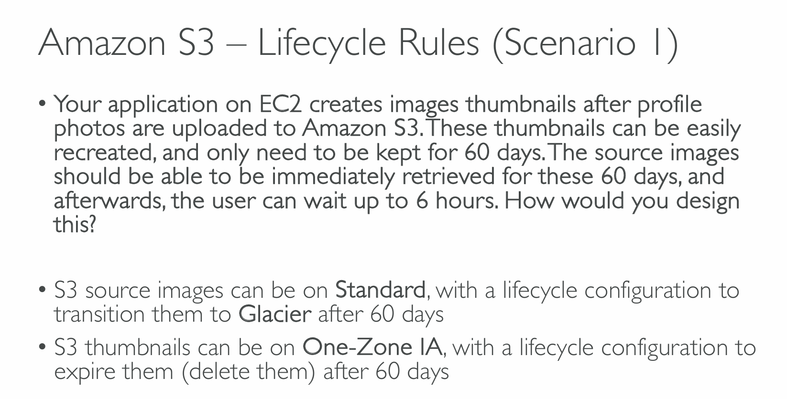
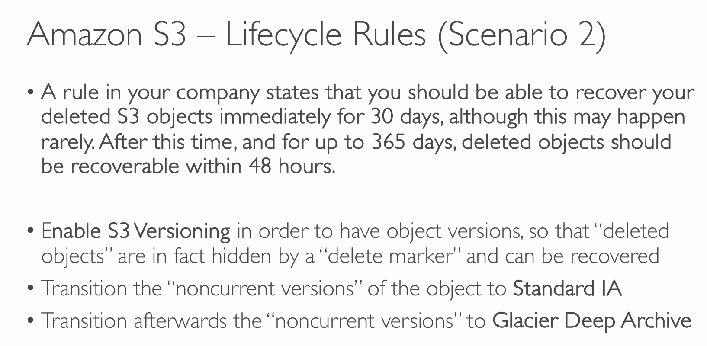
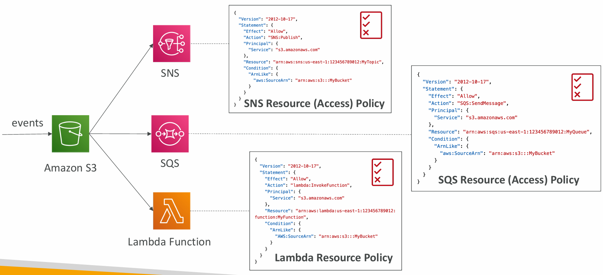
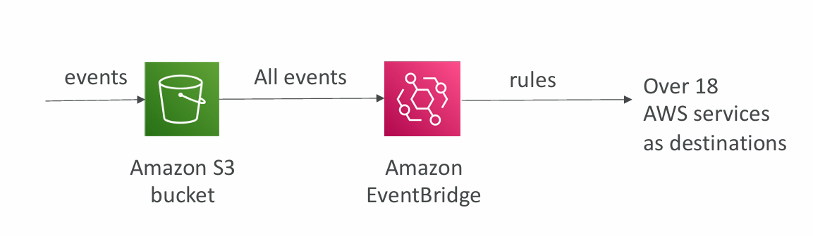
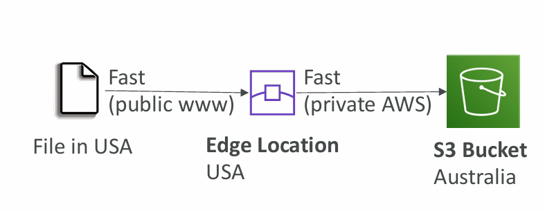

# Section 13. Advanced AWS S3

## Lifecycle Rules

- Transition Actions
  - 객체를 다른 storage class로 이동
- Expiration Actions
  - 객체를 삭제
- Rules can be created for a certain prefix
  - ex) s3://mybucket/mp3/\*
- Rules can be created for certain objects Tags

## S3 Analytics

- Recommendations for **Standard** and **Standard IA**
  - Does NOT work for ONE-Zone IA or Glacier
- Create CSV report
- Report is updated daily
- 24 to 48 hours to start seeing data analysis

## S3 Event Notifications

- S3 Object -- create, remove, restore, replicate
- Object name filtering possible
  - ex) \*.jpg
- Use case: generate thumbnails of images uploaded to S3
- IAM permissions

## Amazon EventBridge

- Advanced filtering options with JSON rules
  - ex) metadata, object size, name
- Multiple Destinations
  - ex) Step Functions, Kinesis Streams, Firehose
- EventBridge Capabilities
  - ex) Archive, Replay Events, Reliable delivery

## Baseline Performance

- S3 automatically scales to high request rates, latency 100 ~ 200 ms
- at least 3500 PUT/COPY/POST/DELETE and 5500 GET/HEAD requests per second per prefix in a bucket
- no limits to the number of prefixes in a bucket

## S3 Performance

- Multi-Part upload
  - Recommended > 100MB
  - Must > 5GB
  - speed up transfers
- S3 Transfer Acceleration

    

  - Compatible with multi-part upload

- S3 Byte-Range Fetches
  - Parallelize GETs by requesting specific byte ranges
  - Better resilience in case of failures
  - Use case:
    - speed up downloads
    - retrieve partial data

## S3 Select & Glacier Select

- Retrieve less data using SQL by performing server-side filtering
- Can filter by rows & columns
- Less network transfer, less CPU cost client-sid

### S3 User-Defined Object Metadata & S3 Object Tags

- S3 User-Defined Object Metadata
  - Name-Value pairs
  - can assign metadata when uploading an object
  - User-defined metadata names must begin with "x-amz-meta-"
  - S3 stores user-defined metadata keys in lowercase
  - Metadata can be retrieved while retrieving the object
- S3 Object Tags
  - Key-Value pairs
  - Useful for fine-grained permissions
  - Useful for analytics purposes
- Cannot search the object metadata or object tags
- must use external DB as a search index such as DynamoDB
