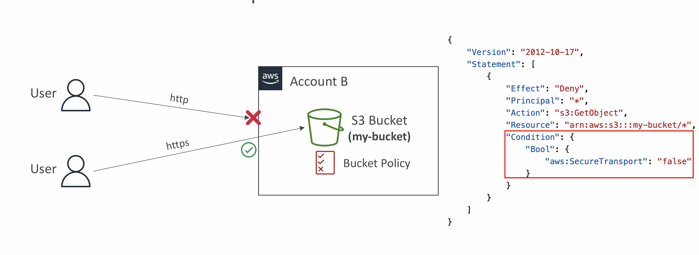
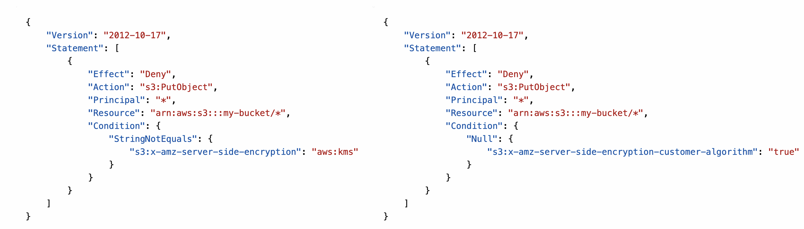
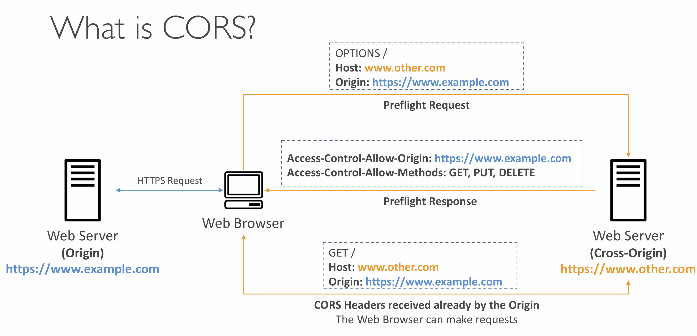
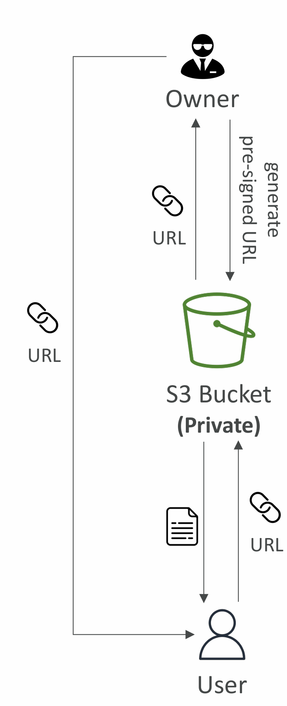
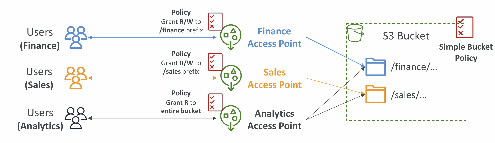
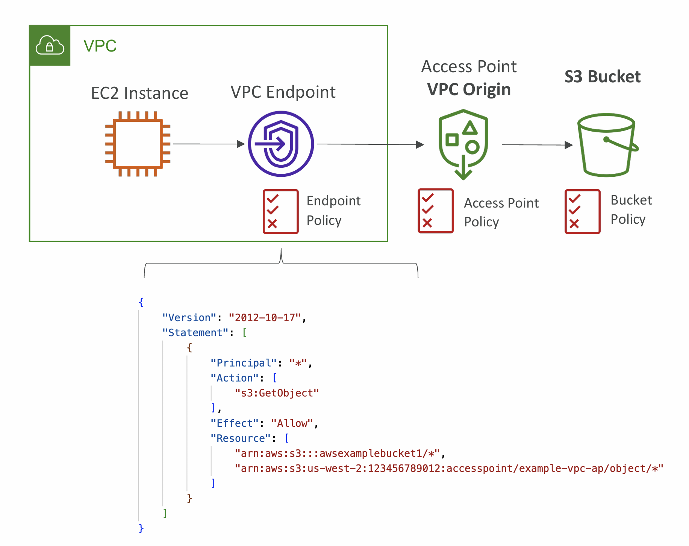
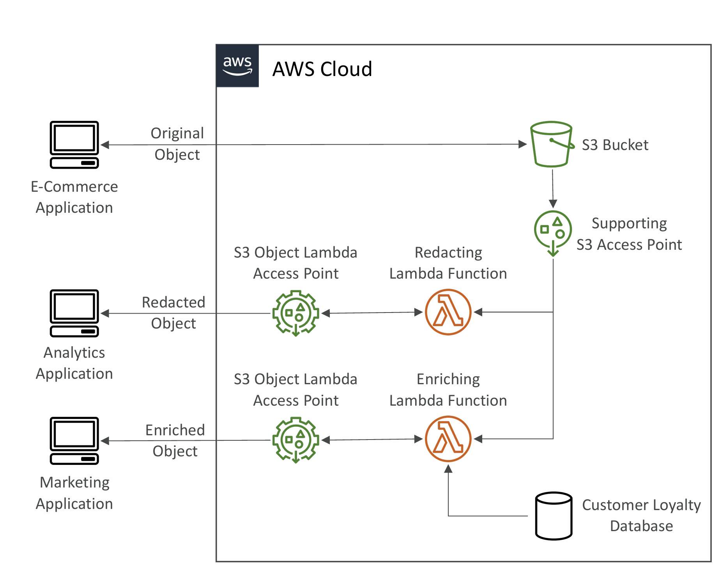

# Section 14. S3 Security

## Object Encryption

- Server-Side Encryption (SSE)
  - Server-Side Encryption with Amazon S3-Managed Keys (SSE-S3) Enabled by Default
    - Encrypts S3 objects using keys handled, managed, and owned by AWS
  - Server-Side Encryption with KMS Keys stored in AWS KMS (SSE-KMS)
    - Leverage AWS Key Management Service (AWS KMS) to manage encryption keys
  - Server-Side Encryption with Customer-Provided Keys (SSE-C)
    - When you want to manage your own encryption keys
- Client-Side Encryption

## SSE-S3

- Encryption using keys handled, managed, and owned by AWS
- Encryption type is **AES-256**
- Must set header **"x-amz-server-side-encryption": "AES256"**
- Enabled by **default** for new buckets & new objects

## SSE-KMS

- Encryption using keys handled and managed by AWS KMS (Key Management Service)
- KMS advantages: user control + audit key usage using CloudTrail
- Must set header **"x-amz-server-side-encryption": "aws:kms"**

### SSE-KMS Limitation

- If you use SSE-KMS, you may be impacted by the KMS limits
- When you upload, it calls the GenerateDataKey KMS API
- When you download, it calls the Decrypt KMS API
- Count towards the KMS quota per second (5500, 10000, 30000 req/s based on region)
- You can request a quota increase using the Service Quotas Console

## SSE-C

- Server-Side Encryption using keys fully managed by the customer outside of AWS
- Amazon S3 does NOT store the encryption key you provide
- HTTPS must be used
- Encryption key must provided in HTTP headers, for every HTTP request made

## Client-Side Encryption

- Use client libraries such as Amazon S3 Client-Side Encryption Library
- Clients must encrypt data themselves before sending to Amazon S3
- Clients must decrypt data themselves when retrieving from Amazon S3
- Customer fully manages the keys and encryption cycle

## Encryption in transit (SSL/TLS)

- Encryption in flight is also called SSL/TLS
- Amazon S3 exposes two endpoints:
  - HTTP Endpoint – non encrypted
  - HTTPS Endpoint – encryption in flight
- HTTPS is recommended
- HTTPS is mandatory for SSE-C

### Force Encyption

## CORS

- Cross-Origin Resource Sharing (CORS)
- Origin = scheme (protocol) + host (domain) + port
  - example: **https://www.example.com** (implied port is 443 for HTTPS, 80 for HTTP)
- Web Browser based mechanism to allow requests to other origins while visiting the main origin
- Same origin: **http://example.com/app1** & **http://www.example.com/app2**
- Different origins: **http://www.example.com** & **http://other.example.com**
  - using **CORS Headers**
  - example: Access-Control-Allow-Origin

- Allow for a specific origin or for \* (all origins)

## MFA Delete

- MFA will be required to:
  - Permanently delete an object version
  - Suspend Versioning on the bucket
- To use MFA Delete, Versioning must be enabled on the bucket
- Only the bucket owner (root account) can enable/disable MFA Delete

## S3 Access Logs

- Log any request which is made to S3
- The target logging bucket must be in the same AWS region
- The log format is at:
  - https://docs.aws.amazon.com/AmazonS3/latest/dev/LogFormat.html
- Do not set loggin bucket to be the monitored bucket!!

## Pre-Signed URLs

- Generate pre-signed URLs using the S3 Console, AWS CLI or SDK
- URL Expiration
  - S3 Console – 1 min up to 720 mins (12 hours)
  - AWS CLI – configure expiration with --expires-in parameter in seconds (default 3600 secs, max. 604800 secs ~ 168 hours)
- Users given a pre-signed URL inherit the permissions of the user that generated the URL for GET / PUT

## Access Points

- Access Points simplify security management for S3 Buckets
- Each Access Point has:
  - DNS name (Internet Origin or VPC Origin)
  - Access point policy (similar to bucket policy)

### VPC Origin

- Can define the access point to be accessible only from within the VPC
- Must create a VPC Endpoint to access the Access Point (Gateway or Interface Endpoint)
- The VPC Endpoint Policy must allow access to the target bucket and Access Point

## Object Lambda

- Change the object before it is retrieved by the caller application
