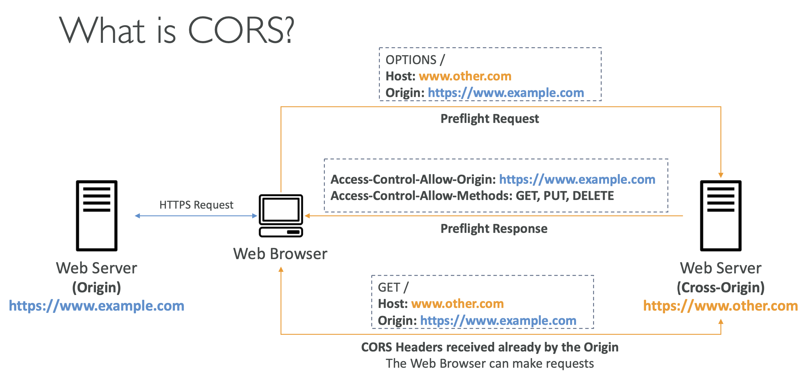
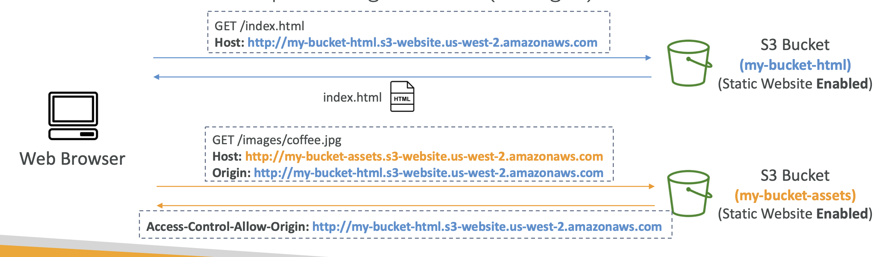
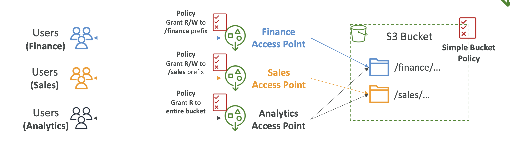
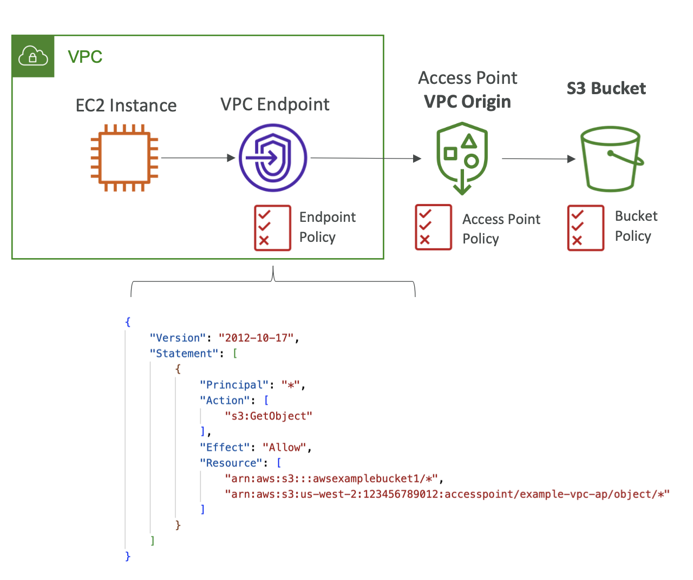
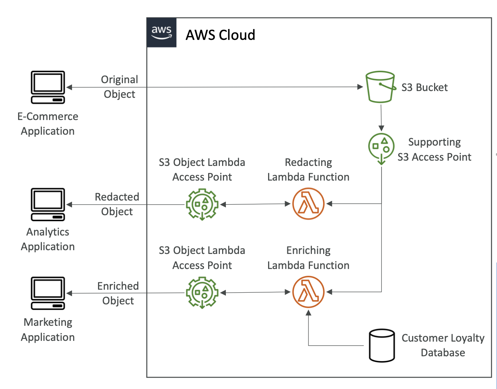

# Section 14. S3 Security

## S3 - Object Encryption

- 4 methods of encrypting objects in S3

  - SSE-S3: encrypts S3 objects using keys handled & managed by AWS
    - AES-256 encryption type
    - Must set header `x-amz-server-side-encryption: AES256`
  - SSE-KMS: leverage AWS Key Management Service to manage encryption keys
    - Audit trail of when keys were used (CloudTrail)
    - Must set header `x-amz-server-side-encryption: aws:kms`
    - Limitation: Limit on the number of requests you can make to the KMS service
  - SSE-C: specify encryption keys that you manage
    - Does not store the encryption key you provide
    - HTTPS must be used
  - Client Side Encryption: encrypt data client-side and upload encrypted data to S3
    - Clients must encrypt/decrypt data themselves
    - Clients fully manage the keys and encryption cycle

- Bucket policies can enforce encryption on objects
- Bucket policies are evaluated before the default encryption settings (Ex. SSE-S3)

## S3 - Encryption in Transit (SSL/TLS)

- Secure Sockets Layer (SSL) / Transport Layer Security (TLS)
- S3 exposes:
  - HTTP endpoint: non-encrypted
  - HTTPS endpoint: encryption in flight

## S3 CORS

- Cross-Origin Resource Sharing
- Allows web apps to make requests to another domain
- Must be enabled on the S3 bucket
  
- S3 bucket must allow the origin domain in the CORS configuration.
  

## S3 - MFA Delete

- Multi-Factor Authentication Delete
- MFA can be required in versioned buckets to delete objects / suspend versioning.
- Versioning must be enabled on the bucket.
- MFA delete capability can only be enabled via the CLI.

## S3 - Access Logs

- For audit purpose, log requests made to the S3 bucket.
- Log requests can be stored in another S3 bucket.
- Warning: Do not enable logging on the source bucket, as it may create a logging loop.

## S3 - Pre-Signed URLs

- URLs that are valid only for a limited time generated by AWS SDKs or CLI.
- Expires:
  - S3 Console: maximum 720 minutes (7 days)
  - CLI: default 3600 seconds (1 hour), maximum 604800 seconds (7 days)

## S3 - Access Points

- Simplify security management for S3 Buckets.
- Each access point has a unique hostname and policy.
  
- VPC Origin:
  - Can define the access point to be accessible only from within the VPC.
  - Must create a VPC Endpoint to access the
    Access Point (Gateway or Interface Endpoint).
- VPC Endpoint Policy must allow access to the target bucket and Access Point.
  

## S3 - Object Lambda

- Use AWS Lambda Functions to change the object before it is retrieved by the caller application.
- Use cases:
  - Masking sensitive data
  - Converting file formats
  - Fetching data from other sources
    
