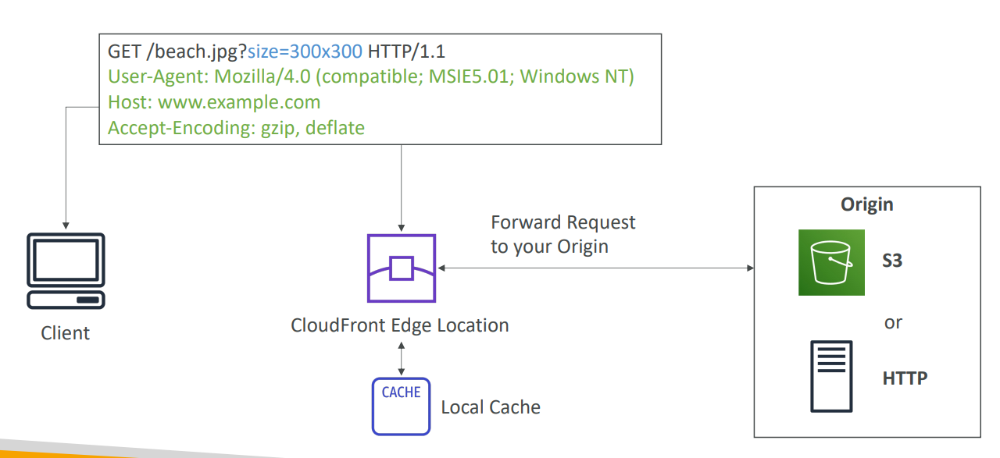
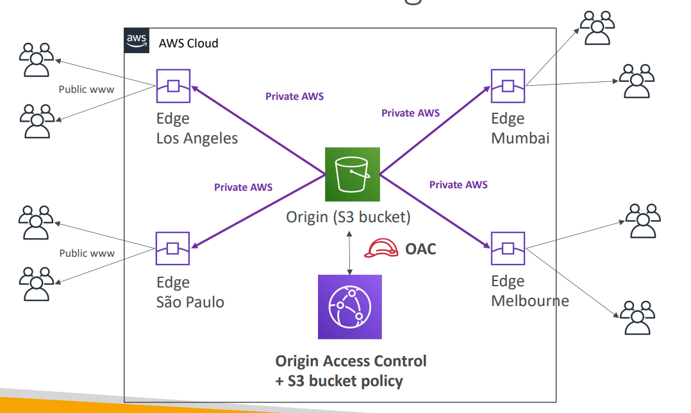
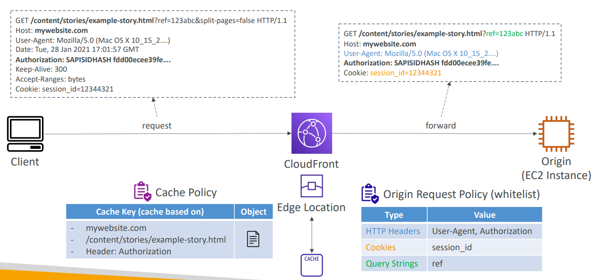
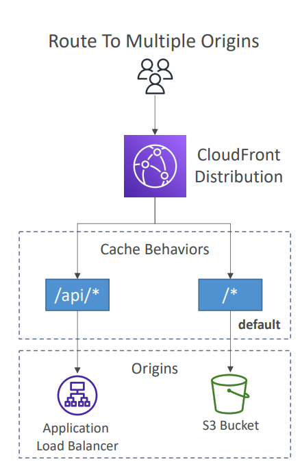
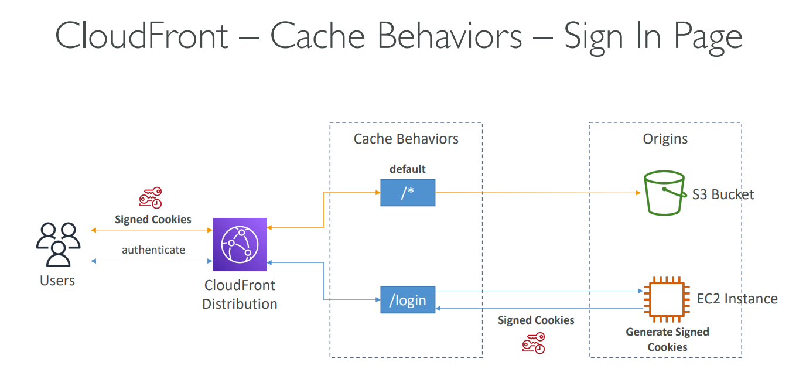
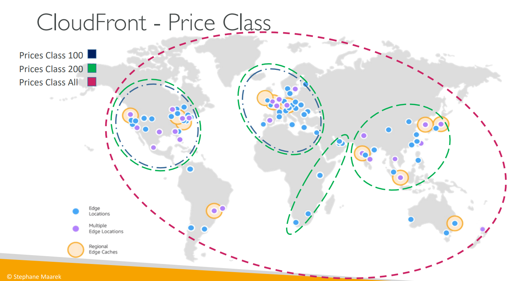
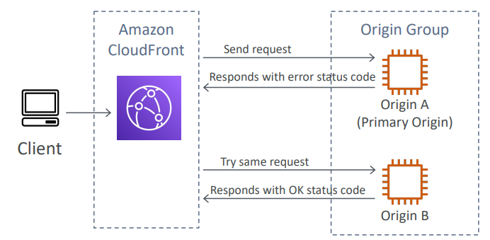

# Section 15. CloudFront

## CloudFront

- Content Delivery Network (CDN) service
- Improves read performance, content is cached at edge locations
- DDoS protection via AWS Shield

## Origins

- S3 bucket
  - For distributing files and caching them at the edge
  - Enhanced security with CloudFront Origin Access Control (OAI)
- Custom origin (HTTP)
  - Application Load Balancer
  - EC2 instance
  - S3 website
  - Any HTTP backend you want

## CloudFront vs. S3 Cross Region Replication

- CloudFront

  - Global Edge Network
  - Files are cached for a TTL
  - Great for static content that must be available everywhere

- S3 Cross Region Replication
  - Must be setup for each region you want replication to happen
  - Files are updated in near real-time
  - Read only
  - Great for dynamic content that needs to be available at low-latency in few regions

## CloudFront Caching

- Cache lives at the Edge Location
- CloudFront identifies each object using the cache key
  - Consists of `hostname + resource portion of the URL`
  - Can add headers to the cache key to differentiate objects (e.g. `User-Agent`)
- Want to maximize the cache hit rate
- Can invali date part of the cache using CreateInvalidation API

## CloudFront Policies - Cache Policy

- Cache based on http headers, cookies, query strings
  - HTTP Header (whitelist): only specified headers are included in the cache key
  - Query String (whitelist): only specified query strings are included in the cache key
  - Query String (Include All-Except): all query strings are included in the cache key except the ones specified
  - Query String (All): all query strings are included in the cache key
- Control TTL (0 seconds to 1 year)
- Create own policy or use predefined managed policies

## Origin Request Policy

- Specify headers, cookies, methods to include in requests to the origin
- Can add CloudFront HTTP headers and Custom Headers to the origin

## Cache Invalidation

- When an object changes at the origin, you can invalidate the cache
- Force CloudFront to fetch the latest version of the object

## Cache Behaviors

- Configure different cache behaviors based on URL path patterns
- Default cache behavior (\*) will apply to all URLs

## CloudFront Geo Restriction

- Allowlist: Whitelist countries that can access content
- Blocklist: Blacklist countries that cannot access content

## CloudFront Signed URLs / Cookies

- Distribute paid content to premium users
- Signed URL: includes a signature so the user can access the content for a limited time
- Signed Cookies: more complex, allows access to multiple restricted files

## CloudFront Signed URLs vs. S3 Pre-Signed URLs

- CloudFront Signed URLs / Cookies

  - Allow access to a path, no matter the origin
  - Account wide key-pair, only the root can manage it
  - Can filter by IP, path, date, expiration
  - Can leverage caching features

- S3 Pre-Signed URLs
  - Issue a request as the person who pre-signed the URL
  - Uses the IAM key of the signing IAM principal
  - Limited lifetime

## CloudFront Signed URLs Process

1. A trusted key group: Can leverage APIs to create keys
2. An AWS account containing the key pair: Need to manage the keys using the root account (not recommended)

- Private key: Used by application to sign URLs
- Public key: Stored in CloudFront, used to verify URLs

## CloudFront Price Class

- Reduce the number of edge locations to reduce cost
- 3 price classes
  - Price Class All: All regions, best performance
  - Price Class 200: Most regions, excludes more expensive regions
  - Price Class 100: least expensive regions

## Multiple Origin

- Route to different origins based on the content type

## Origin Group

- To increase high availability and do failover
- 1 primary origin, 1 secondary origin
- If primary fails, CloudFront will failover to secondary

## Real Time Logs

- Real-time log received by CloudFront send to Kinesis Data Streams
- 2 Types of logs
  - Sampling Rate: percentage of requests to log
  - Specific Fields: log only specific fields
