# Section 17. Elastic Beanstalk

## Elastic Beanstalk

- Most web apps have the same architecture
- Developer centric view of deploying an application on AWS
- Use all the component’s we’ve seen before: EC2, ASG, ELB, RDS, …
- Managed service
  - Automatically handles capacity provisioning, load balancing, scaling, application health monitoring, instance configuration, …
  - Just the application code is the responsibility of the developer
- Full control over the configuration
- Beanstalk is free but you pay for the underlying instances

## Components

- **Application**: collection of Elastic Beanstalk components (environments,
  versions, configurations, …)
- **Application Version**: an iteration of your application code
- **Environment**
  - Collection of AWS resources running an application version (only one application version at a time)
  - Tiers: Web Server Environment Tier & Worker Environment Tier
  - Can create multiple environments (dev, test, prod, …)

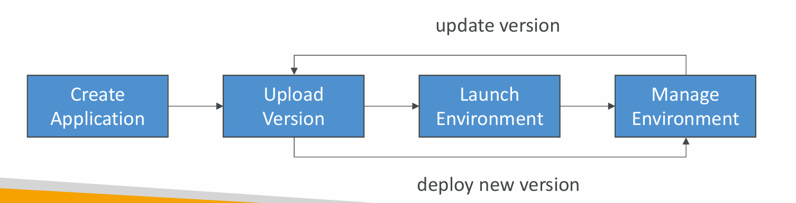

## Supported Platforms

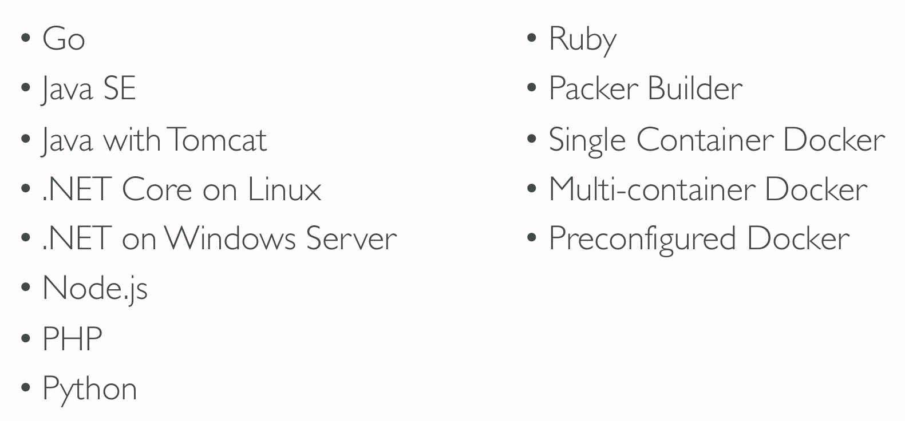

- custom platform

### Web Server Tier vs. Worker Tier

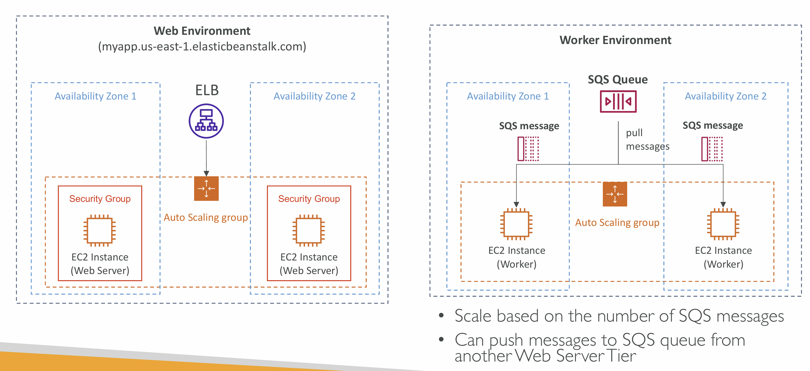

## Elastic Beanstalk Deployment Modes

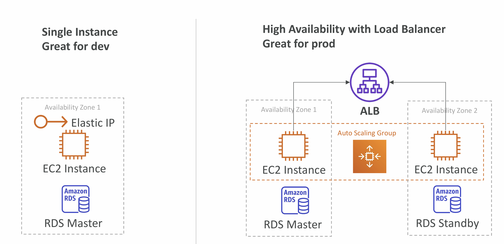

## Beanstalk Deployment Options for Updates

- All at once
- Rolling
- Rolling with additional batches
- Immutable
- Blue Green
- Traffic Splitting

## All at once

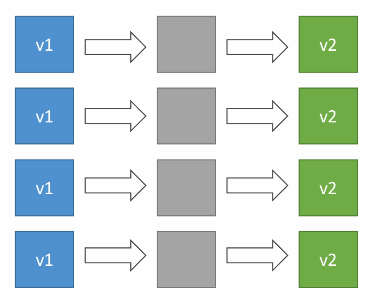

- Fastest deployment
- Application has downtime
- Great for quick iterations in development environment
- No additional cost

### Rolling

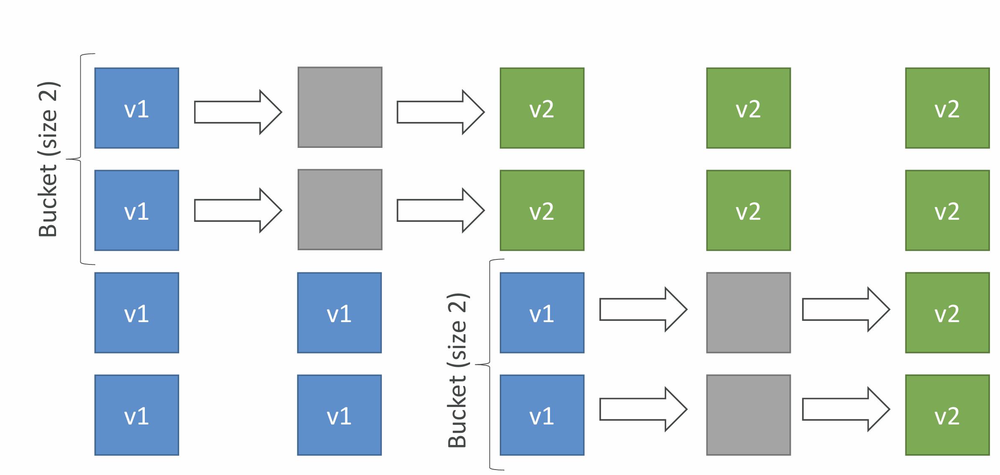

- Application is running below capacity
- Can set the bucket size
- Application is running both versions simultaneously
- No additional cost
- Long deployment

## Rolling with additional batches

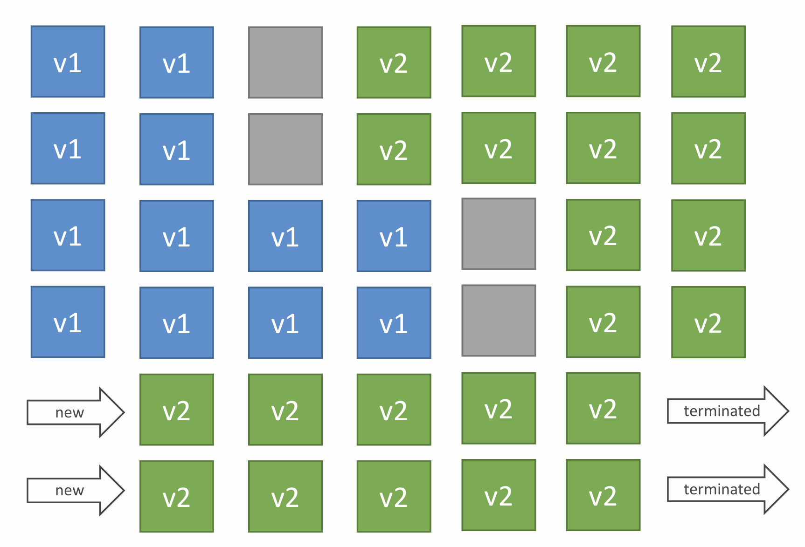

- Application is running at capacity
- Can set the bucket size
- Application is running both versions simultaneously
- Small additional cost
- Additional batch is removed at the end of the deployment
- Longer deployment
- Good for prod

## Immutable

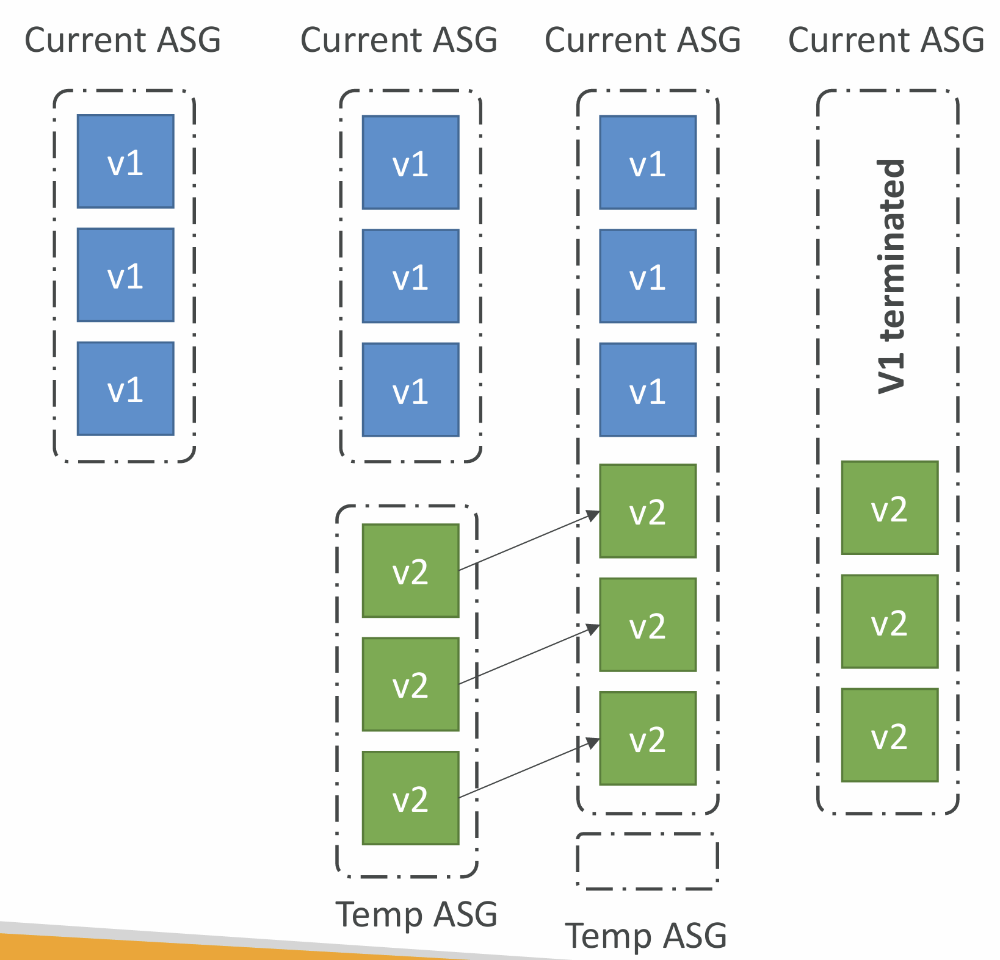

- Zero downtime
- New Code is deployed to new
  instances on a temporary ASG
- High cost, double capacity
- Longest deployment
- Quick rollback in case of failures
  (just terminate new ASG)
- Great for prod

## Blue Green

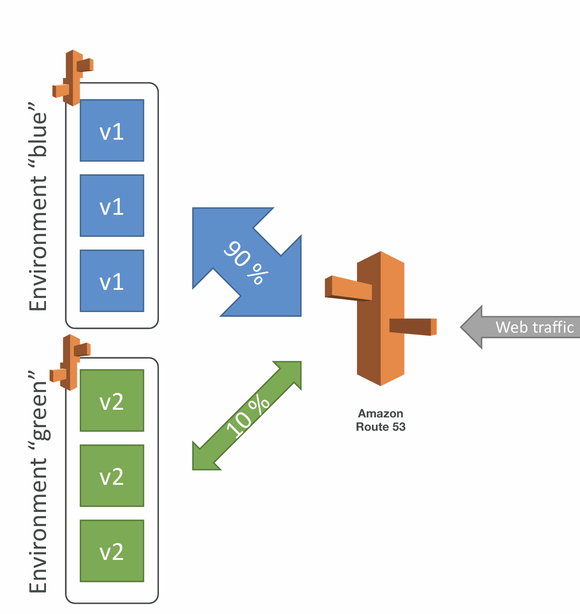

- Not a “direct feature” of Elastic Beanstalk
- Zero downtime and release facility
- Create a new “stage” environment and
  deploy v2 there
- The new environment (green) can be
  validated independently and roll back if
  issues
- Route 53 can be setup using weighted
  policies to redirect a little bit of traffic to
  the stage environment
- Using Beanstalk, “swap URLs” when done
  with the environment test

## Traffic Splitting

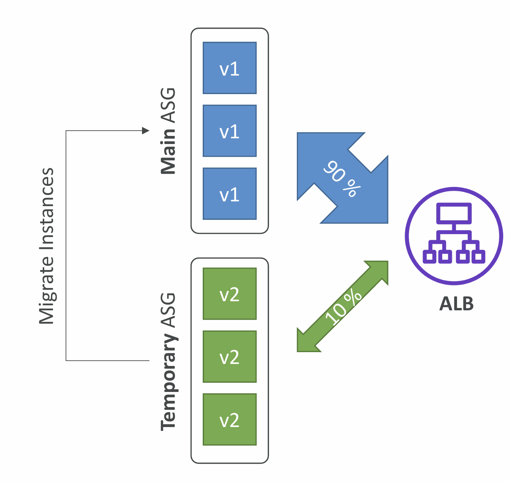

- Canary Testing
- New application version is deployed to a
  temporary ASG with the same capacity
- A small % of traffic is sent to the
  temporary ASG for a configurable amount
  of time
- Deployment health is monitored
- If there’s a deployment failure, this triggers
  an automated rollback (very quick)
- No application downtime
- New instances are migrated from the
  temporary to the original ASG
- Old application version is then terminated

## Elastic Beanstalk CLI

- We can install an additional CLI called the “EB cli” which makes working with Beanstalk from the CLI easier
- Basic commands are:
  - eb create
  - eb status
  - eb health
  - eb events
  - eb logs
  - eb open
  - eb deploy
  - eb config
  - eb terminate
- It’s helpful for your automated deployment pipelines!

## Elastic Beanstalk Deployment Process

- Describe dependencies
  (requirements.txt for Python, package.json for Node.js)
- Package code as zip, and describe dependencies
  - Python: requirements.txt
  - Node.js: package.json
- Console: upload zip file (creates new app version), and then deploy
- CLI: create new app version using CLI (uploads zip), and then deploy
- Elastic Beanstalk will deploy the zip on each EC2 instance, resolve
  dependencies and start the application

## Beanstalk Lifecycle Policy

- Elastic Beanstalk can store at most 1000 application versions
- To phase out old application versions, use a lifecycle policy
  - Based on time (old versions are removed)
  - Based on space (when you have too many versions)
- Versions that are currently used won’t be deleted
- Option not to delete the source bundle in S3 to prevent data loss

## Elastic Beanstalk Extensions

- A zip file containing our code must be deployed to Elastic Beanstalk
- All the parameters set in the UI can be configured with code using files
- Requirements:
  - in the .ebextensions/ directory in the root of source code
  - YAML / JSON format
  - .config extensions (example: logging.config)
- Able to modify some default settings using: option_settings
- Ability to add resources such as RDS, ElastiCache, DynamoDB, etc…
- Resources managed by .ebextensions get deleted if the environment goes away

## Elastic Beanstalk Under the Hood

- Under the hood, Elastic Beanstalk relies on CloudFormation
- CloudFormation is used to provision other AWS services
- Use case: Can define CloudFormation resources in your .ebextensions to provision ElastiCache, an S3 bucket, anything you want!

## Elastic Beanstalk Cloning

- Clone an environment with the exact same configuration
- Useful for deploying a “test” version of your application
- All resources and configuration are preserved:
  - Load Balancer type and configuration
  - RDS database type (but the data is not preserved)
  - Environment variables
- After cloning an environment, you can change settings

## Elastic Beanstalk Migration: Load Balancer

- After creating an Elastic Beanstalk environment, you cannot change the Elastic Load Balancer type (only the configuration)
- To migrate:
  1. create a new environment with the same configuration except LB (can’t clone)
  2. deploy your application onto the new environment
  3. perform a CNAME swap or Route 53 update

## RDS with Elastic Beanstalk

- RDS can be provisioned with Beanstalk, which is great for dev / test
- This is not great for prod as the database lifecycle is tied to the Beanstalk environment lifecycle
- The best for prod is to separately create an RDS database and provide our EB application with the connection string

## Elastic Beanstalk Migration: Decouple RDS

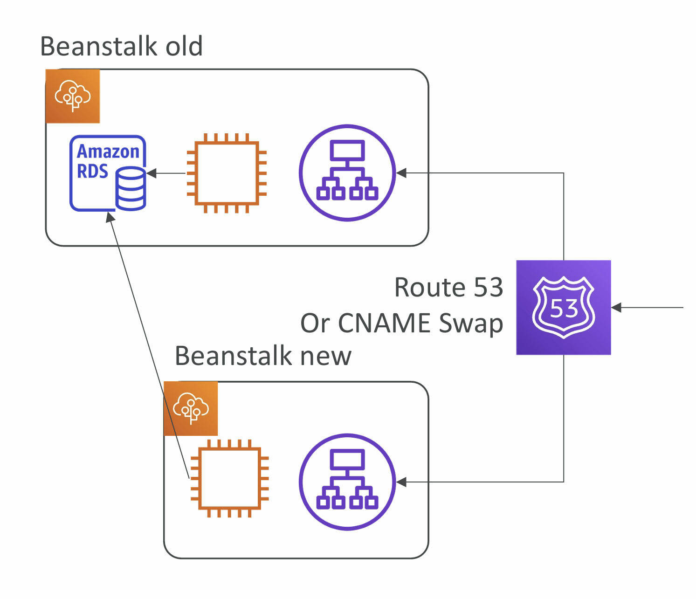

1. Create a snapshot of RDS DB (as a safeguard)
2. Go to the RDS console and protect the RDS database from deletion
3. Create a new Elastic Beanstalk environment, without RDS, point your application to existing RDS
4. perform a CNAME swap (blue/green) or Route 53 update, confirm working
5. Terminate the old environment (RDS won’t be deleted)
6. Delete CloudFormation stack (in DELETE_FAILED state)
