# Section 16. ECS, ECR & Fargate - Docker in AWS

## Docker

- Docker images are stored in repositories in Docker Hub or Amazon ECR (Elastic Container Registry).
- Docker containers management on AWS:
  - ECS (Elastic Container Service)
  - EKS (Elastic Kubernetes Service)
  - Fargate
  - ECR

## ECS (Elastic Container Service)

- EC2 Launch Type
  - Developers must provision and manage the underlying infrastructure.
  - Each EC2 instance must run ECS agent to register in the ECS cluster.
  - AWS takes care of starting & stopping containers on EC2 instances.
    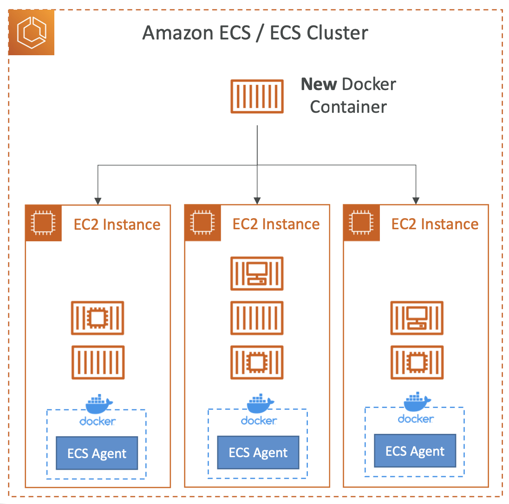
- Fargate Launch Type (Serverless)
  - Developers don't need to worry about the underlying infrastructure.
  - AWS takes care of starting & stopping containers on Fargate instances.
    

## IAM Roles for ECS

- EC2 Instance Profile
  - Used by ECS agent to communicate with ECS service. (ex. ECS, ECR, CloudWatch)
- ECS Task Role
  - Used by ECS task to communicate with other AWS services. (ex. S3, DynamoDB)
    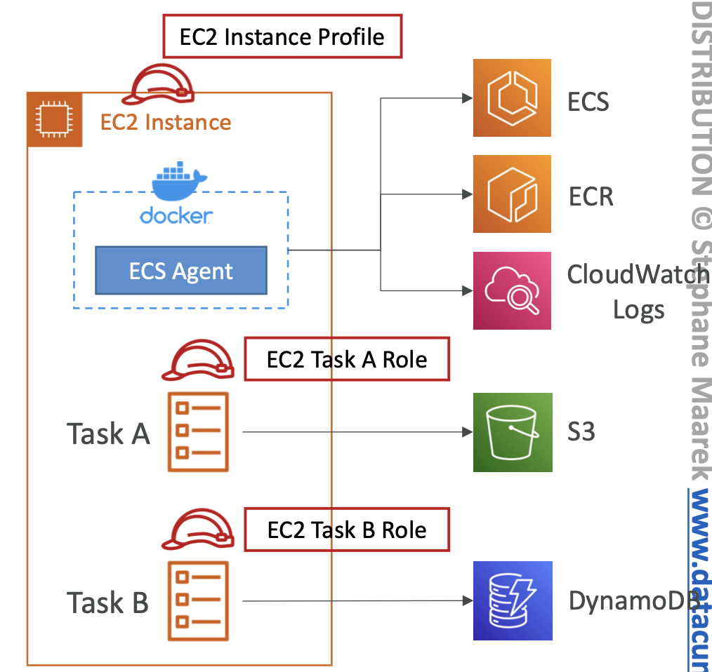

## ECS - Load Balancer Integrations

- Application Load Balancer (ALB)
  - Supports and works for most use cases.
- Network Load Balancer (NLB)
  - Recommended for high-performance workloads, or to pair with AWS Private Link.
    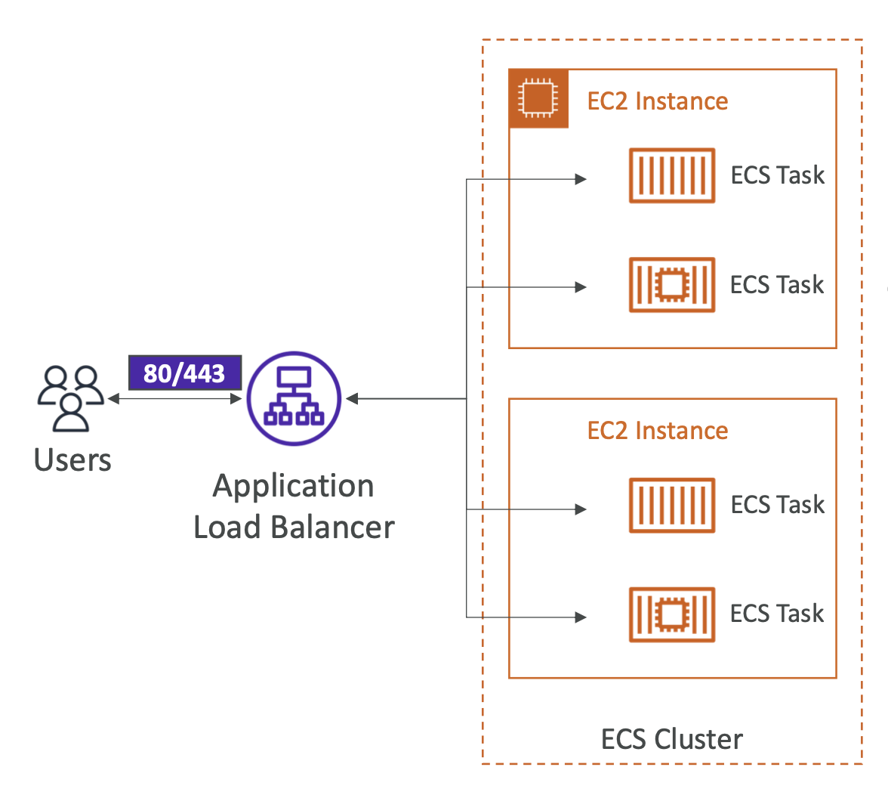

## ECS - Data Volumes

- EFS (Elastic File System)
  - Persistent multi-AZ storage for ECS tasks.
  - Serverless.
  - Works for both EC2 and Fargate launch types.
- S3 cannot be mounted as a file system.

## ECS - Auto Scaling

- Auto Scaling based on:
  - CPU utilization.
  - Memory utilization.
  - ALB request count per target.
- ECS Service Auto Scaling:
  - Target tracking scaling: target a specific value for a specific CloudWatch metric.
  - Step scaling: scale based on CloudWatch alarms.
  - Scheduled scaling: scale based on time.
- EC2 Auto Scaling != ECS Service Auto Scaling.
  - EC2 Auto Scaling: scales the number of EC2 instances in the ECS cluster.
  - ECS Service Auto Scaling: scales the number of tasks in the ECS service.
- ECS Cluster Capacity Providers
  - Automatically provision capacity for ECS tasks.
  - Pair with Auto Scaling groups.
    

## ECS - Rolling Update

- When updating, we can control how many tasks are updated at a time.
- Minimum healthy percent: minimum number of tasks that must be healthy during an update.
- Maximum percent: maximum number of tasks that can be started during an update.

- Ex: 4 tasks, 50% min, 100% max
  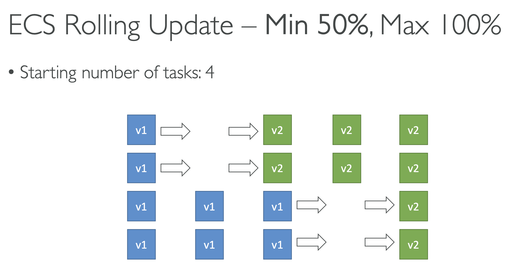
- Ex: 4 tasks, 100% min, 200% max
  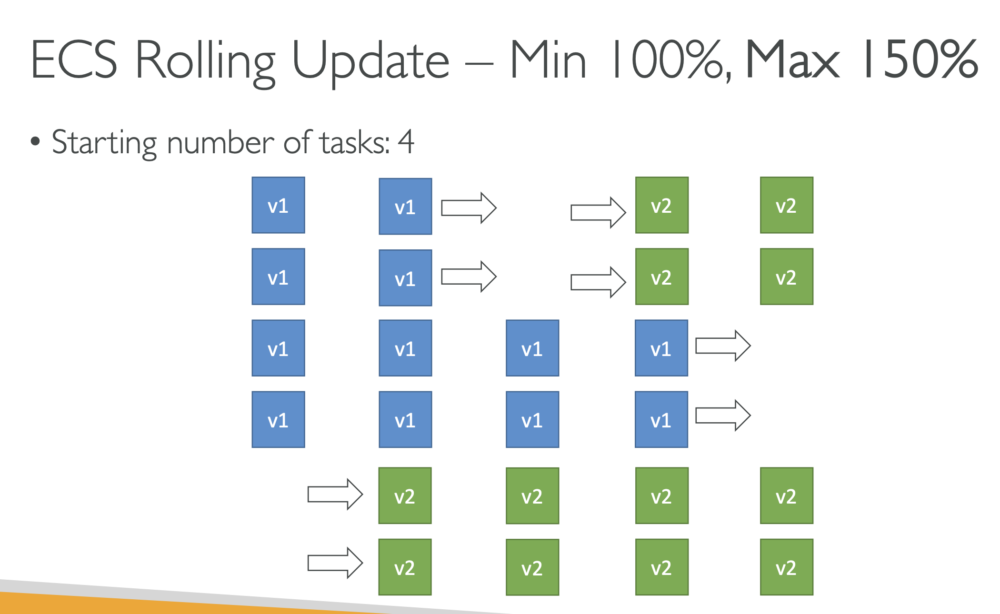

## ECS - Solution Architectures

- ECS tasks invoked by EventBridge.
  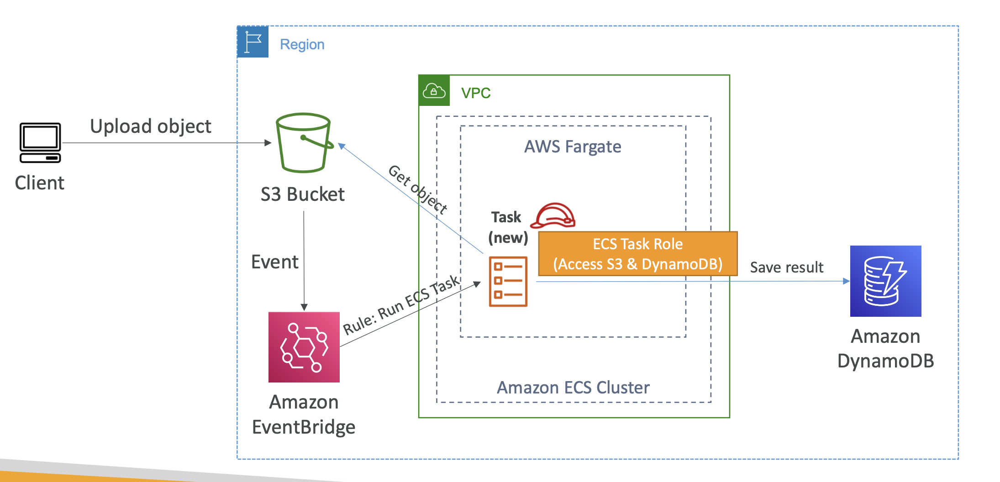
- ECS tasks invoked by EventBridge Schedule.
  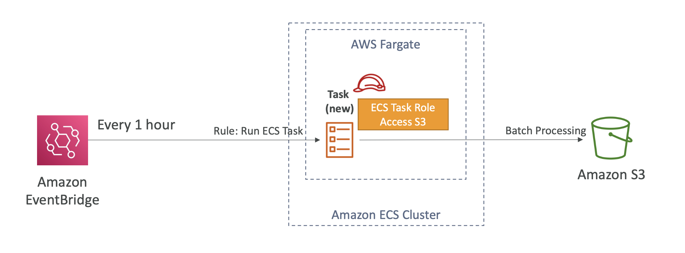
- SQS
  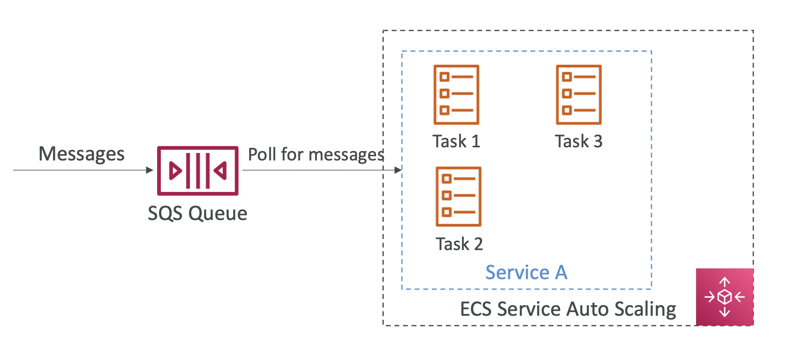
- Intercept Stopped Tasks using EventBridge
  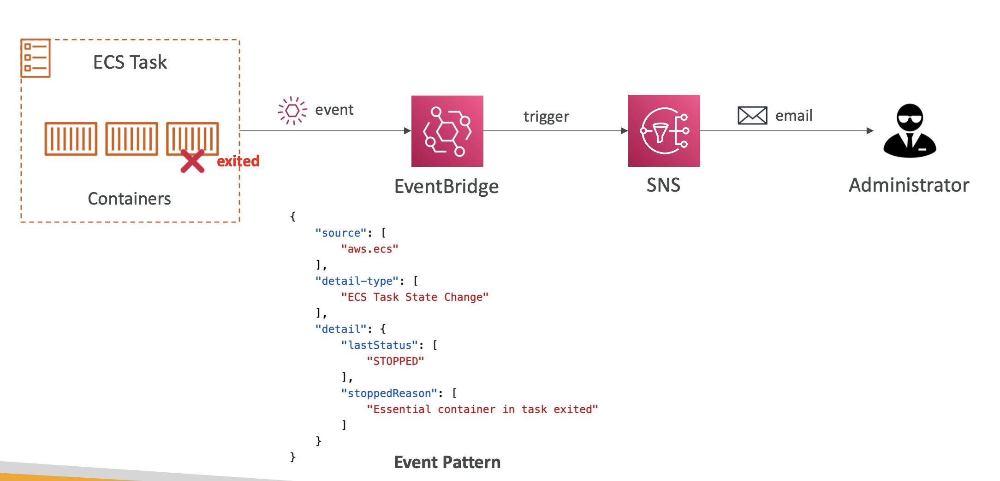

## ECS - Task Definitions

- In JSON format to define containers, volumes, environment variables, etc.
- Can define up to 10 containers in a task definition.

## ECS - Load Balancing (EC2 Launch Type)

- Container port is fixed but host port is dynamic.
- ALB's Dynamic Port Mapping: ALB finds the host port for the container port.
- EC2 instances must be in a security group that allows traffic from the ALB.
  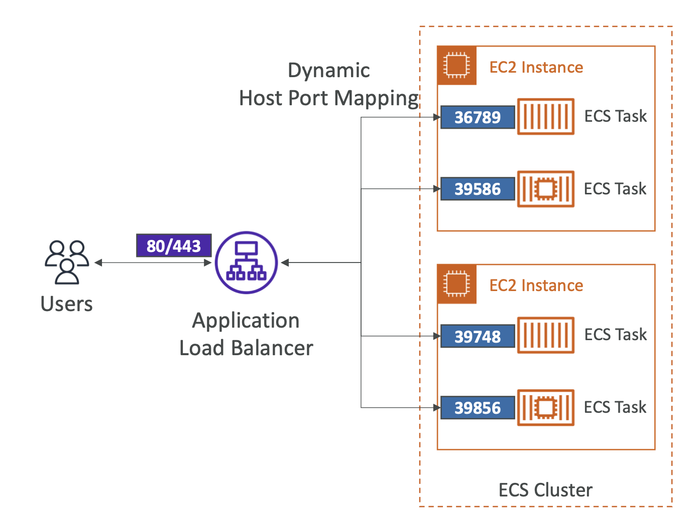

## ECS - Load Balancing (Fargate)

- Each task has a unique IP address.
- Only define the container port in the task definition.

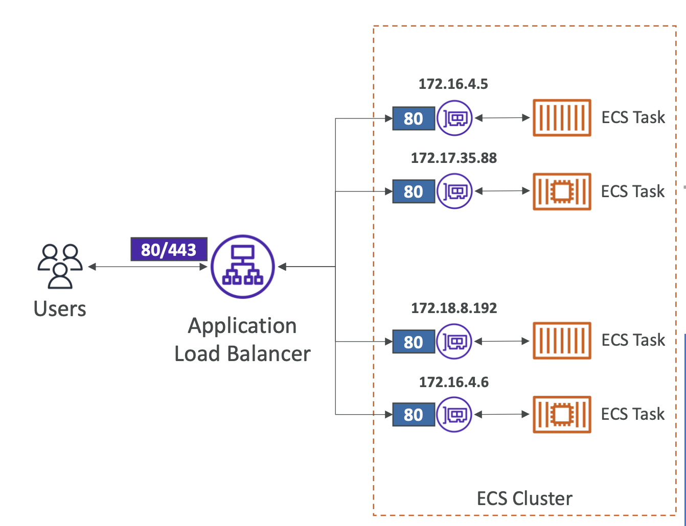

## ECS - Environment Variables

- HardCoded: defined in the task definition.
- SSM Parameter Store: store secrets in SSM and reference them in the task definition.
- Secrets Manager: store secrets in Secrets Manager and reference them in the task definition.

## ECS - Task Placement

- Task Placement Strategies:

  - Binpack: packs tasks based on CPU and memory requirements.
  - Random: places tasks randomly.
  - Spread: spreads tasks across instances. (ex. AZs, instance Ids)

- Task Placement Constraints:
  - DistinctInstance: places tasks on instances with different instance IDs.
  - MemberOf: places tasks on instances that satisfy an expression. (using cluster query language)

## ECR (Elastic Container Registry)

- Private & Public repositories to store Docker images.
- Access is controlled by IAM policies.
- Supports image vulnerability scanning, versioning, image tags, image lifecycle.

## ECR - AWS CLI

- Authenticate Docker CLI to ECR:
  ```bash
  aws ecr get-login-password --region region | docker login --username AWS --password-stdin aws_account_id.dkr.ecr.region.amazonaws.com
  ```
- Push Docker image to ECR:
  ```bash
  docker tag image_name:tag aws_account_id.dkr.ecr.region.amazonaws.com/repository_name:tag
  docker push aws_account_id.dkr.ecr.region.amazonaws.com/repository_name:tag
  ```
- Pull Docker image from ECR:
  ```bash
  docker pull aws_account_id.dkr.ecr.region.amazonaws.com/repository_name:tag
  ```

## AWS Copilot

- CLI tool to build, release, and operate production-ready containerized applications on AWS.
- Run apps on ECS, Fargate, and App Runner.
- Automated CI/CD pipeline.
- Supports multiple environments (dev, test, prod).

## EKS (Elastic Kubernetes Service)

- EKS supports EC2 to deploy worker nodes or Fargate to deploy serverless containers.
- For multiple regions, deploy one EKS cluster per region.
  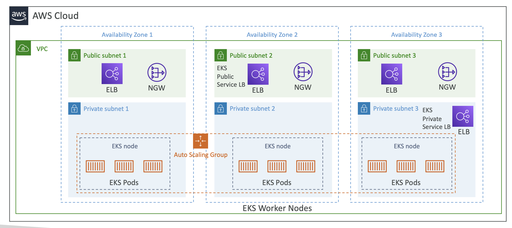

## EKS - Node Types:

- Managed Node Group: managed by AWS.
- Self-Managed Node Group: managed by the user. (ASG & AMI)
- Fargate: serverless. (no nodes)

## EKS - Data Volumes

- Need to specify StorageClass manifest on EKS cluster.
- Leverages CSI (Container Storage Interface) compliant drivers.

- Supports for:
  - EBS (Elastic Block Store)
  - EFS (Elastic File System)
  - FSx for Lustre
  - FSx for NetApp ONTAP
