# Section 19. AWS Integration & Messaging (SQS, SNS & Kinesis)

## Introduction

- When we start deploying multiple applications, they will inevitably need to communicate with one another
- There are two patterns of application communication

    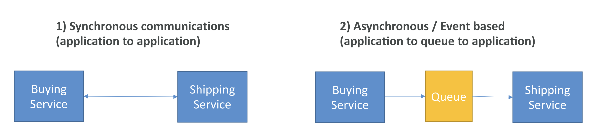

- Synchronous between applications can be problematic if there are
  sudden spikes of traffic
  - ex) What if you need to suddenly encode 1000 videos but usually it’s 10?
- In that case, it’s better to decouple your applications,
  - using **SQS: queue model**
  - using **SNS: pub/sub model**
  - using **Kinesis: real-time streaming mode**

## SQS

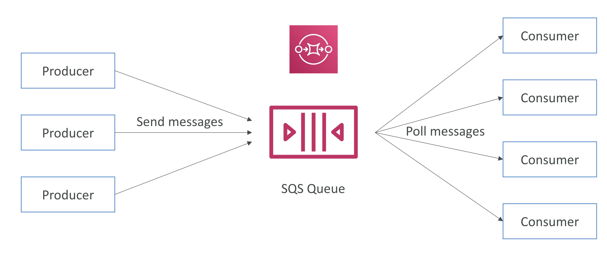

## Standard Queue

- Oldest offering (over 10 years old)
- Fully managed service, used to decouple applications
- Attributes:
  - Unlimited throughput, unlimited number of messages in queue
  - Default retention of messages: 4 days, maximum of 14 days
  - Low latency (<10 ms on publish and receive)
  - Limitation of 256KB per message sent
- Can have duplicate messages (at least once delivery, occasionally)
- Can have out of order messages (best effort ordering)

## Producing Messages

- Produced to SQS using the SDK (SendMessage API)
- The message is persisted in SQS until a consumer deletes it
- Message retention: default 4 days, up to 14 days
- SQS standard: unlimited throughput

## Consuming Messages

- Consumers (running on EC2 instances, servers, or AWS Lambda)…
- Poll SQS for messages (receive up to 10 messages at a time)
- Process the messages
- Delete the messages using the DeleteMessage API

## Multiple EC2 Instances Consumers

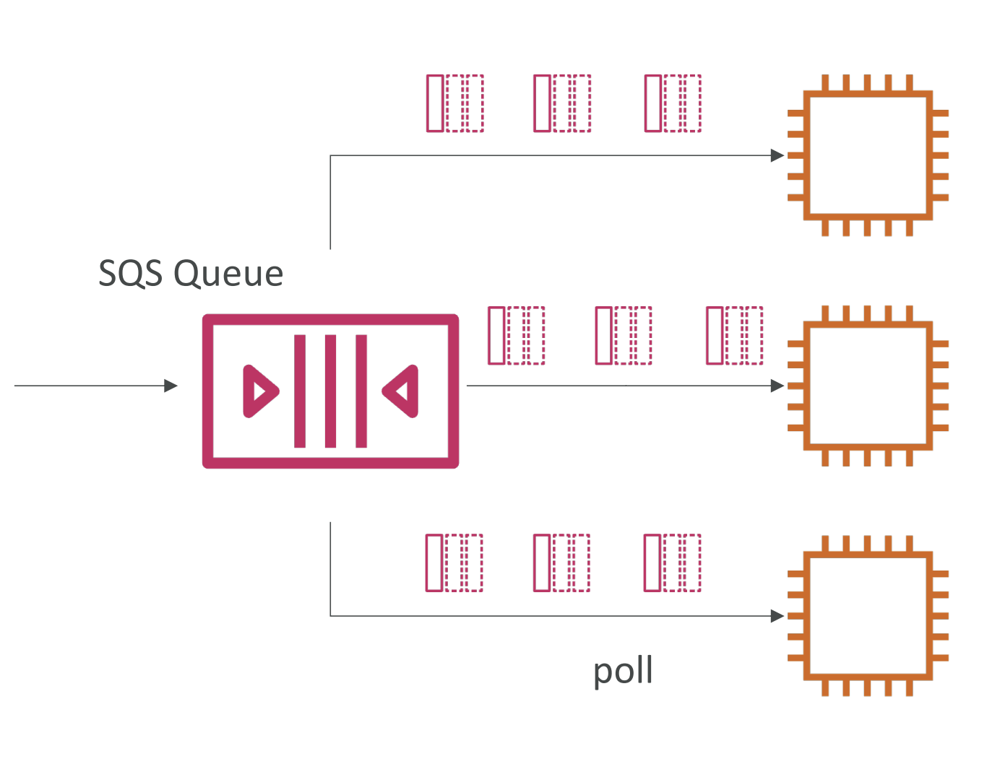

- Consumers receive and process messages in parallel
- At least once delivery
- Best-effort message ordering
- Consumers delete messages after processing them
- We can scale consumers horizontally to improve throughput of processing

## SQS with Auto Scaling Group (ASG)

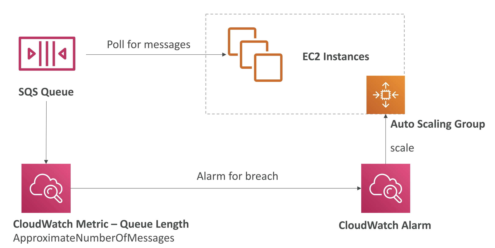

## SQS to decouple between application tiers

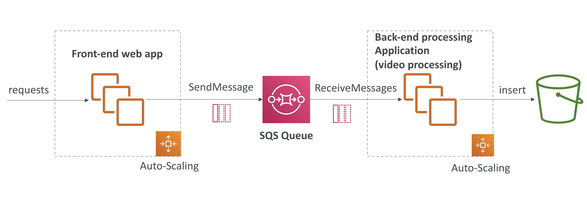

## Security

- Encryption:
  - In-flight encryption using HTTPS API
  - At-rest encryption using KMS keys
  - Client-side encryption if the client wants to perform encryption/decryption itself
- Access Controls: IAM policies to regulate access to the SQS API
- SQS Access Policies (similar to S3 bucket policies)
  - Useful for cross-account access to SQS queues
  - Useful for allowing other services (SNS, S3…) to write to an SQS queue

## SQS Queue Access Policy

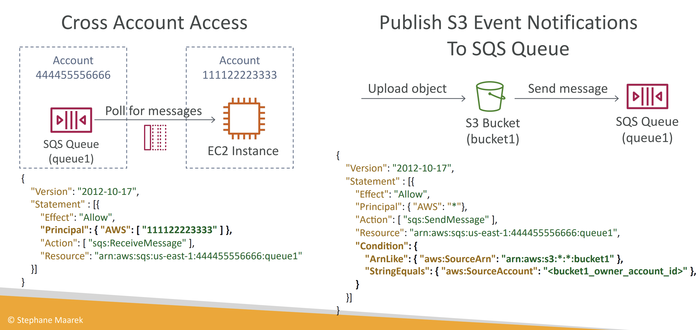

## Message Visibility Timeout

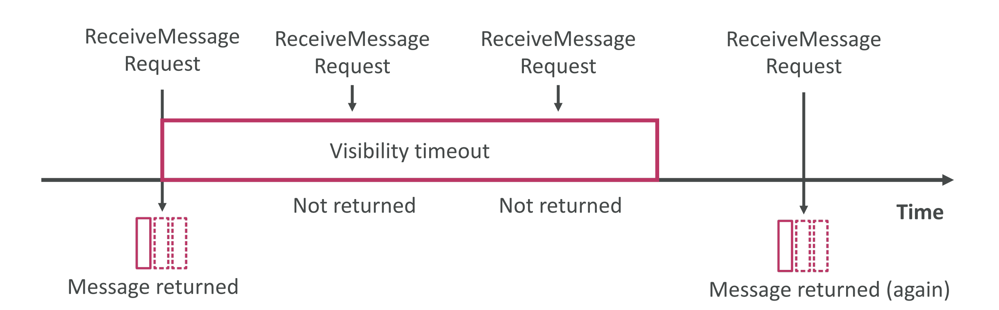

- After a message is polled by a consumer, it becomes invisible to other consumers
- By default, the “message visibility timeout” is 30 seconds
- After the message visibility timeout is over, the message is “visible” in SQS
- If a message is not processed within the visibility timeout, it will be processed twice
- A consumer could call the ChangeMessageVisibility API to get more time
- If visibility timeout is high (hours), and consumer crashes, re-processing will take time
- If visibility timeout is too low (seconds), we may get duplicates

## Dead Letter Queue (DLQ)

- We can set a threshold of how many times a message can go back to the queue
- After the MaximumReceives threshold is exceeded, the message goes into a Dead Letter Queue (DLQ)
- Useful for debugging!
- DLQ of a FIFO queue must also be a FIFO queue
- DLQ of a Standard queue must also be a Standard queue
- Make sure to process the messages in the DLQ before they expire:
  - Good to set a retention of 14 days in the DLQ

### Redrive to Source

- Feature to help consume messages in the DLQ to understand what is wrong with them
- When our code is fixed, we can redrive the messages from the DLQ back into the source queue (or any other queue) in batches without writing custom code

## Delay Queue

- Delay a message (consumers don’t see it immediately) up to 15 minutes
- Default is 0 seconds (message is available right away)
- Can set a default at queue level
- Can override the default on send using the DelaySeconds parameter

## Long Polling

- When a consumer requests messages from the queue, it can optionally “wait” for messages to arrive if there are none in the queue
- LongPolling decreases the number of API calls made to SQS while increasing the efficiency and decreasing the latency of your application.
- The wait time can be between 1 sec to 20 sec (20 sec preferable)
- Long Polling is preferable to Short Polling
- Long polling can be enabled at the queue level or at the API level using ReceiveMessageWaitTimeSeconds

## Extended Client

- Message size limit is 256KB, how to send large messages?
- Using the SQS Extended Client (Java Library)

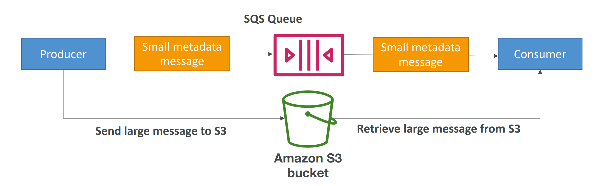

## Must know API

- **CreateQueue (MessageRetentionPeriod), DeleteQueue**
- **PurgeQueue**: delete all the messages in queue
- **SendMessage (DelaySeconds), ReceiveMessage, DeleteMessage**
- **MaxNumberOfMessages**: default 1, max 10 (for ReceiveMessage API)
- **ReceiveMessageWaitTimeSeconds**: Long Polling
- **ChangeMessageVisibility:** change the message timeout

- Batch APIs for SendMessage, DeleteMessage,ChangeMessageVisibility helps decrease your costs

## FIFO Queue

- FIFO = First In First Out (ordering of messages in the queue)
- Limited throughput: 300 msg/s without batching, 3000 msg/s with
- Exactly-once send capability (by removing duplicates)
- Messages are processed in order by the consumer

## FIFO – Deduplication

- De-duplication interval is 5 minutes
- Two de-duplication methods:
  - Content-based deduplication: will do a SHA-256 hash of the message body
  - Explicitly provide a Message Deduplication ID

## FIFO – Message Grouping

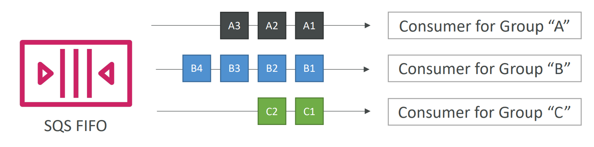

- Specify MessageGroupID in an SQS FIFO queue
- Messages that share a common Message Group ID will be in order within the group
- Parallel processing
- Ordering across groups is not guaranteed

## SNS

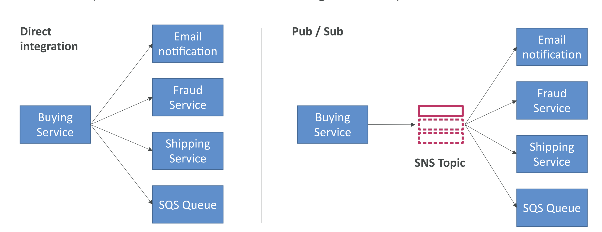

- The “event producer” only sends message to one SNS topic
- As many “event receivers” (subscriptions) as we want to listen to the SNS topic
  notifications
- Each subscriber to the topic will get all the messages
- Up to 12,500,000 subscriptions per topic
- 100,000 topics limit
- Many AWS services can send data directly to SNS for notifications

## SNS – How to publish

- Topic Publish (using the SDK)
  - Create a topic
  - Create a subscription (or many)
  - Publish to the topic
- Direct Publish (for mobile apps SDK)
  - Create a platform application
  - Create a platform endpoint
  - Publish to the platform endpoint
  - Works with Google GCM, Apple APNS, Amazon ADM…

## SNS – Security

- Encryption:
  - In-flight encryption using HTTPS API
  - At-rest encryption using KMS keys
  - Client-side encryption if the client wants to perform encryption/decryption itself
- Access Controls: IAM policies to regulate access to the SNS API
- SNS Access Policies (similar to S3 bucket policies)
  - Useful for cross-account access to SNS topics
  - Useful for allowing other services (S3…) to write to an SNS topic

## SNS + SQS: Fan Out

- Push once in SNS, receive in all SQS queues that are subscribers
- Fully decoupled, no data loss
- SQS allows for: data persistence, delayed processing and retries of work
- Ability to add more SQS subscribers over time
- Make sure your SQS queue access policy allows for SNS to write
- Cross-Region Delivery: works with SQS Queues in other regions

### SNS + SQS Application

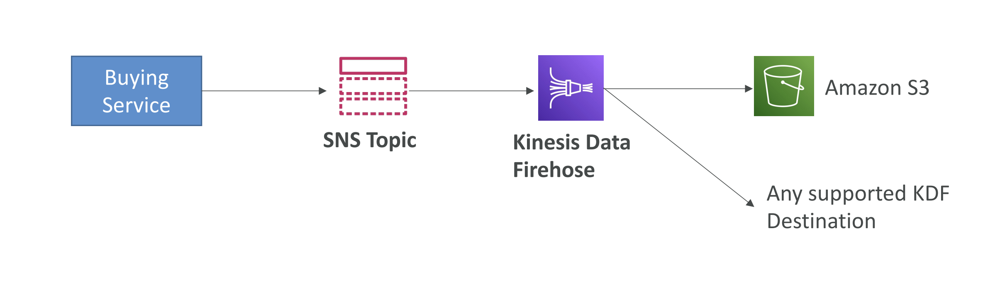

## SNS – FIFO Topic

- Similar features as SQS FIFO:
  - Ordering by Message Group ID (all messages in the same group are ordered)
  - Deduplication using a Deduplication ID or Content Based Deduplication
- Can have SQS Standard and FIFO queues as subscribers
- Limited throughput (same throughput as SQS FIFO)

## SNS – Message Filtering

- JSON policy used to filter messages sent to SNS topic’s subscriptions
- If a subscription doesn’t have a filter policy, it receives every message

## Kinesis Overview

- Makes it easy to collect, process, and analyze streaming data in real-time
- Ingest real-time data such as: Application logs, Metrics, Website clickstreams,
  IoT telemetry data…

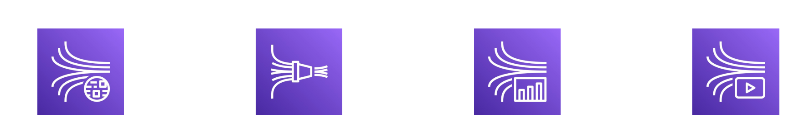

- **Kinesis Data Streams**: capture, process, and store data streams
- **Kinesis Data Firehose**: load data streams into AWS data stores
- **Kinesis Data Analytics**: analyze data streams with SQL or Apache Flink
- **Kinesis Video Streams**: capture, process, and store video streams

## Kinesis Data Streams

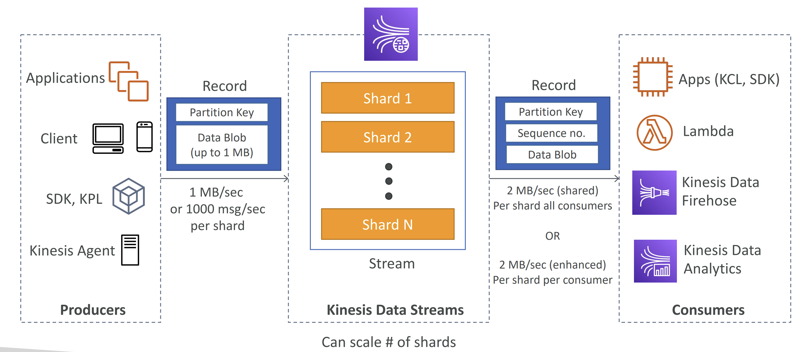

- Retention between 1 day to 365 days
- Ability to reprocess (replay) data
- Once data is inserted in Kinesis, it can’t be deleted (immutability)
- Data that shares the same partition goes to the same shard (ordering)
- Producers: AWS SDK, Kinesis Producer Library (KPL), Kinesis Agent
- Consumers:
  - Write your own: Kinesis Client Library (KCL), AWS SDK
  - Managed: AWS Lambda, Kinesis Data Firehose, Kinesis Data Analytics

## Kinesis Data Streams – Capacity Modes

- Provisioned mode:
  - You choose the number of shards provisioned, scale manually or using API
  - Each shard gets 1MB/s in (or 1000 records per second)
  - Each shard gets 2MB/s out (classic or enhanced fan-out consumer)
  - You pay per shard provisioned per hour
- On-demand mode:
  - No need to provision or manage the capacity
  - Default capacity provisioned (4 MB/s in or 4000 records per second)
  - Scales automatically based on observed throughput peak during the last 30 days
  - Pay per stream per hour & data in/out per GB

## Kinesis Data Streams Security

- Control access / authorization using
  IAM policies
- Encryption in flight using HTTPS
  endpoints
- Encryption at rest using KMS
- You can implement
  encryption/decryption of data on
  client side (harder)
- VPC Endpoints available for Kinesis to
  access within VPC
- Monitor API calls using CloudTrail

## Kinesis Producers

- Puts data records into data streams
- Data record consists of:
  - Sequence number (unique per partition-key within shard)
  - Partition key (must specify while put records into stream)
  - Data blob (up to 1 MB)
- Producers:
  - AWS SDK: simple producer
  - Kinesis Producer Library (KPL): C++, Java, batch, compression, retries
  - Kinesis Agent: monitor log files
- Write throughput: 1 MB/sec or 1000 records/sec per shard
- PutRecord API
- Use batching with PutRecords API to reduce costs & increase throughput

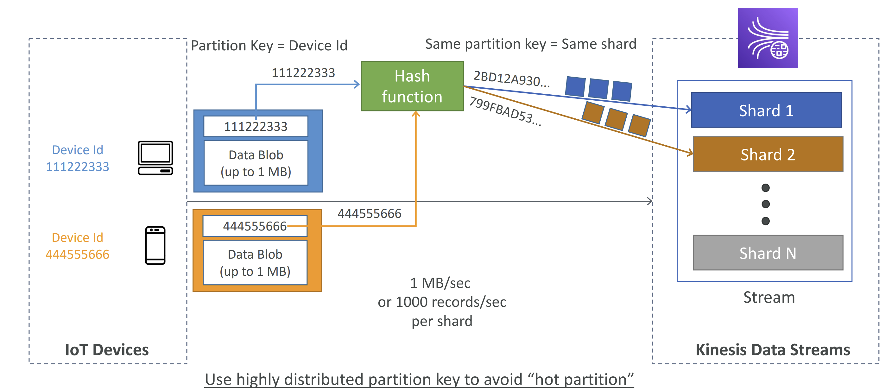

## Kinesis - ProvisionedThroughputExceeded

## Kinesis Data Streams Consumers

- Get data records from data streams and process them
  - AWS Lambda
  - Kinesis Data Analytics
  - Kinesis Data Firehose
  - Custom Consumer (AWS SDK) – Classic or Enhanced Fan-Out
  - Kinesis Client Library (KCL): library to simplify reading from data stream

## Kinesis Consumers – Custom Consumer

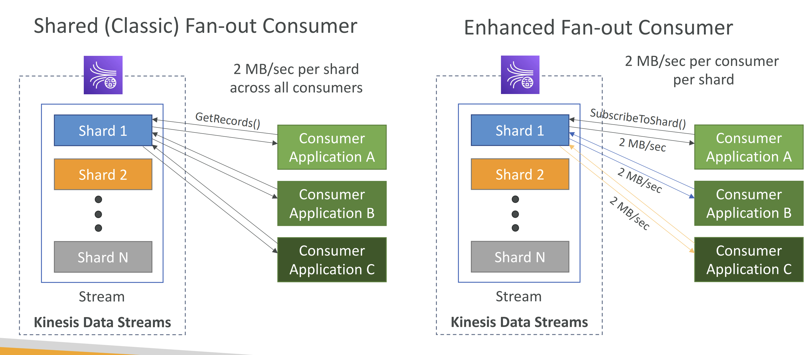

- Shared (Classic) Fan-out Consumer - pull
  - Low number of consuming applications
  - Read throughput: 2 MB/sec per shard across all consumers
  - Max. 5 GetRecords API calls/sec
  - Latency ~200 ms
  - Minimize cost ($)
  - Consumers poll data from Kinesis using GetRecords API call
  - Returns up to 10 MB (then throttle for 5 seconds) or up to 10000 records
- Enhanced Fan-out Consumer - push
  - Multiple consuming applications for the same stream
  - 2 MB/sec per consumer per shard
  - Latency ~70 ms
  - Higher costs ($$$)
  - Kinesis pushes data to consumers over HTTP/2 (SubscribeToShard API)
  - Soft limit of 5 consumer applications (KCL) per data stream (default)

## Kinesis Consumers – AWS Lambda

- Supports Classic & Enhanced fan-out consumers
- Read records in batches
- Can configure batch size and batch window
- If error occurs, Lambda retries until succeeds or data expired
- Can process up to 10 batches per shard simultaneously

## Kinesis Client Library (KCL)

- A Java library that helps read record from a Kinesis Data Stream with
  distributed applications sharing the read workload
- Each shard is to be read by only one KCL instance
  - 4 shards = max. 4 KCL instances
  - 6 shards = max. 6 KCL instances
- Progress is checkpointed into DynamoDB (needs IAM access)
- Track other workers and share the work amongst shards using DynamoDB
- KCL can run on EC2, Elastic Beanstalk, and on-premises
- Records are read in order at the shard level
- Versions:
  - KCL 1.x (supports shared consumer)
  - KCL 2.x (supports shared & enhanced fan-out consumer)

## Kinesis Operation – Shard Splitting

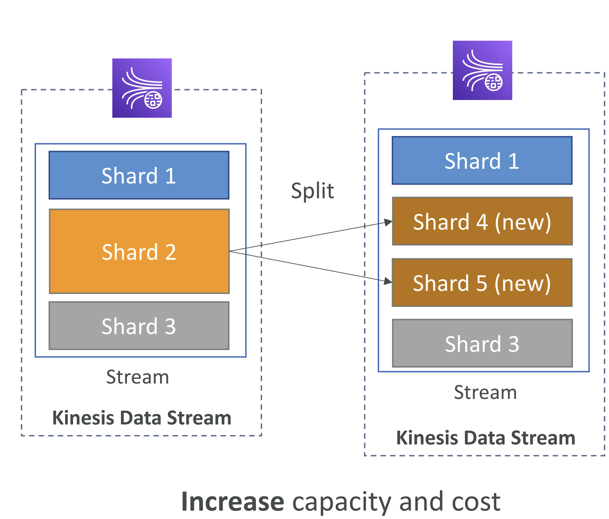

- Used to increase the Stream capacity (1 MB/s data in per shard)
- Used to divide a “hot shard”
- The old shard is closed and will be deleted once the data is expired
- No automatic scaling (manually increase/decrease capacity)
- Can’t split into more than two shards in a single operation

## Kinesis Operation – Merging Shards

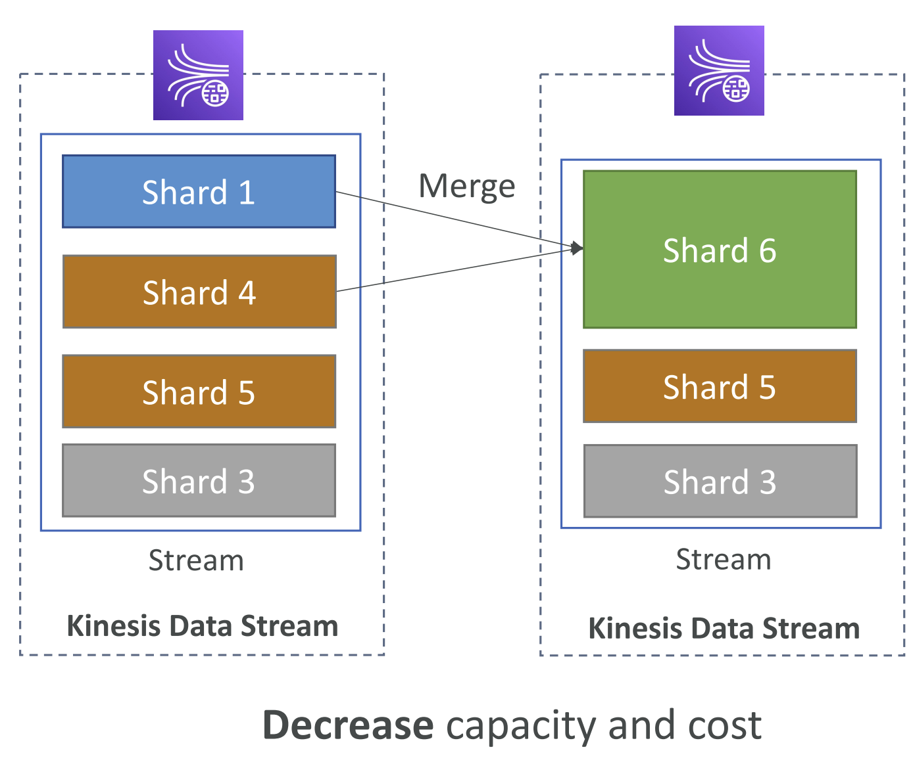

- Decrease the Stream capacity and save costs
- Can be used to group two shards with low traffic (cold shards)
- Old shards are closed and will be deleted once the data is expired
- Can’t merge more than two shards in a single operation

## Kinesis Data Firehose

- Fully Managed Service, no administration, automatic scaling, serverless
  - AWS: Redshift / Amazon S3 / OpenSearch
  - 3rd party partner: Splunk / MongoDB / DataDog / NewRelic / …
  - Custom: send to any HTTP endpoint
- Pay for data going through Firehose
- Near Real Time
  - Buffer interval: 0 seconds (no buffering) to 900 seconds
  - Buffer size: minimum 1MB
- Supports many data formats, conversions, transformations, compression
- Supports custom data transformations using AWS Lambda
- Can send failed or all data to a backup S3 bucket

## Kinesis Data Analytics for SQL applications

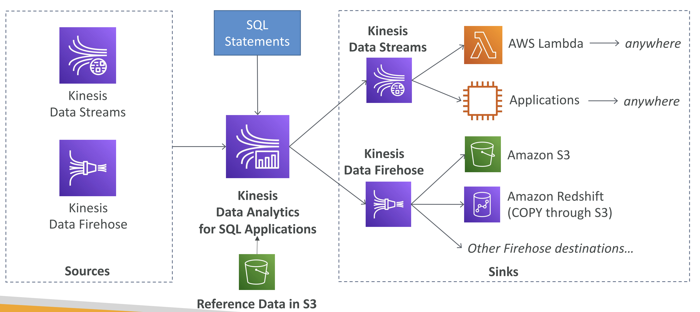

- Real-time analytics on Kinesis Data Streams & Firehose using SQL
- Add reference data from Amazon S3 to enrich streaming data
- Fully managed, no servers to provision
- Automatic scaling
- Pay for actual consumption rate
- Output:
  - Kinesis Data Streams: create streams out of the real-time analytics queries
  - Kinesis Data Firehose: send analytics query results to destinations
- Use cases:
  - Time-series analytics
  - Real-time dashboards
  - Real-time metrics

## Kinesis Data Analytics for Apache Flink

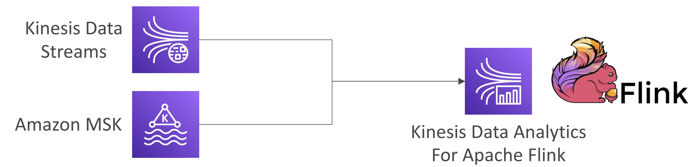

- Use Flink (Java, Scala or SQL) to process and analyze streaming data
- Run any Apache Flink application on a managed cluster on AWS
  - provisioning compute resources, parallel computation, automatic scaling
  - application backups (implemented as checkpoints and snapshots)
  - Use any Apache Flink programming features
  - Flink does not read from Firehose (use Kinesis Analytics for SQL instead)
