# Section 18. CloudFormation

## CloudFormation

- Creates resources in AWS using JSON or YAML templates in the right order, with the right configuration.
- Benefits:
  - IaC (Infrastructure as Code)
  - Version Control
  - Cost Estimation
  - Resource Management

## How CloudFormation Works

- Templates uploaded to S3 or directly to CloudFormation.
- CloudFormation reads the template and creates a "stack" (a collection of resources defined in the template).
- Resources are created.
  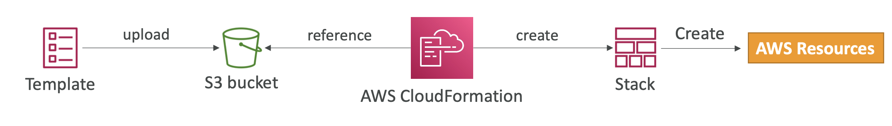

## Deploying a CloudFormation Template

- Manual way:

  - Editing templates in CloudFormation Designer or code editor.
  - Using the AWS Management Console to input parameters.

- Automated way:

  - Editing templates in a YAML or JSON file.
  - Using the AWS CLI.
  - Using the AWS SDKs.

## CloudFormation Template Structure

- Required elements:

  - `AWSTemplateFormatVersion`: Version of the template.

  - `Description`: Comments about the template.

  - `Resources`: Resources to be created.

    - Can reference other resources.

  - `Parameters`: Values to pass to the template.

    - Can be used to customize the template.
    - `AllowedValues`: Values that can be passed.
    - `NoEcho`: Hides the value when passed.
      
    - `!Ref`: References a parameter.
      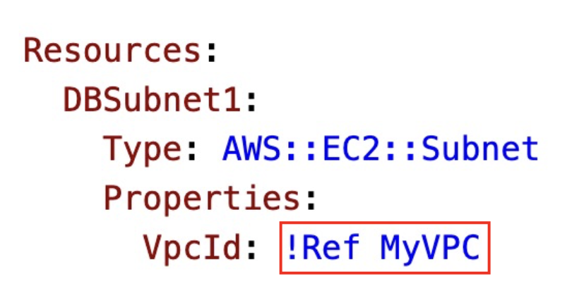

  - `Mappings`: Static variables.

    - Used to map keys to values.
      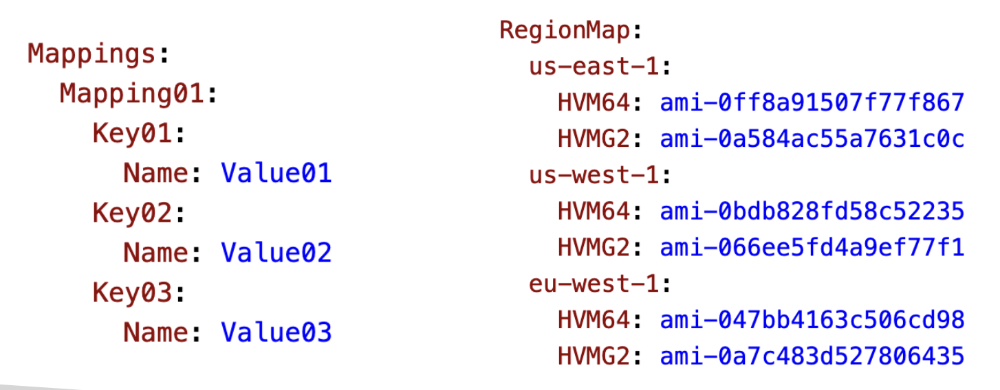
    - `!FindInMap`: Finds a value in a map.
      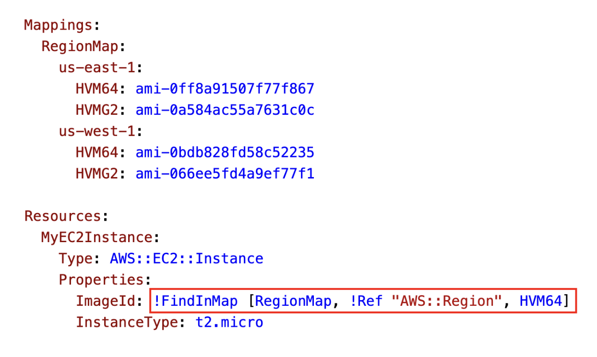

  - `Outputs`: Values returned by the template.

    - Can be used to reference resources.
      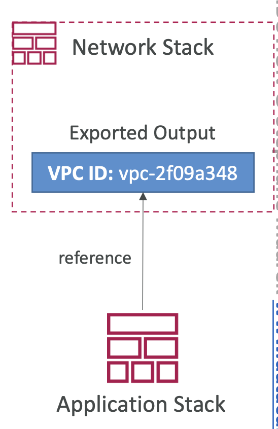
    - `!ImportValue`: Imports a value from another stack.
      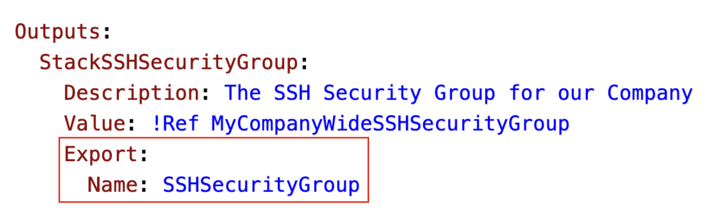
      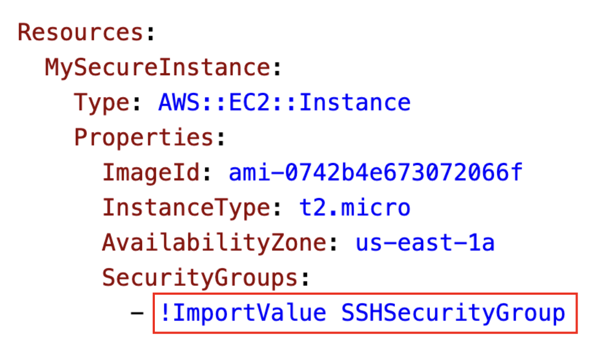

  - `Conditions`: Conditions to create resources.

    - Can be used to create resources based on conditions. (e.g. environment, region)
      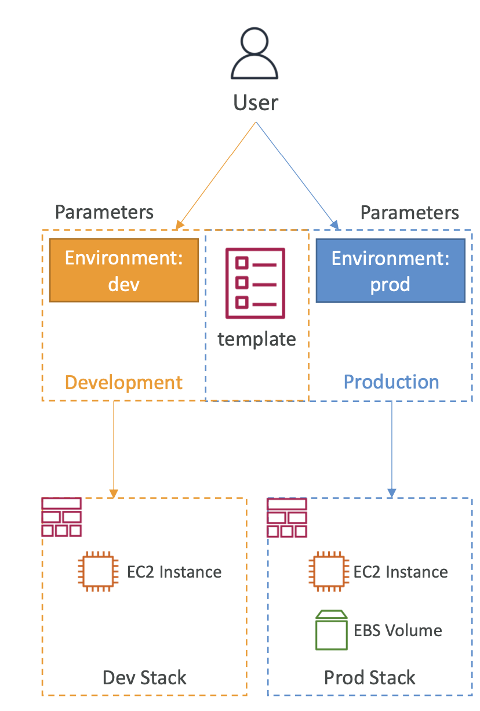!
    - `!Equals`: Compares two values.
      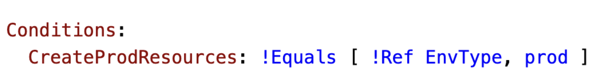

## Intrinsic Functions

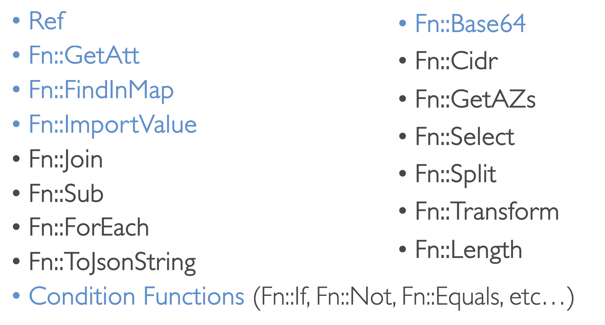

## Rollbacks

- Stack Creation Failures:

  - Resources are deleted in the reverse order they were created.

- Stack Update Failures:

  - Resources are rolled back to their previous state.

- Rollback Failures:

  - Fix resources manually then issue ContinueUpdateRollback API from Console or CLI.

## Service Role

- IAM Role that allow CloudFormation to create resources on your behalf.
- Give ability to users to create/update/delete resources without giving them permissions to work with those resources.
  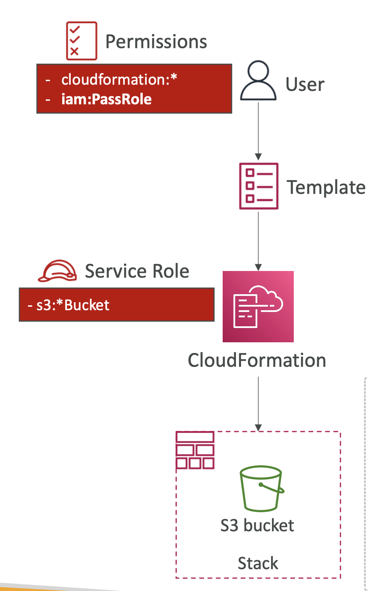

## CloudFormation Capabilities

- `CAPABILITY_IAM`: Allows CloudFormation to create IAM roles.
- `CAPABILITY_NAMED_IAM`: If the resources are named, this capability is required.
- `CAPABILITY_AUTO_EXPAND`: Allows CloudFormation to create macros.

## Deletion Policy

- `Retain`: Keeps the resource.
- `Delete`: Deletes the resource.
- `Snapshot`: Takes a snapshot of the resource before deleting it.

## Stack Policies

- Prevent updates to specific properties of resources.
- Can be used to prevent updates to resources.

## Termination Protection

- Prevents a stack from being deleted.
- Can be enabled or disabled.

## Custom Resources

- Allows you to write custom logic in Lambda that can be executed during stack creation or update.
- Can be used to create resources that CloudFormation doesn't support.
- Example: Emptying an S3 bucket before deleting it.
  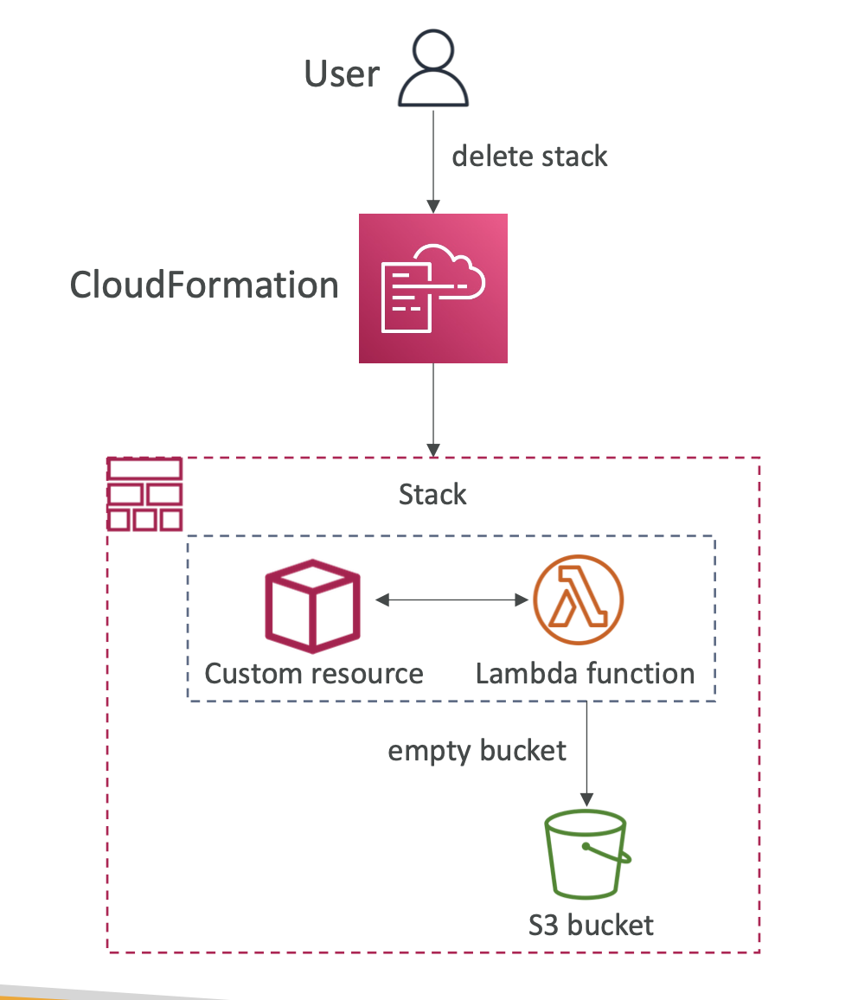

## StackSets

- Allows you to create stacks across multiple accounts and regions.
- Can be applied into all accounts of an AWS Organization.
- Only Administrator account (or Delegated Administrator) can create StackSets.
  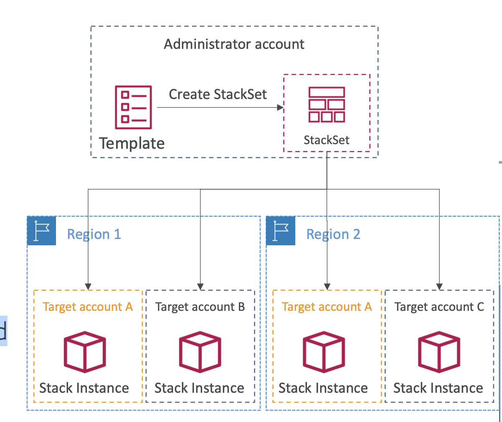
