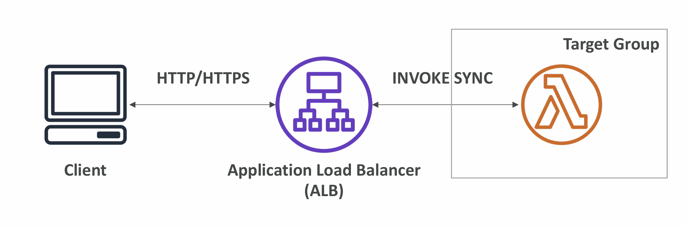
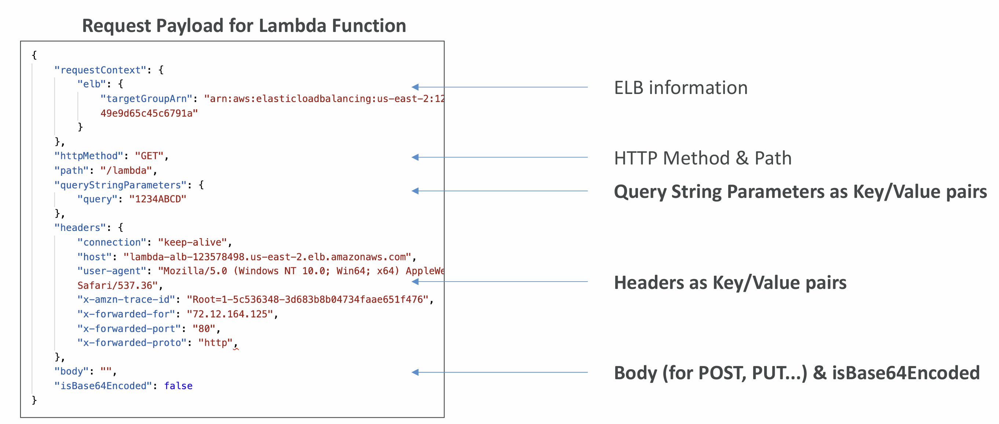
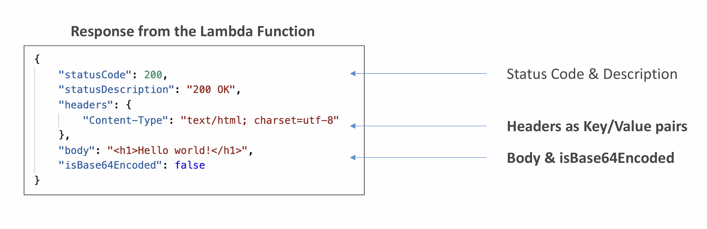
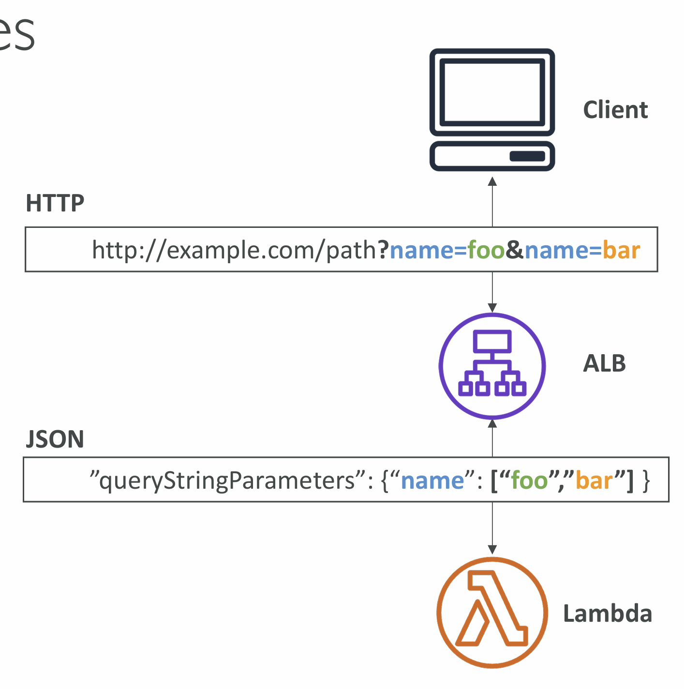
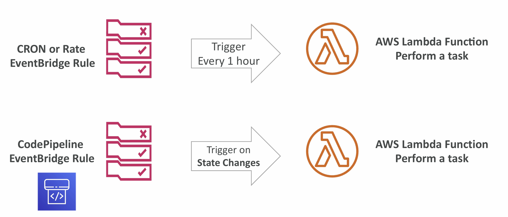
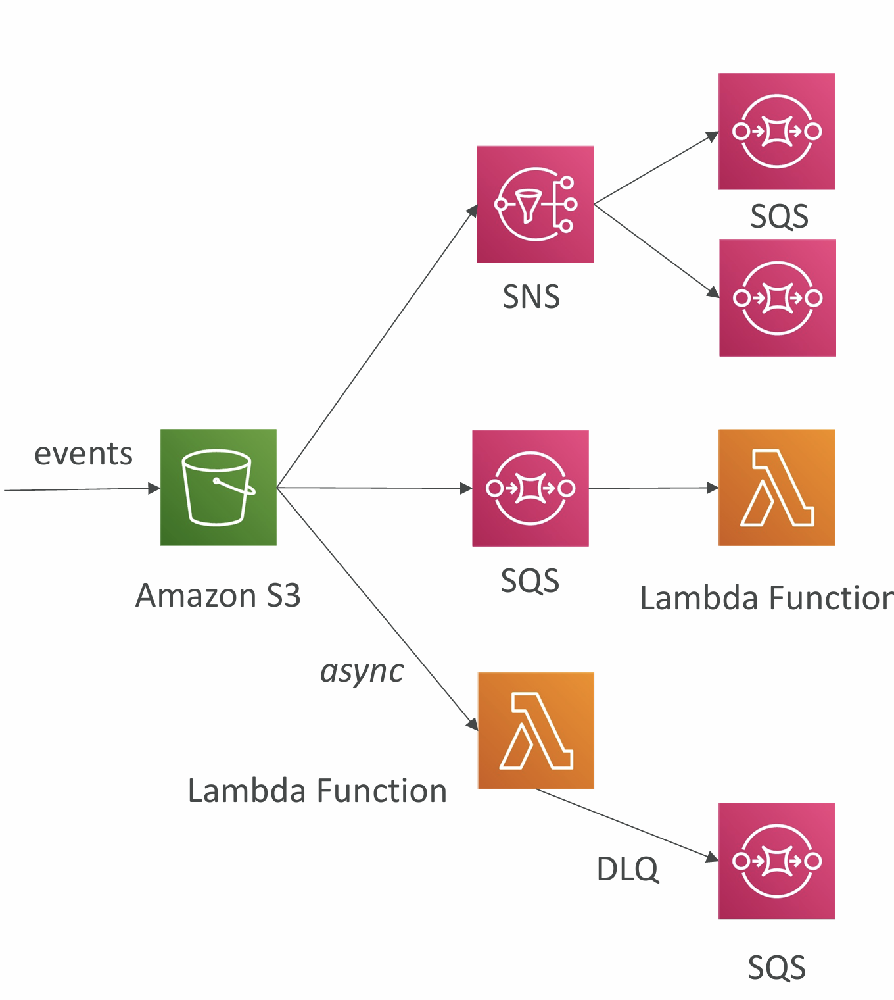
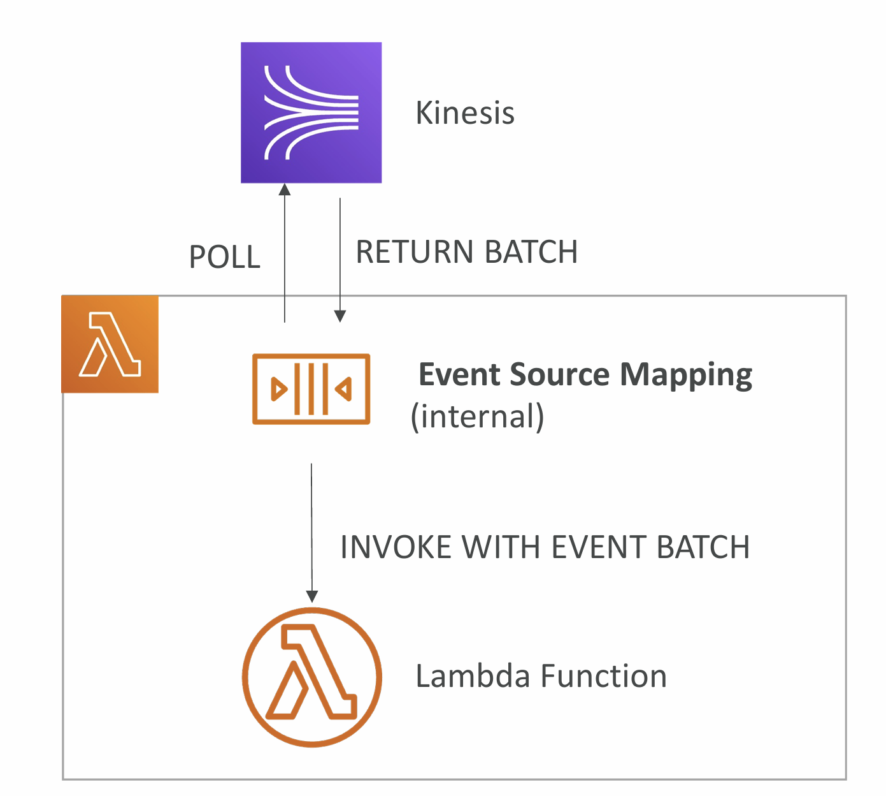
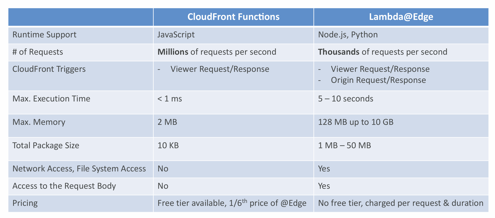
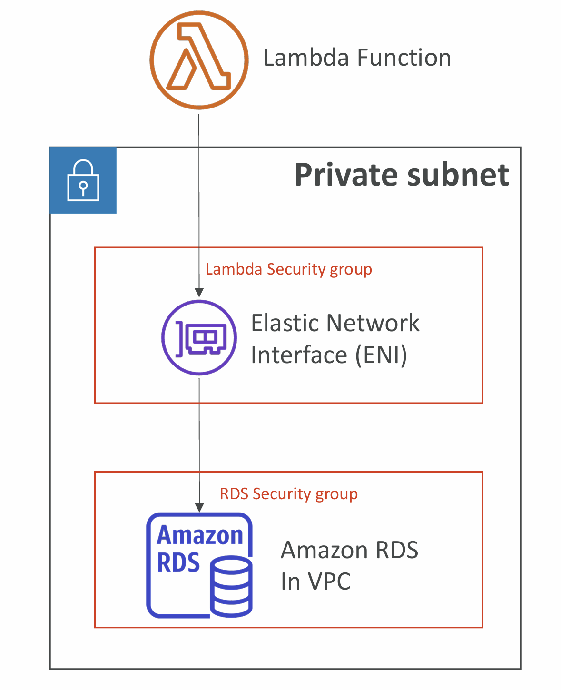
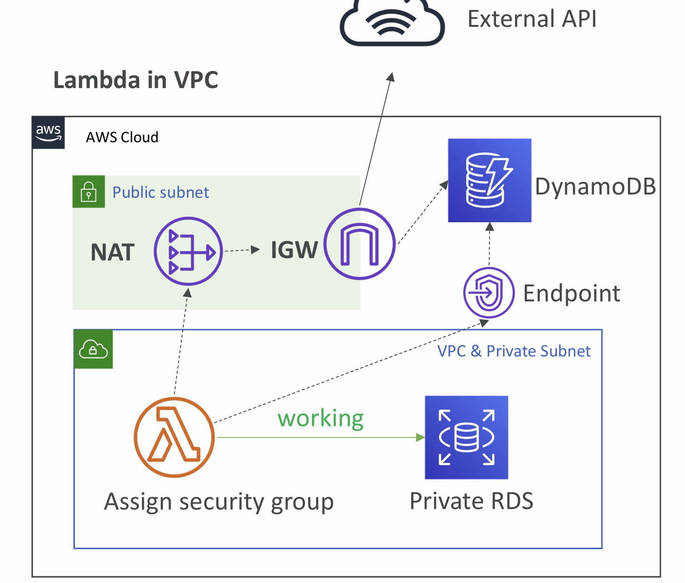

# Section 21. AWS Lambda

## What’s serverless?

- Serverless is a new paradigm in which the developers don’t have to
  manage servers anymore…
- Serverless does not mean there are no servers…

## Serverless in AWS

- AWS Lambda
- DynamoDB
- AWS Cognito
- AWS API Gateway
- Amazon S3
- AWS SNS & SQS
- AWS Kinesis Data Firehose
- Aurora Serverless
- Step Functions
- Fargate

## Why AWS Lambda

- EC2
  - Virtual Servers in the Cloud
  - Limited by RAM and CPU
  - Continuously running
  - Scaling means intervention to add / remove servers
- Lambda
  - Virtual functions – no servers to manage!
  - Limited by time - short executions
  - Run on-demand
  - Scaling is automated!

## Benefits of AWS Lambda

- Easy Pricing:
  - Pay per request and compute time
  - Free tier of 1,000,000 AWS Lambda requests and 400,000 GBs of compute time
- Integrated with the whole AWS suite of services
- Integrated with many programming languages
- Easy monitoring through AWS CloudWatch
- Easy to get more resources per functions (up to 10GB of RAM!)
- Increasing RAM will also improve CPU and network!

## AWS Lambda language support

- Node.js (JavaScript)
- Python
- Java (Java 8 compatible)
- C# (.NET Core)
- Golang
- C# / Powershell
- Ruby
- Custom Runtime API (community supported, example Rust)
- Lambda Container Image
  - The container image must implement the Lambda Runtime API
  - ECS / Fargate is preferred for running arbitrary Docker images

## Synchronous Invocations

- Synchronous: CLI, SDK, API Gateway, Application Load Balancer
  - Results is returned right away
  - Error handling must happen client side (retries, exponential backoff, etc…)

## Lambda Integration with ALB

- To expose a Lambda function as an HTTP(S) endpoint…
- You can use the Application Load Balancer (or an API Gateway)
- The Lambda function must be registered in a target group

## ALB Multi-Header Values

## Asynchronous Invocations

- S3, SNS, CloudWatch Events…
- The events are placed in an Event Queue
- Lambda attempts to retry on errors
  - 3 tries total
  - 1 minute wait after 1st , then 2 minutes wait
- Make sure the processing is idempotent (in
  case of retries)
- If the function is retried, you will see duplicate
  logs entries in CloudWatch Logs
- Can define a DLQ (dead-letter queue) – SNS
  or SQS – for failed processing (need correct
  IAM permissions)

## CloudWatch Events / EventBridge

## S3 Events Notifications

- S3 event notifications typically deliver events
  in seconds but can sometimes take a minute
  or longer
- If two writes are made to a single non
  versioned object at the same time, it is
  possible that only a single event notification
  will be sent
- If you want to ensure that an event
  notification is sent for every successful write,
  you can enable versioning on your bucket.

## Event Source Mapping

- Kinesis Data Streams
- SQS & SQS FIFO queue
- DynamoDB Streams
- Common denominator:
  records need to be polled
  from the source
- Your Lambda function is
  invoked synchronously

## Streams & Lambda (Kinesis & DynamoDB)

- An event source mapping creates an iterator for each shard, processes items in order
- Start with new items, from the beginning or from timestamp
- Processed items aren't removed from the stream (other consumers can read them)
- Low traffic: use batch window to accumulate records before processing
- You can process multiple batches in parallel
  - up to 10 batches per shard
  - in-order processing is still guaranteed for each partition key

## Streams & Lambda – Error Handling

- By default, if your function returns an error, the entire batch is
  reprocessed until the function succeeds, or the items in the batch
  expire.
- To ensure in-order processing, processing for the affected shard is
  paused until the error is resolved
- You can configure the event source mapping to:
  - discard old events
  - restrict the number of retries
  - split the batch on error (to work around Lambda timeout issues)
- Discarded events can go to a Destination

## SQS & SQS FIFO

- Event Source Mapping will poll SQS (Long Polling)
- Specify batch size (1-10 messages)
- Recommended: Set the queue visibility timeout to 6x the timeout of your Lambda function
- To use a DLQ
  - set-up on the SQS queue, not Lambda (DLQ for Lambda is only for async invocations)
  - Or use a Lambda destination for failures

## Queues & Lambda

- Lambda also supports in-order processing for FIFO (first-in, first-out) queues, scaling up to the number of active message groups.
- For standard queues, items aren't necessarily processed in order.
- Lambda scales up to process a standard queue as quickly as possible.
- When an error occurs, batches are returned to the queue as individual items
  and might be processed in a different grouping than the original batch.
- Occasionally, the event source mapping might receive the same item from
  the queue twice, even if no function error occurred.
- Lambda deletes items from the queue after they're processed successfully.
- You can configure the source queue to send items to a dead-letter queue if
  they can't be processed.

## Lambda Event Mapper Scaling

- Kinesis Data Streams & DynamoDB Streams:
  - One Lambda invocation per stream shard
  - If you use parallelization, up to 10 batches processed per shard simultaneously
- SQS Standard:
  - Lambda adds 60 more instances per minute to scale up
  - Up to 1000 batches of messages processed simultaneously
- SQS FIFO:
  - Messages with the same GroupID will be processed in order
  - The Lambda function scales to the number of active message groups

## Lambda – Event and Context Objects

- Event Object
  - JSON-formatted document contains data for the function to process
- Context Object
  - Provides methods and properties that provide information about the invocation, function, and runtime environment

## Lambda – Destinations

- Nov 2019: Can configure to send result to a destination
- Asynchronous invocations - can define destinations for successful and failed event:
  - Amazon SQS
  - Amazon SNS
  - AWS Lambda
  - Amazon EventBridge bus
- Event Source mapping: for discarded event batches
  - Amazon SQS
  - Amazon SNS

## Lambda Environment Variables

- Environment variable = key / value pair in “String” form
- Helpful to store secrets

## Lambda Logging & Monitoring

- CloudWatch Logs:
  - AWS Lambda execution logs are stored in AWS CloudWatch Logs
  - Make sure your AWS Lambda function has an execution role with an IAM
    policy that authorizes writes to CloudWatch Logs
- CloudWatch Metrics:
  - AWS Lambda metrics are displayed in AWS CloudWatch Metrics
  - Invocations, Durations, Concurrent Executions
  - Error count, Success Rates, Throttles
  - Async Delivery Failures
  - Iterator Age (Kinesis & DynamoDB Streams)

## Lambda Tracing with X-Ray

- Enable in Lambda configuration (Active Tracing)
- Runs the X-Ray daemon for you
- Use AWS X-Ray SDK in Code
- Ensure Lambda Function has a correct IAM Execution Role
  - The managed policy is called AWSXRayDaemonWriteAccess
- Environment variables to communicate with X-Ray
  - \_X_AMZN_TRACE_ID: contains the tracing header
  - AWS_XRAY_CONTEXT_MISSING: by default, LOG_ERROR
  - **AWS_XRAY_DAEMON_ADDRESS**: the X-Ray Daemon IP_ADDRESS:PORT

## Customization At The Edge

## Lambda in VPC

- You must define the VPC ID, the Subnets and the Security Groups
- Lambda will create an ENI (Elastic Network Interface) in your subnets
- AWSLambdaVPCAccessExecutionRole

### Lambda in VPC – Internet Access

- A Lambda function in your VPC does not have internet access
- Deploying a Lambda function in a public subnet does not give it internet access or a public IP
- Deploying a Lambda function in a private subnet gives it internet access if you have a NAT Gateway / Instance
- You can use VPC endpoints to privately access AWS services without a NAT
