# Section 20. AWS Monitoring, Troubleshooting & Audit

## CloudWatch

### Cloudwatch Metrics

- Variable to monitor.
- Metrics belong to namespaces.
- Dimension is an attribute of a metric. (Ex. instance id, environment, etc.)
- Metrics have timestamps.

### EC2 Detailed monitoring

- EC2 instance metrics are sent to CloudWatch every 5 minutes
- Detailed monitoring sends metrics every 1 minute

### Custom metrics

- You can send your own custom metrics to CloudWatch (Ex. memory (RAM) usage, disk space, number of logged in users, etc.)
- Use the PutMetricData API

### CloudWatch Logs

- `Log groups`: collection of logs, usually from one application.
- `Log streams`: instances within application / log files / containers.
- `Log events`: individual log messages.

- Can define log expiration policies.
- Logs are encrypted by default & can use KMS for additional security.
- S3 Export: export logs to S3 for archival. (API call: CreateExportTask)

### CloudWatch Insights

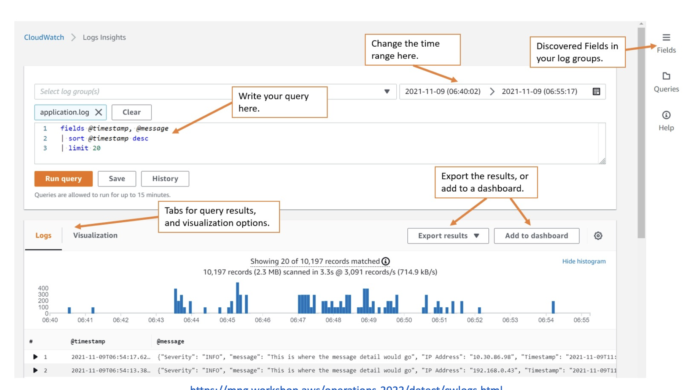

- Search and analyze log data stored in CloudWatch Logs.
- Provides a purpose-built query language.

### CloudWatch Logs Subscription

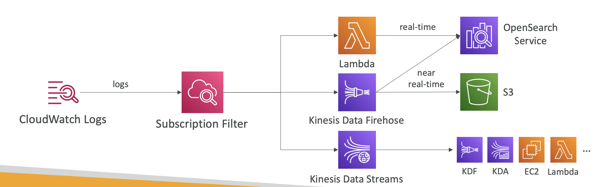

- Real-time log events from CloudWatch Logs for processing and analysis.
- `Subscription Filter`: Filter which logs are events delivered to your destination.

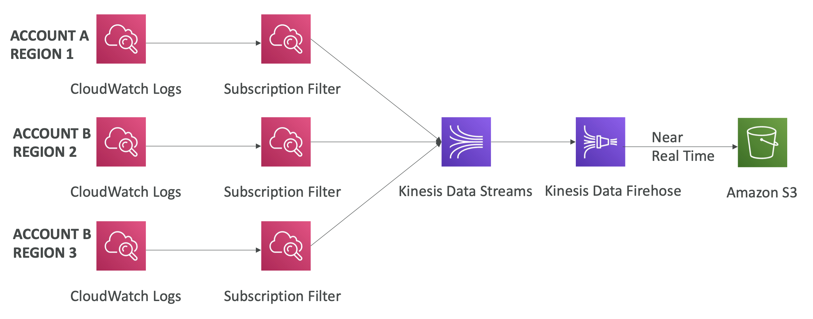

- `Cross-Account Subscription`: Send log events to resources in a different AWS account (KDS, KDF).
  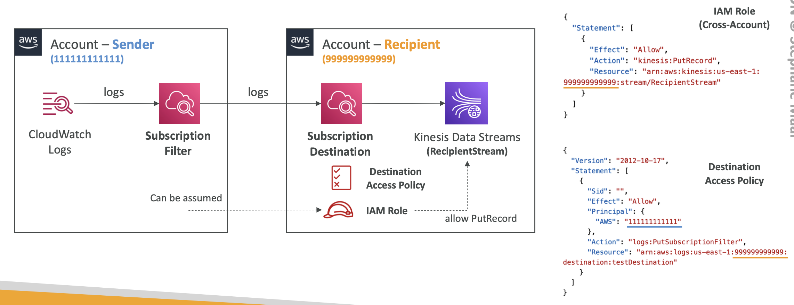

### CloudWatch Logs for EC2

- Need to run a CloudWatch agent on EC2 to push the log files.
- Make sure IAM permissions are correct.
- CloudWatch agent can be installed on on-premises servers.

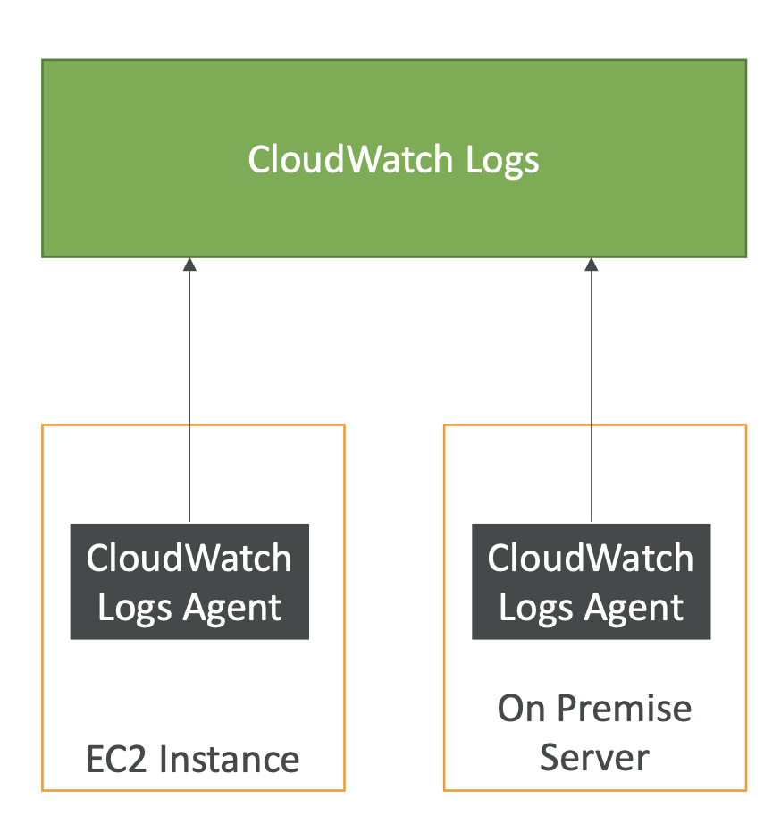

### CloudWatch Logs Agent & Unified Agent

- `CloudWatch Logs Agent`: Old version.
  - Pushes log files to CloudWatch.
- `CloudWatch Unified Agent`: New version.
  - Collect additional system-level metrics such as RAM, processes, etc.
  - Centralized configuration using SSM Parameter Store.

### CloudWatch Logs Metric Filter

- Filter expressions to search for and extract log data.
- Create metric filters to extract values from log events.
- Use metric filters to create CloudWatch metrics.

### CloudWatch Alarms

- Alarms are used to trigger notifications for any metric.
- Alarms can go to Auto Scaling, EC2 actions, SNS notifications, etc.
- Alarm states: OK, ALARM, INSUFFICIENT_DATA.
- Targets: EC2 actions, Auto Scaling, SNS, etc.
- Composite Alarms: Multiple alarms together.
  - Use AND / OR logic.
  - Ex. CPU > 70% for 5 minutes, and RAM > 70% for 5 minutes.
    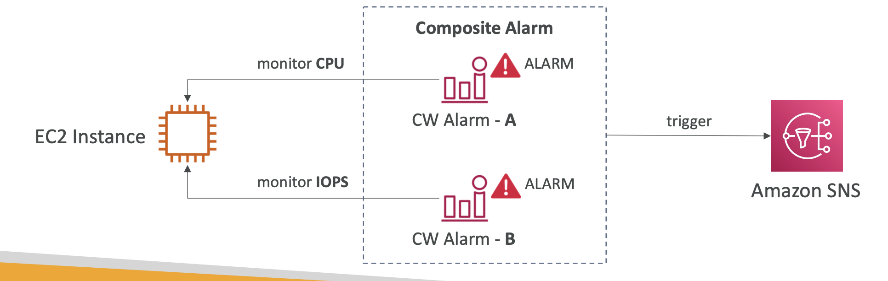
- To test alarms and notifications, set the alarm state to Alarm using CLI.
  (Ex. `aws cloudwatch set-alarm-state --alarm-name "myalarm" --state-valueALARM --state-reason "testing purposes"`)

### CloudWatch Synthetics Canary

- Configurable scripts that run on a schedule to monitor your endpoints and APIs.
- To monitor your endpoints, you can use the default blueprint scripts or create your own.
- Checks the availability and latency of your endpoints and can store load time data and screenshots of the UI.

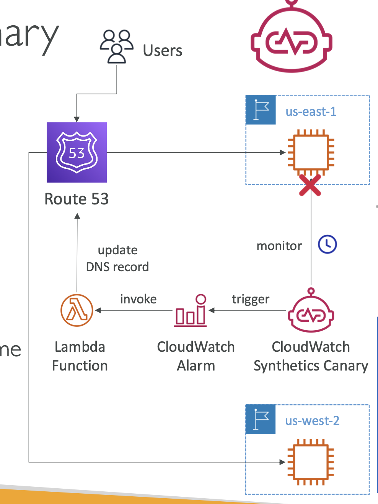

- CloudWatch Synthetics Canary Blueprints:
  

## EventBridge (Formerly CloudWatch Events)

- Schedule: Cron jobs (scheduled scripts)
- Event Pattern: Event rules to react to a service doing something.
  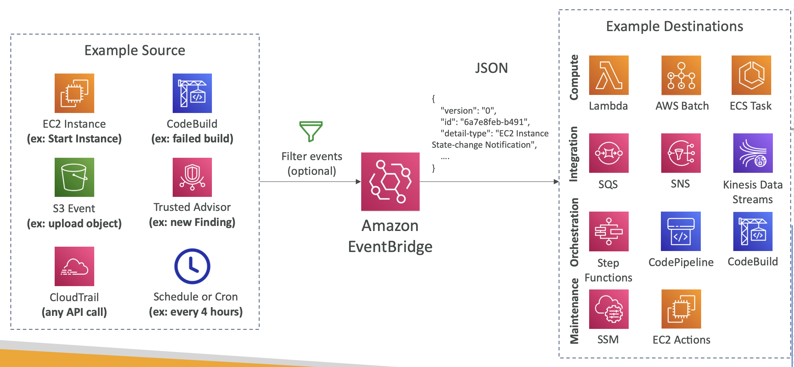

### EventBridge Schema Registry

- EventBridge can analyze the events in
  your bus and infer the schema.
- You can use the schema registry to discover events and their structure.

### Resource-based policies

- Manage permissions for a specific Event Bus.
- Define who can send events to the bus.
  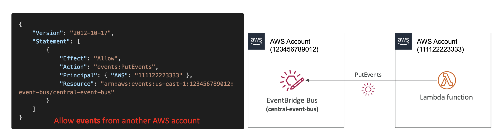

## AWS X-Ray

- Debugging tool for distributed applications.
- Provides an end-to-end view of requests as they travel through your application.
  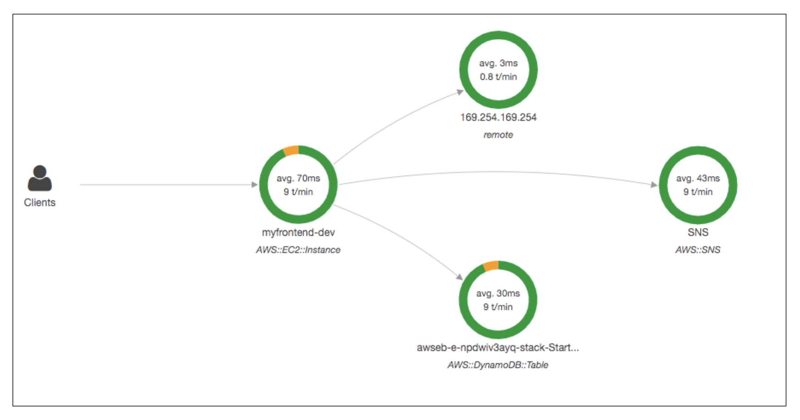

### X-Ray Leverages Tracing

- `Tracing`: Follows a request from start to finish.
- Tracing is made of segments (+ sub segments)
- Each segment represents a unit of work.

### How to enable X-Ray?

1. Your code (Java, Python, Go, Node.js, .NET) must import the AWS X-Ray SDK.
2. Install the X-Ray daemon or enable X-Ray AWS Integration. (low level UDP packet interceptor)
   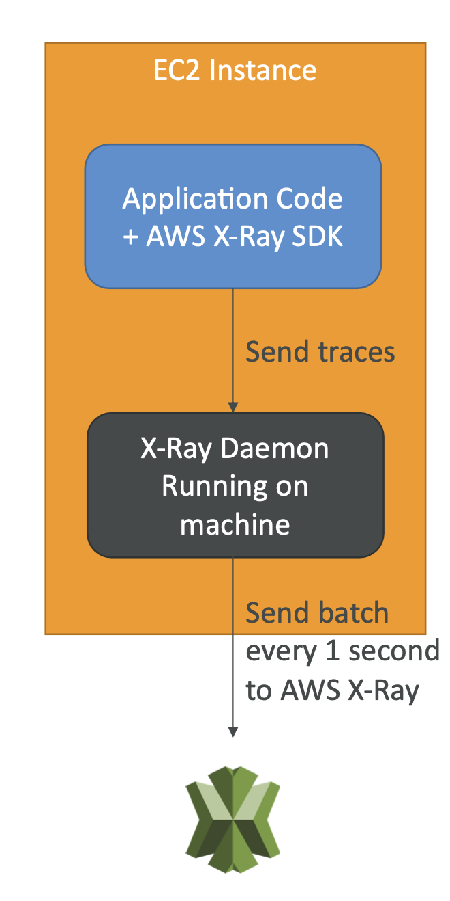

### X-Ray Troubleshooting

- If X-Ray is not working on EC2:
  - Ensure the EC2 IAM Role has the proper permissions.
  - Ensure the EC2 instance is running the X-Ray Daemon.
- To enable X-Ray on Lambda:
  - Ensure that X-Ray is imported in the code.
  - Ensure it has an IAM execution role with proper policy (AWSX-RayWriteOnlyAccess).

### X-Ray Instrumentation

- Measure of product’s performance, diagnose errors, and to write trace information.
- Use the X-Ray SDK to instrument your code.
  

### X-Ray Concepts

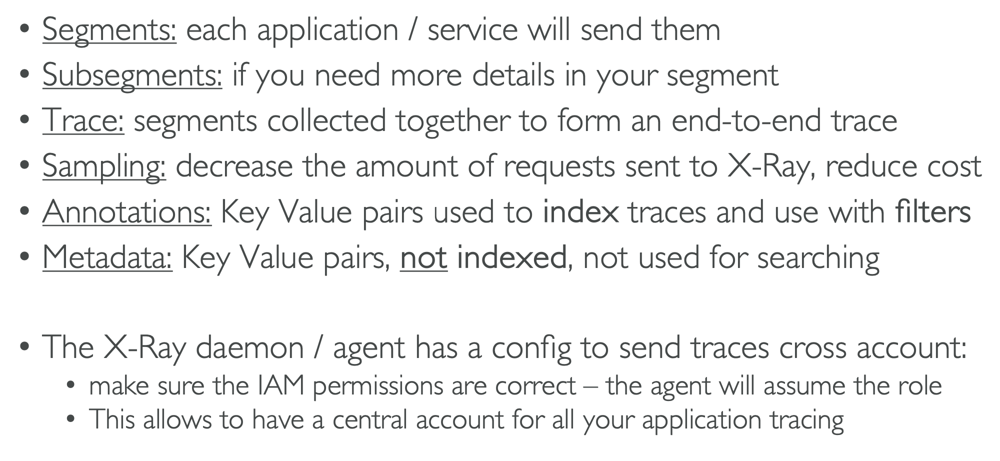

### X-Ray Sampling Rules

- Control the amount of data that X-Ray records.
- Default: Record the first request each second, and 5% of any additional requests.

### X-Ray APIs

- Write APIs:
  - `PutTraceSegments`: Uploads segment documents to AWS X-Ray.
  - `PutTelemetryRecords`: Used by the AWS X-Ray daemon to send telemetry data.
  - `GetSamplingRules`: Retrieves all sampling rules.
  - `GetSamplingTargets`: Retrieves information about the number of requests instrumented by the X-Ray SDK.
  - `GetSamplingStatisticSummaries`: Retrieves information about the number` of requests instrumented by the X-Ray SDK.
- Read APIs:

  - `GetServiceGraph`: Main graph in the console.
  - `BatchGetTraces`: Retrieves a list of traces specified by ID.
  - `GetTraceSummaries`: Summaries for a specific trace.
  - `GetTraceGraph`: Graph for a specific trace.

### X-Ray with Elastic Beanstalk

- Run the daemon by setting an option in the Elastic Beanstalk console or with a configuration file.
- Give your instance profile the correct IAM permissions so that the X-Ray daemon can function correctly.

### X-Ray with ECS

### AWS Distro for OpenTelemetry

- Secure, production-ready, AWS-supported distribution of the OpenTelemetry project.
- Provides APIs, libraries, agents, and instrumentation to capture distributed traces and metrics.
- Standardize with open-source APIs from Telemetry or send traces to multiple destinations simultaneously well as on-premises.
  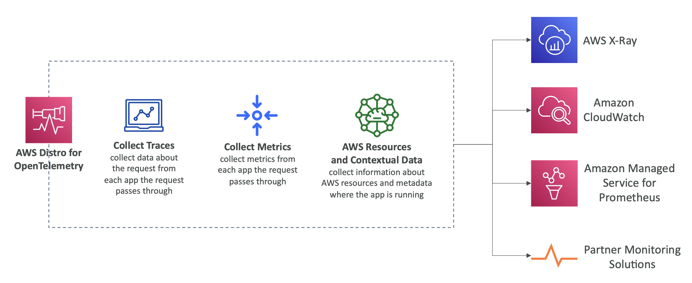

## CloudTrail

- Provides governance, compliance and audit for an AWS Account.
- CloudTrail is enabled by default.
- Get a history of events / API calls made within your AWS account by:
  - Console
  - SDK
  - CLI
  - AWS Services

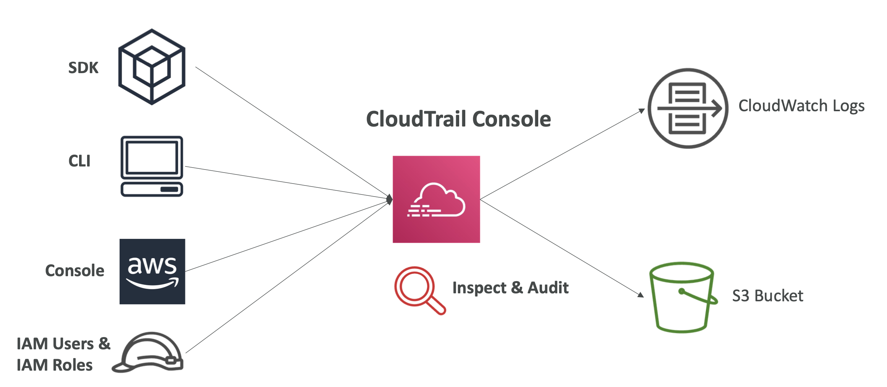

### CloudTrail Events

- Management Events: Operations that are performed on resources in an AWS account.
- Data Events: Events that are related to data resources in an account. (Ex. S3 bucket access, Lambda function invocation, etc.)
- Insights Events: Insights events are generated by CloudTrail Insights.

### CloudTrail Insights

- To detect unusual activity in AWS account:

  - inaccurate resource provisioning
  - hitting service limits
  - Bursts of AWS IAM actions
  - Gaps in periodic maintenance activity

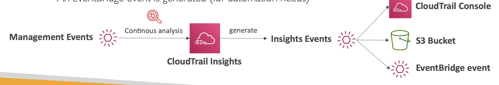

### CloudTrail Events Retention

- By default, CloudTrail events are stored for 90 days.
- To store events for a longer period, save them to S3 and use Athena to query them.

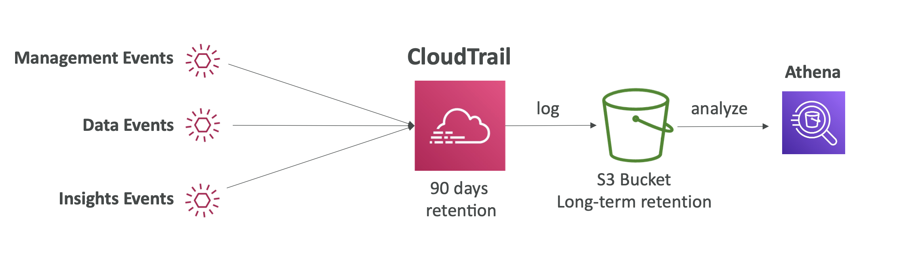

### EventBridge - Intercept API Calls

- Use EventBridge to intercept API calls.
  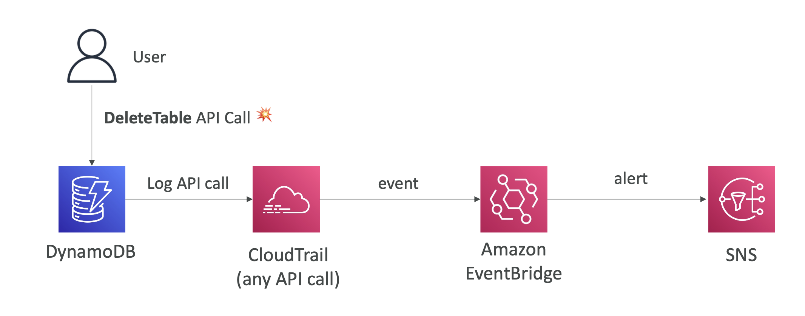
