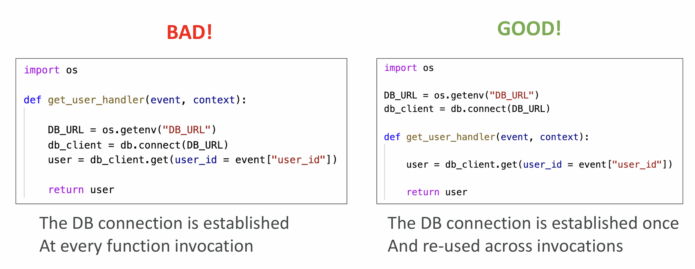
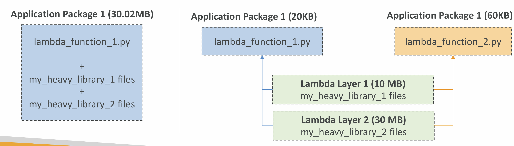
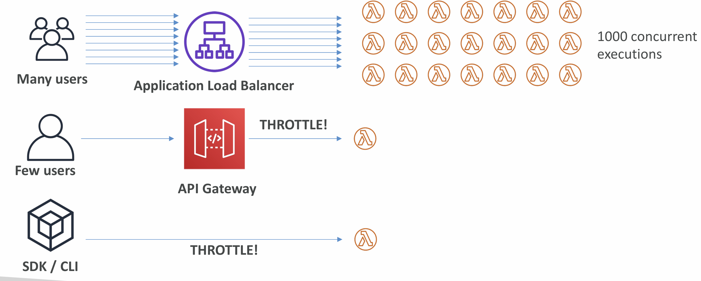
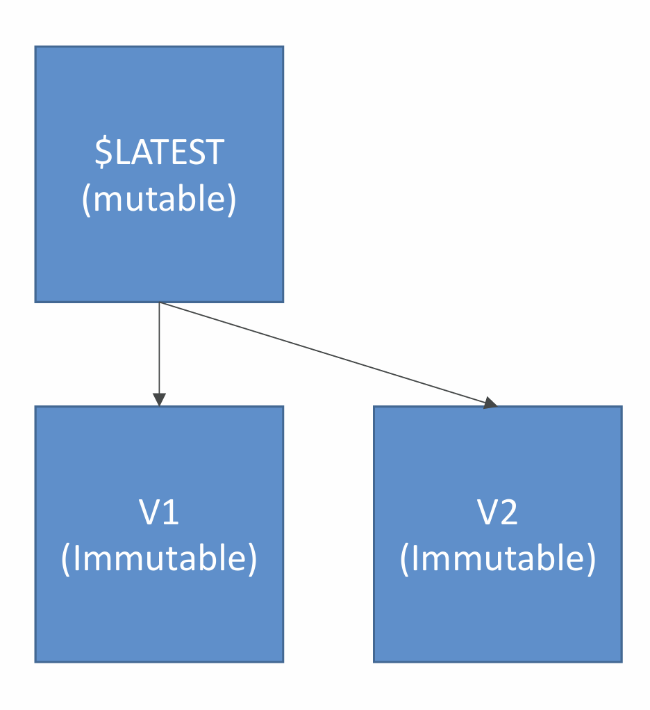
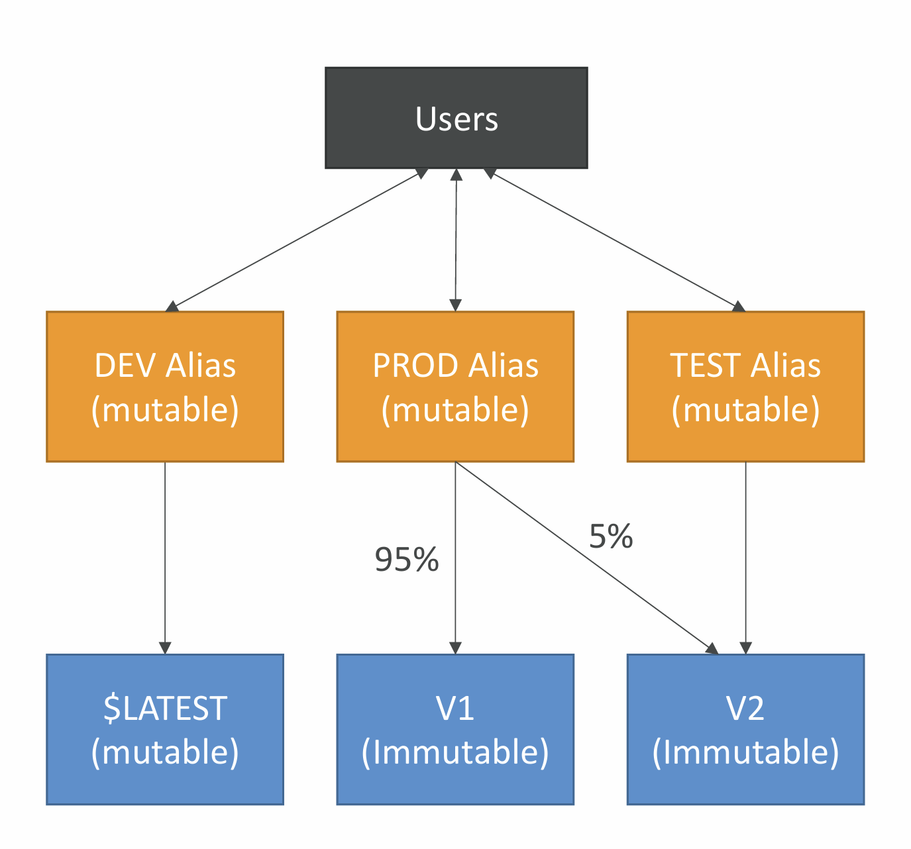
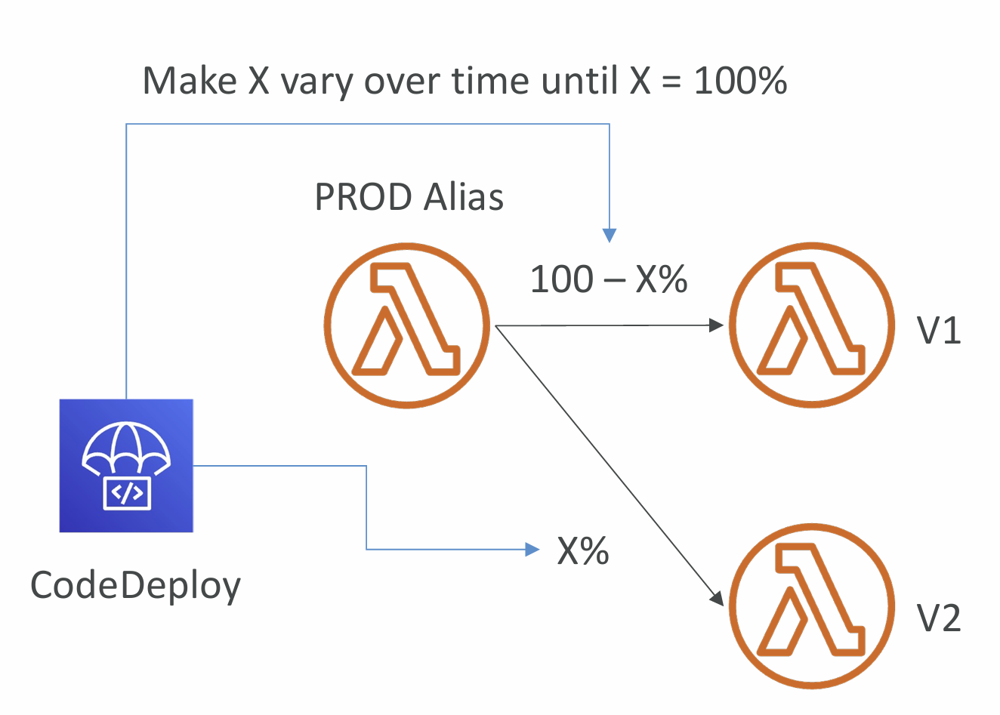

# Section 21. AWS Lambda

## Lambda Function Configuration

- RAM:
  - From 128MB to 10GB in 1MB increments
  - The more RAM you add, the more vCPU credits you get
  - At 1,792 MB, a function has the equivalent of one full vCPU
  - After 1,792 MB, you get more than one CPU, and need to use multi-threading in your code to benefit from it (up to 6 vCPU)
- If your application is CPU-bound (computation heavy), increase RAM
- Timeout: default 3 seconds, maximum is 900 seconds (15 minutes)

## Lambda Execution Context

- The execution context is a temporary runtime environment that
  initializes any external dependencies of your lambda code
- Great for database connections, HTTP clients, SDK clients…
- The execution context is maintained for some time in anticipation of
  another Lambda function invocation
- The next function invocation can “re-use” the context to execution time
  and save time in initializing connections objects
- The execution context includes the /tmp directory

## Initialize outside the handler

## Lambda Functions /tmp space

- If your Lambda function needs to download a big file to work…
- If your Lambda function needs disk space to perform operations…
- You can use the /tmp directory
- Max size is 10GB
- The directory content remains when the execution context is frozen, providing transient cache that can be used for multiple invocations (helpful to checkpoint your work)
- For permanent persistence of object (non temporary), use S3
- To encrypt content on /tmp, you must generate KMS Data Keys

## Lambda Layers

- Custom Runtimes
- Externalize Dependencies to re-use them

## File Systems Mounting

- Lambda functions can access EFS file systems if they are running in a VPC
- Configure Lambda to mount EFS file systems to local directory during initialization
- Must leverage EFS Access Points
- Limitations: watch out for the EFS connection limits (one function instance = one connection) and connection burst limits

## Concurrency and Throttling

- Concurrency limit: up to 1000 concurrent executions
- Can set a “reserved concurrency” at the function level (=limit)
- Each invocation over the concurrency limit will trigger a “Throttle”
- Throttle behavior:
  - If synchronous invocation:
    - return ThrottleError - 429
  - If asynchronous invocation:
    - For throttling errors (429) and system errors (500-series), Lambda returns the event to the queue and attempts to run the function again for up to 6 hours.
    - The retry interval increases exponentially from 1 second after the first attempt to a maximum of 5 minutes.
- If you need a higher limit, open a support ticket

## Cold Starts & Provisioned Concurrency

- Cold Start:
  - New instance => code is loaded and code outside the handler run (init)
  - If the init is large (code, dependencies, SDK…) this process can take some time.
  - First request served by new instances has higher latency than the rest
- Provisioned Concurrency:
  - Concurrency is allocated before the function is invoked (in advance)
  - So the cold start never happens and all invocations have low latency
  - Application Auto Scaling can manage concurrency (schedule or target utilization)

## Lambda Function Dependencies

- If your Lambda function depends on external libraries, You need to install the packages alongside your code and zip it together
- Upload the zip straight to Lambda if less than 50MB, else to S3 first
- Native libraries work: they need to be compiled on Amazon Linux
- AWS SDK comes by default with every Lambda function

## Lambda and CloudFormation – inline

- Cannot include function dependencies with inline functions

## Lambda and CloudFormation – through S3

- You must store the Lambda zip in S3
- You must refer the S3 zip location in the CloudFormation code
  - S3Bucket
  - S3Key: full path to zip
  - S3ObjectVersion: if versioned bucket

## Lambda Container Images

- Deploy Lambda function as container images of up to 10GB from ECR
- Base images are available for Python, Node.js, Java, .NET, Go, Ruby
- Can create your own image as long as it implements the Lambda Runtime API
- Test the containers locally using the Lambda Runtime Interface Emulator

## Lambda Container Images – Best Practices

- Strategies for optimizing container images:
  - Use AWS-provided Base Images
    - Stable, Built on Amazon Linux 2, cached by Lambda service
  - Use Multi-Stage Builds
    - Build your code in larger preliminary images, copy only the artifacts you need in your final container image, discard the preliminary steps
  - Build from Stable to Frequently Changing
    - Make your most frequently occurring changes as late in your Dockerfile as possible
  - Use a Single Repository for Functions with Large Layers
    - ECR compares each layer of a container image when it is pushed to avoid uploading and storing duplicates
- Use them to upload large Lambda Functions (up to 10 GB)

## AWS Lambda Versions

## AWS Lambda Aliases

## Lambda & CodeDeploy

- CodeDeploy can help you automate traffic shift for Lambda aliases
- Linear: grow traffic every N minutes until 100%
  - Linear10PercentEvery3Minutes
  - Linear10PercentEvery10Minutes
- Canary: try X percent then 100%
  - Canary10Percent5Minutes
  - Canary10Percent30Minutes
- AllAtOnce: immediate
- Can create Pre & Post Traffic hooks to check the health of the Lambda function

## Function URL

- Dedicated HTTP(S) endpoint for your Lambda function
- A unique URL endpoint is generated for you (never changes)
  - https://{url-id}.lambda-url.{region}.on.aws (dual-stack IPv4 & IPv6)
- Access your function URL through the public Internet only
- Supports Resource-based Policies & CORS configurations
- Can be applied to any function alias or to $LATEST (can’t be applied to other function versions)
- Create and configure using AWS Console or AWS API

## Function URL Security

- Resource-based Policy
  - AuthType NONE: allow public and unauthenticated access
  - AuthType AWS_IAM: IAM is used to authenticate and authorize requests
    - Same account: Identity-based Policy OR Resource-based Policy as ALLOW
    - Cross account: Identity-based Policy AND Resource Based Policy as ALLOW
- Cross-Origin Resource Sharing (CORS)

## Lambda and CodeGuru Profiling

- Gain insights into runtime performance of your Lambda functions using CodeGuru Profiler
- CodeGuru creates a Profiler Group for your Lambda function
- Supported for Java and Python runtimes
- Activate from AWS Lambda Console
- When activated, Lambda adds:
  - CodeGuru Profiler layer to your function
  - Environment variables to your function
  - AmazonCodeGuruProfilerAgentAccess policy to your function

## AWS Lambda Limits to Know - per region

- Execution:
  - Memory allocation: 128 MB – 10GB (1 MB increments)
  - Maximum execution time: 900 seconds (15 minutes)
  - Environment variables (4 KB)
  - Disk capacity in the “function container” (in /tmp): 512 MB to 10GB
  - Concurrency executions: 1000 (can be increased)
- Deployment:
  - Lambda function deployment size (compressed .zip): 50 MB
  - Size of uncompressed deployment (code + dependencies): 250 MB
  - Size of environment variables: 4 KB

## AWS Lambda Best Practices

- Perform heavy-duty work outside of your function handler
- Use environment variables
- Minimize your deployment package size to its runtime necessities
- Avoid using recursive code, never have a Lambda function call itself
