# Section 22. DynamoDB

## NoSQL databases

- Do not support query joins.
- Scale horizontally.

## DynamoDB

- Fully managed NoSQL database service.
- Low cost and auto-scaling capabilities.
- Standard & Infrequent Access (IA) Table Class.

## DynamoDB - Basics

- `Table` - collection of data.
- `Attribute` - data field.
- `Primary Key` - unique attribute.
  - `Partition Key` - single attribute.
    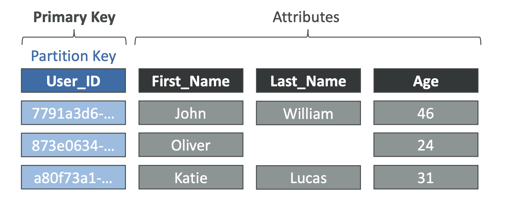
  - `Composite Key` - partition key and sort key.
    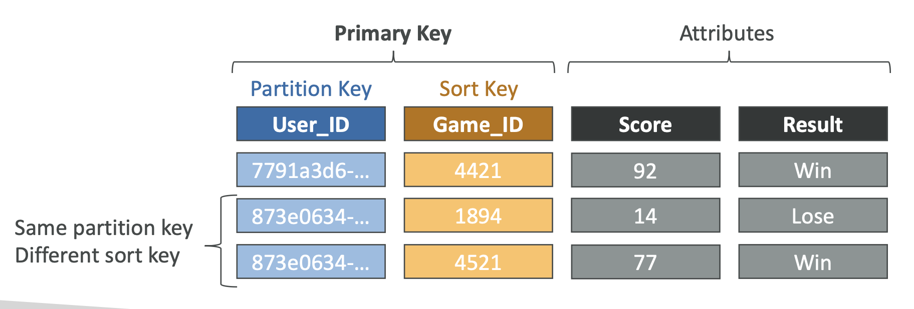
- `Item` - data record.

## Read / Write Capacity Modes

- `Provisioned` - fixed capacity.
  - `Read Capacity Units` - 4KB per second.
    - 1 Read Capacity Unit (RCU) represents one Strongly Consistent Read per second, or 2 Eventually Consistent Reads per second, for an item up to 4 KB in size.
      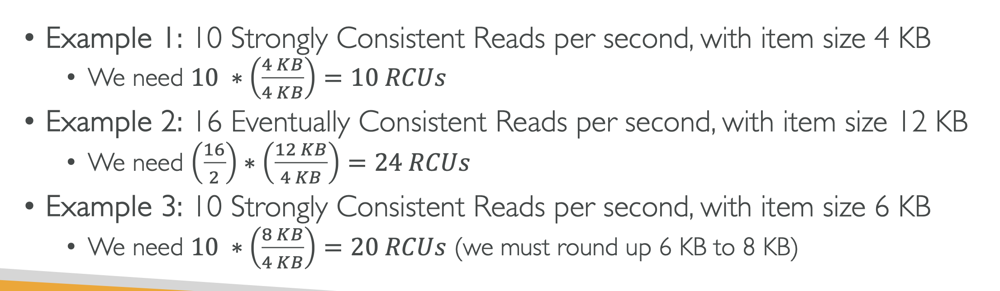
  - `Write Capacity Units` - 1KB per second.
    - 1 write per second for an item up to 1 KB in size.
      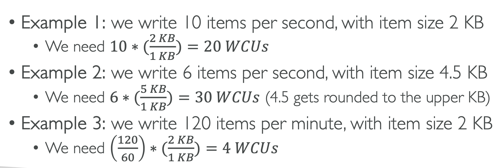
- `On-Demand` - pay-per-request.
  - No capacity planning.
  - RRUs (Read Request Units) and WRUs (Write Request Units).

## Basic Operations

- `PutItem` - create or replace an item. (Same Primary Key)
- `UpdateItem` - modify an item. (Attribute)
- `Conditional Writes` - write an item if conditions are met.
- `GetItem` - retrieve an item. (Primary Key)
- `Query` - retrieve items with the same partition key.
- `Scan` - retrieve all items in a table.
- `DeleteItem` - remove an item.

- Batch Operations
  - `BatchGetItem` - retrieve multiple items.
  - `BatchWriteItem` - write multiple items.

## Conditional Writes

- Filter expressions are for read operations & Conditional writes are for write operations.
- `attribute_exists` - check if an attribute exists.
- `attribute_not_exists` - check if an attribute does not exist.
- `attribute_type` - check if an attribute is of a certain type.
- `begins_with` - check if a string attribute begins with a substring.
- `contains` - check if a set contains a value.
- `size` - check if a set contains a number of elements.

## Indexes

- `Local Secondary Index` - same partition key, different sort key.

  - Must be defined at table creation time.
  - Up to 5 Local Secondary Indexes per table.
    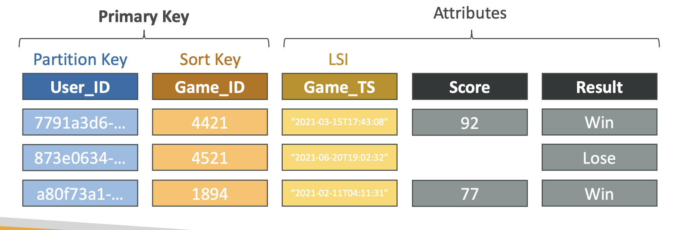

- `Global Secondary Index` - different partition key, different sort key.

  - Can be created at any time.
  - Speed up queries on non-key attributes
    

## PartiQL

- SQL-compatible query language for NoSQL databases.
- `SELECT`, `INSERT`, `UPDATE`, `DELETE`, `CREATE TABLE`, `DROP TABLE`, `DESCRIBE TABLE`.

## Optimistic Locking

- Prevents concurrent writes to an item.
- Each item has an attribute that acts as a version number.
  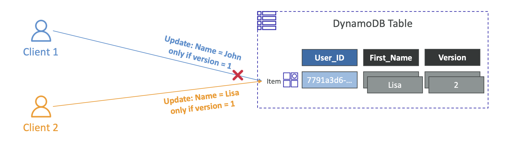

## DynamoDB Accelerator (DAX)

- In-memory cache for DynamoDB.
- Speed up read-heavy workloads.
  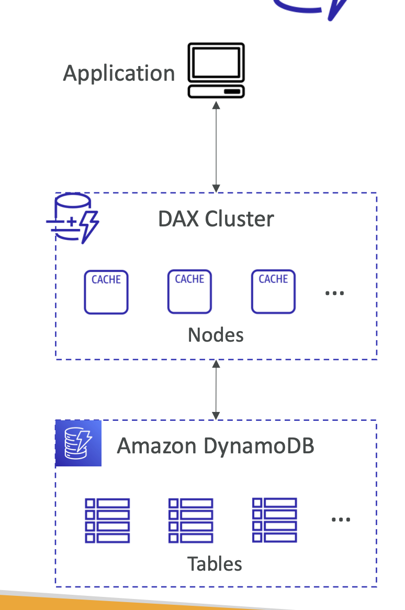
  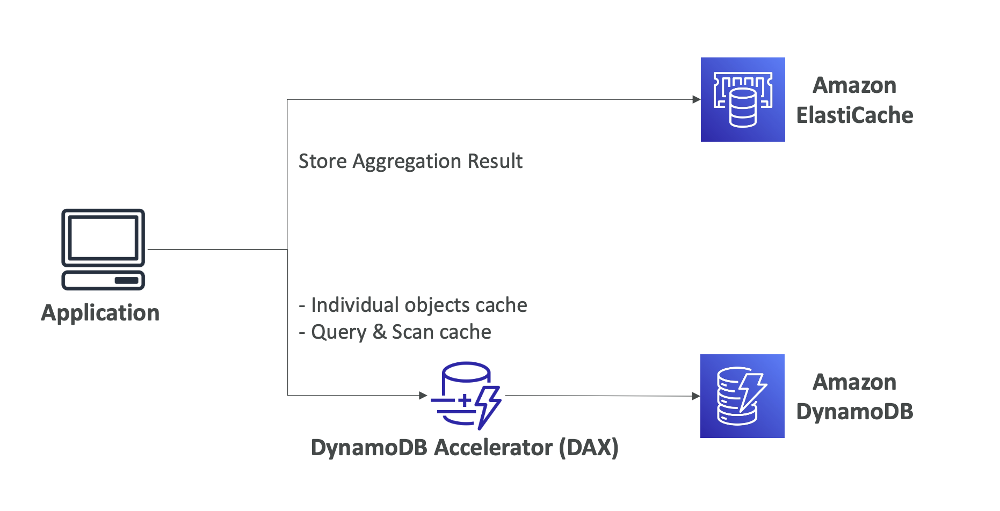

## DynamoDB Streams

- Capture changes in a table.
- Stream records are stored for 24 hours.
- Lambda functions can be triggered by stream records.
  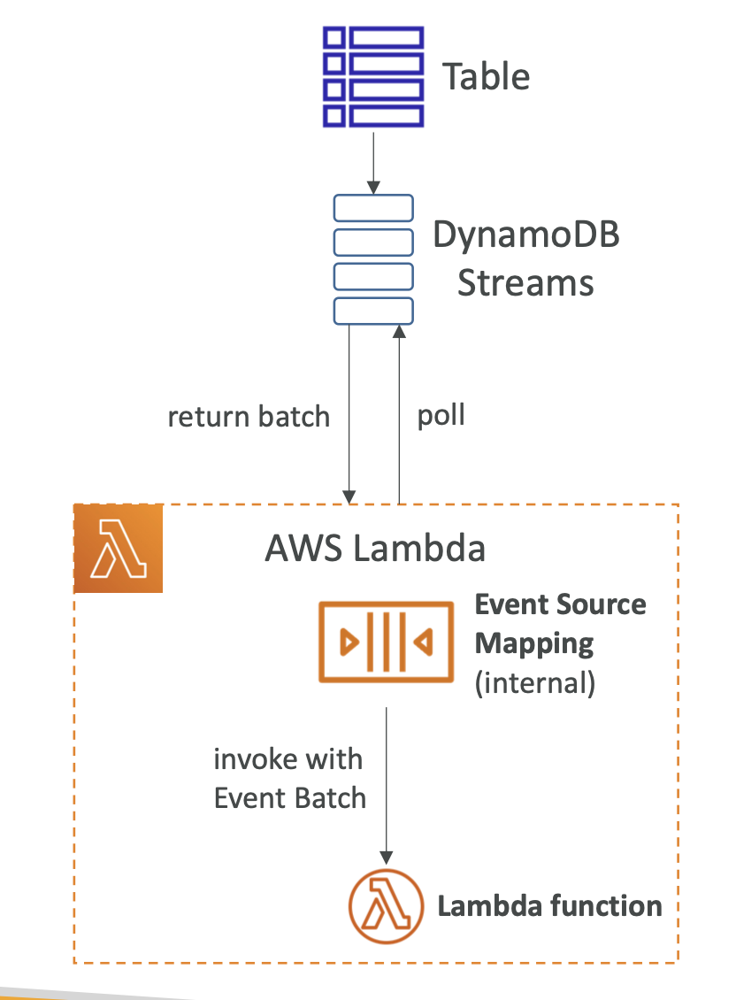

## DynamoDB - Time to Live (TTL)

- Automatically delete items after a certain time.
- Does not consume read/write capacity.
- Attribute with a timestamp.
  

## DynamoDB - CLI

- `--projection-expression` - select attributes.
- `--filter-expression` - filter items.

- Pagination
  - `--page-size` - number of items per page.
  - `--max-items` - maximum number of items.
  - `--starting-token` - start from a specific item.

## DynamoDBTransactions

- Atomic, consistent, isolated, and durable (ACID) operations.
- Multiple operations in a single transaction.
- `TransactGetItems`, `TransactWriteItems`.
  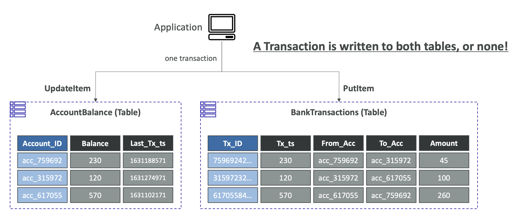
  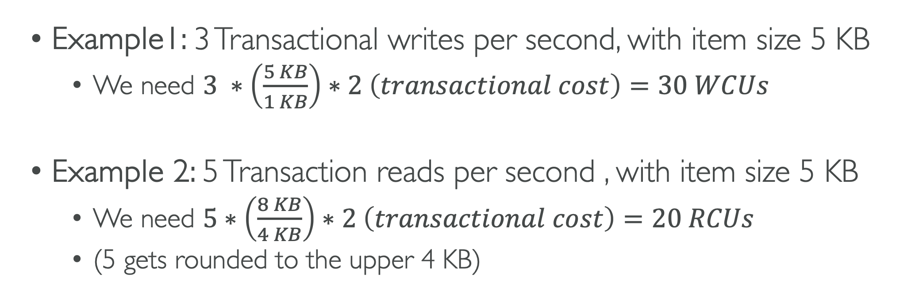

## As Session State Cache

- Store session state in DynamoDB.
  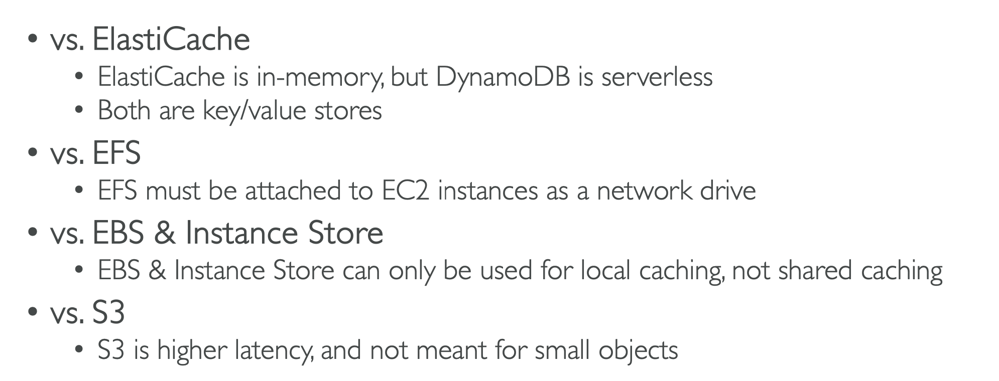

## Write Types

- Concurrent writes: multiple writes to the same item.
- Conditional writes: write an item if conditions are met.
- Atomic writes: multiple writes in a single transaction.
- Batch writes: write multiple items in a single request.

## Large Objects Pattern

- Store large objects in S3.
- Store metadata in DynamoDB.
  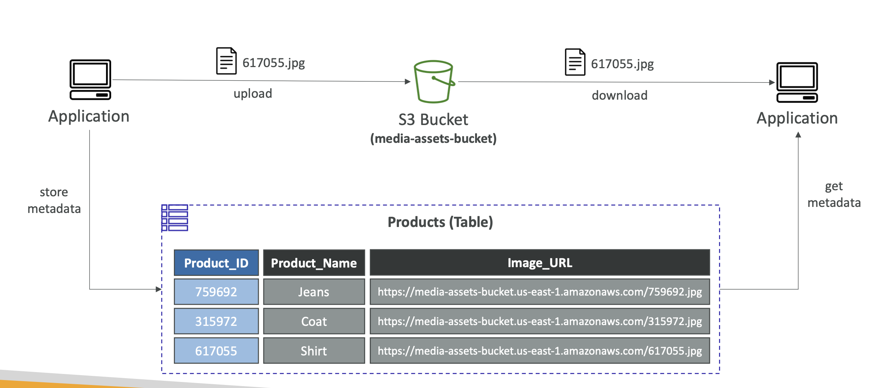

## DynamoDB Security

- Users Interact with DynamoDB Directly.
  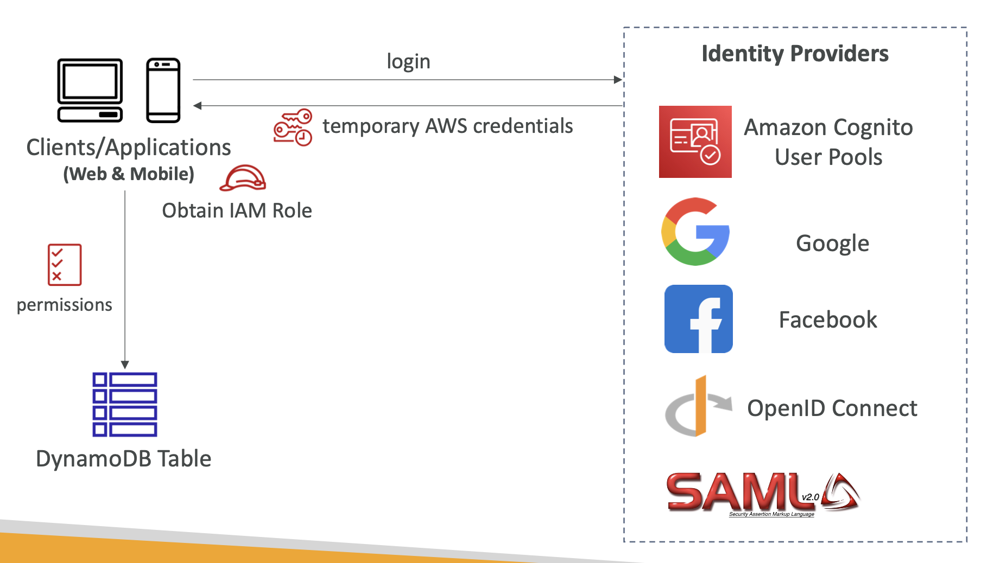
